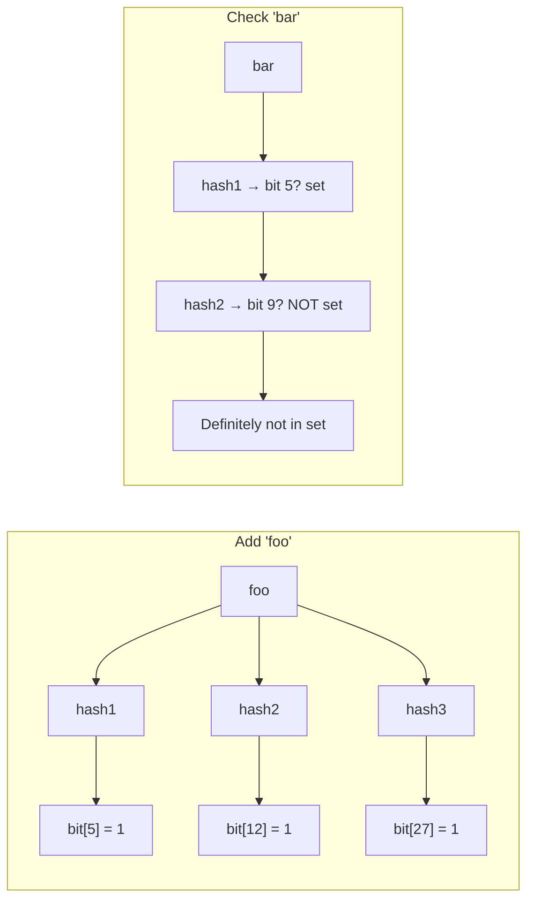
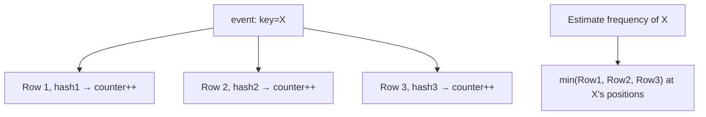
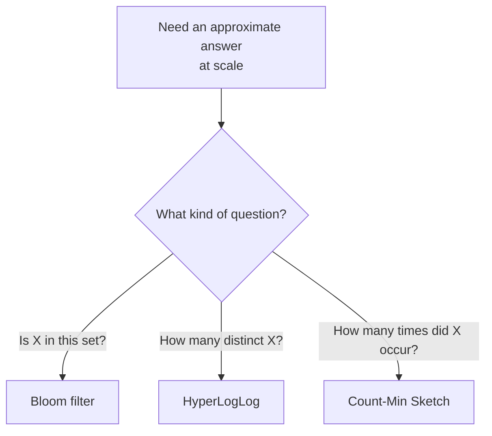

# Probabilistic Structures

Bloom filters, HyperLogLog, and Count-Min Sketch — trading a small, tunable error rate for massive reductions in memory and time versus exact data structures.

> **Related:** Bloom filters in the LSM(Log-Structured Merge) read path → [tree-and-index-structures §4](../../tree-and-index-structures/includes/04-lsm-trees.md) · Approximate rate limiting → [api-rate-limiting](../../api-rate-limiting/README.md) · Analytics cardinality → [data-platforms §1 OLTP vs OLAP](../../data-platforms/includes/01-oltp-vs-olap.md)

---

## At a glance

| Structure | Question it answers | Error direction | Typical use |
|-----------|----------------------|--------------------|-------------|
| **Bloom filter** | "Is this element *possibly* in the set?" | False positives possible; **never** false negatives | Skip unnecessary disk/network lookups |
| **HyperLogLog (HLL)** | "Approximately how many *distinct* elements have I seen?" | Small relative error (~1–2% typical) on cardinality | Unique visitor counts, distinct-value estimation at scale |
| **Count-Min Sketch** | "Approximately how many times has this element occurred?" | Overestimates possible; **never** underestimates | Rate-limit approximation, heavy-hitter detection |

**Rule of thumb:** Reach for a probabilistic structure when the **exact** answer would require memory or time proportional to the full dataset, and your use case can tolerate a small, mathematically bounded error rate in exchange for constant or near-constant space.

---

## Bloom filter

A Bloom filter is a bit array plus `k` hash functions. Adding an element sets `k` bits; checking membership tests whether all `k` bits are set.



| Property | Detail |
|----------|--------|
| **False positive** | Possible — bits can be set by *other* elements' hashes coincidentally |
| **False negative** | **Impossible** — if any of the `k` bits is unset, the element was definitely never added |
| **Size vs error tradeoff** | More bits per element and more hash functions → lower false-positive rate, more memory |
| **No removal** | A standard Bloom filter cannot remove elements (would risk unsetting a bit another element needs) — use a Counting Bloom filter if deletion is required |

**Where it earns its place:** an LSM tree checks a Bloom filter before reading an SSTable from disk — a "definitely not here" answer skips an expensive I/O entirely, and a false positive just costs one wasted read (see [tree-and-index-structures §4](../../tree-and-index-structures/includes/04-lsm-trees.md#core-components)).

---

## HyperLogLog (HLL)

HyperLogLog estimates the **cardinality** (count of distinct elements) of a huge stream using a fixed, tiny amount of memory (a few KB) regardless of whether the true cardinality is thousands or billions.

| Property | Detail |
|----------|--------|
| **Mechanism** | Hashes each element; tracks the position of the leading zero run in each hash bucket — rare long runs statistically imply a large cardinality |
| **Memory** | ~12 KB for ~2% standard error at cardinalities into the billions (Redis's implementation) |
| **Mergeable** | HLL sketches from different shards/regions can be merged into one estimate without re-scanning raw data |
| **What it cannot do** | Cannot tell you *which* elements are distinct, only *how many* |

```text
redis> PFADD visitors:2026-07-12 user123 user456 user123
redis> PFCOUNT visitors:2026-07-12
(integer) 2   # approximate distinct count, ~12KB regardless of total events
```

**Where it earns its place:** "unique visitors today" or "distinct IPs hitting this endpoint" across a stream far too large to hold in a `SET` — a `SET` grows linearly with cardinality; an HLL sketch stays flat.

---

## Count-Min Sketch

Count-Min Sketch estimates **frequency** (how many times has X occurred) using a small 2D array of counters and multiple hash functions, trading a bounded overestimate for constant memory.



| Property | Detail |
|----------|--------|
| **Overestimate only** | Hash collisions can only inflate a count, never deflate it — take the **minimum** across rows to reduce (not eliminate) the effect |
| **Memory** | Fixed size (`width × depth` counters), independent of the number of distinct keys tracked |
| **Common pairing** | Combined with a heap to track "top-K heavy hitters" without storing per-key exact counts |

**Where it earns its place:** approximate per-client request counting for rate limiting at very high cardinality (millions of API(Application Programming Interface) keys/IPs) where an exact counter per key would not fit in memory — see [api-rate-limiting](../../api-rate-limiting/README.md) for the exact-counting default and where an approximation becomes worth the tradeoff at extreme scale.

---

## Choosing between them



| Structure | Do not use for |
|-----------|-------------------|
| Bloom filter | Anything needing an exact answer, or needing to enumerate members |
| HyperLogLog | Anything needing per-element frequency, not just distinct count |
| Count-Min Sketch | Anything where **underestimating** would be unsafe (it never happens) but **overestimating** would be (it does happen) |

---

## Common mistakes

| Mistake | Problem | Fix |
|---------|---------|-----|
| Using a Bloom filter as the source of truth | False positives make it wrong sometimes, by design | Use it as a **pre-filter** before an authoritative check |
| Sizing a Bloom filter for today's data, ignoring growth | False-positive rate climbs as more elements are added past capacity | Size for expected peak cardinality, or use a scalable/dynamic variant |
| Treating HLL cardinality as exact | It has a real, if small, standard error | Communicate it as an estimate; re-verify with exact counts if a decision is high-stakes |
| Using Count-Min Sketch where undercounting would be dangerous (e.g. hard security limits) | It only overestimates — but relying on "probably under the limit" logic elsewhere can be wrong | Use exact counters for hard limits; sketches for approximate/analytics use only |
| Reinventing these structures instead of using a library/Redis command | Subtle bugs in hash function choice or bit-array sizing | `PFADD`/`PFCOUNT` (Redis HLL), well-tested Bloom filter libraries (RocksDB, Guava) |