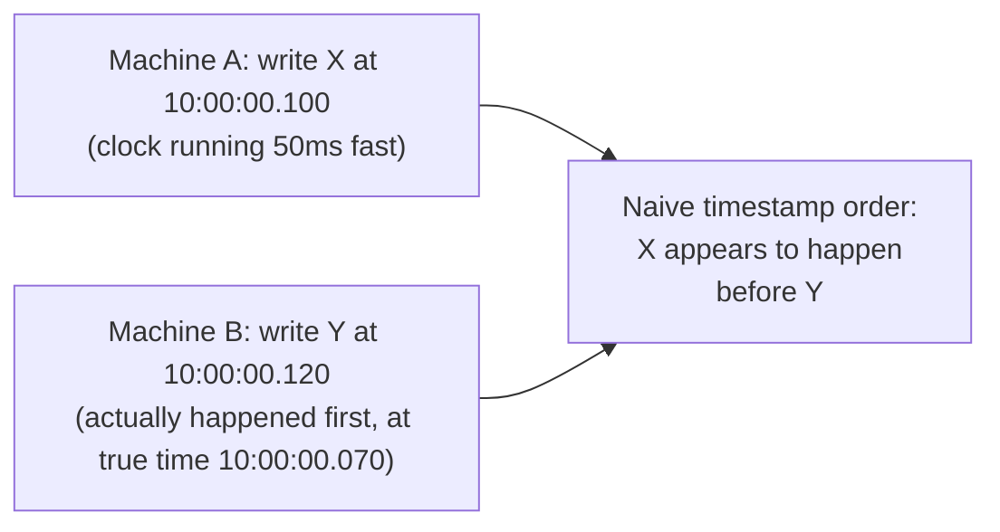
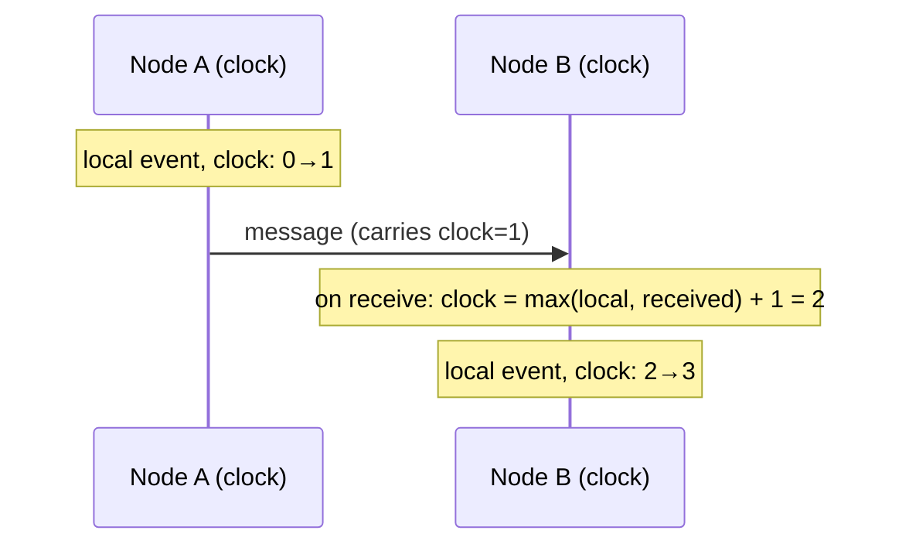
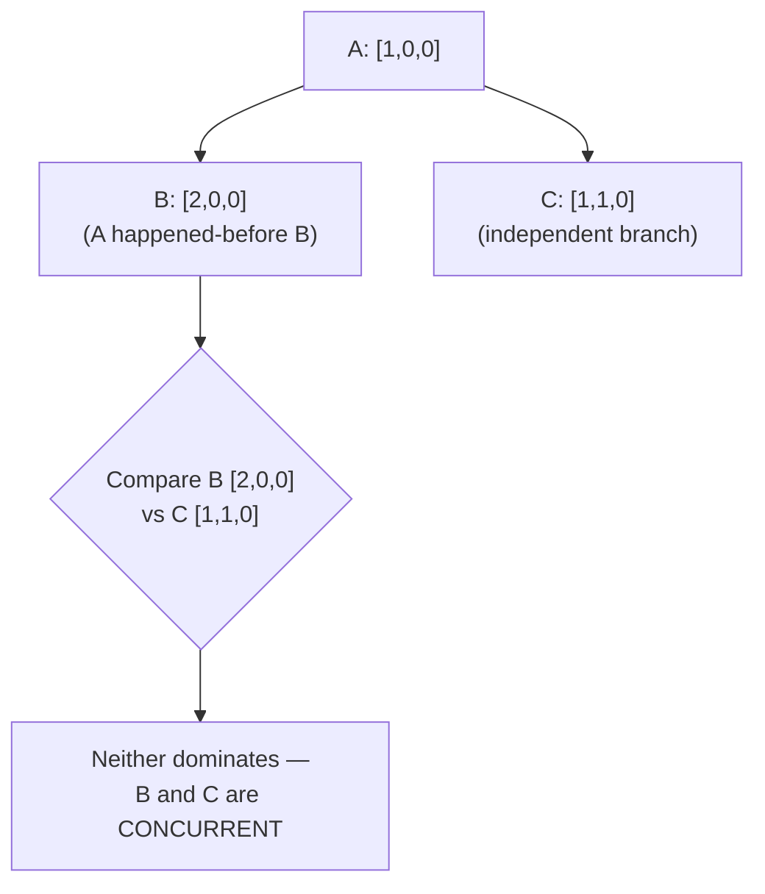

# Clocks and Ordering

Lamport clocks, vector clocks, and TrueTime-style caveats — how to reason about "what happened before what" across machines that do not share a clock.

> **Related:** Conflict resolution using vector clocks → [§1 CAP and PACELC](01-cap-and-pacelc.md#reconciling-divergent-replicas) · Consensus depends on ordered log entries → [§4](04-consensus-and-leader-election.md) · Event ordering in a domain model → [event-sourcing-and-cqrs §1](../../event-sourcing-and-cqrs/includes/01-core-concepts.md)

---

## At a glance

| Mechanism | Answers | Cost |
|-----------|---------|------|
| **Wall-clock timestamp** | "What time did this happen, per this machine's clock?" | Cheap, but clocks drift and are **not** reliably comparable across machines |
| **Lamport clock** | "Did A happen-before B?" (a total, but not necessarily causally accurate, order) | One integer per event — very cheap |
| **Vector clock** | "Did A happen-before B, after B, or concurrently with B?" (true causal order) | One integer per node, per event — grows with node count |
| **TrueTime / hybrid logical clocks** | Bounded wall-clock uncertainty, used to approximate global ordering | Requires specialized infrastructure (atomic clocks + GPS(Global Positioning System), or NTP(Network Time Protocol) discipline) |

**Rule of thumb:** Never trust wall-clock timestamps from different machines to establish **causal order** — clock skew of even a few milliseconds can make an effect appear to precede its cause. Use logical clocks when order matters and you cannot guarantee tightly synchronized physical clocks.

---

## Why wall clocks are not enough



Clock drift, NTP(Network Time Protocol) correction jumps, leap seconds, and simple hardware clock inaccuracy mean two machines' "same instant" timestamps can disagree by milliseconds to seconds — enough to invert the true order of causally related events.

---

## Lamport clocks

A **Lamport clock** is a single counter per node that establishes a **total order** consistent with causality, without needing synchronized physical clocks:



| Rule | Effect |
|------|--------|
| Increment local counter on every event | Establishes a per-node sequence |
| On receiving a message, set `clock = max(local, received_clock) + 1` | Guarantees the receive event's clock is greater than the send event's clock |
| Compare `(clock, node_id)` pairs for a total order | `node_id` breaks ties between events with equal clock values |

**What it guarantees:** if A happened-before B (there is a causal chain — same node sequence, or a message from A to B), then `clock(A) < clock(B)`.

**What it does not guarantee:** the converse. `clock(A) < clock(B)` does **not** mean A happened-before B — they might be entirely unrelated, concurrent events that simply landed on that side of the total order. Lamport clocks impose an order; they do not preserve the information needed to detect true concurrency.

---

## Vector clocks

A **vector clock** keeps one counter **per node**, giving each event a vector instead of a scalar — enough information to determine true causal relationships, including detecting genuine concurrency.

```text
Node A: [2, 0, 1]   Node B: [1, 3, 1]
```

| Comparison | Meaning |
|------------|---------|
| Every element of V1 ≤ corresponding element of V2, and at least one is strictly less | V1 happened-before V2 |
| Neither vector is ≤ the other in every position | V1 and V2 are **concurrent** — genuinely independent, no causal relationship |



This is exactly the mechanism Dynamo-style stores use to detect **genuinely conflicting concurrent writes** (as opposed to one write simply superseding another) — see [§1 reconciling divergent replicas](01-cap-and-pacelc.md#reconciling-divergent-replicas). The cost is that a vector clock's size grows with the number of nodes that have ever touched the data, which is why production systems prune or bound them (e.g. dropping the oldest entries after a size limit).

---

## Causality vs wall clock — a decision lens

| Need | Use |
|------|-----|
| Human-readable "when did this happen" for logs/UIs | Wall-clock timestamp — fine, just do not use it for ordering decisions |
| "Did this write happen after that one, causally?" | Lamport or vector clock |
| "Are these two writes truly independent (need conflict resolution)?" | Vector clock specifically — Lamport clocks cannot distinguish this from an arbitrary total-order tie |
| "Global order across a huge distributed system with tight latency needs" | Hybrid logical clocks (HLC) or a TrueTime-style bounded-uncertainty clock — see below |

---

## TrueTime and hybrid logical clocks — the caveats

Google Spanner's **TrueTime** API(Application Programming Interface) exposes not a single timestamp but an **uncertainty interval** (`[earliest, latest]`), backed by atomic clocks and GPS receivers in every datacenter, kept tightly synchronized (typically single-digit milliseconds of uncertainty).

| Property | Detail |
|----------|--------|
| **What it buys** | External consistency (globally ordered commit timestamps) without a fully logical-clock-based protocol |
| **What it costs** | Specialized hardware (atomic clocks + GPS) most teams cannot replicate outside a hyperscaler's own datacenters |
| **Commit-wait** | Spanner delays a transaction's visibility until the uncertainty interval has definitely passed, trading a small latency cost for correctness |

**Hybrid Logical Clocks (HLC)** approximate the same idea without special hardware: they combine a wall-clock component (for human-readable, roughly-synchronized timestamps) with a logical counter (for tie-breaking and causality within the same physical timestamp) — a practical middle ground most teams can actually implement, used in systems like CockroachDB and MongoDB's cluster-wide timestamps.

**The caveat that matters in practice:** unless you run infrastructure with TrueTime-grade clock synchronization, treat wall-clock-based global ordering as **approximate at best** — reach for Lamport/vector clocks or an HLC when correctness genuinely depends on order, and reserve raw wall-clock timestamps for observability and rough recency, not conflict resolution.

---

## Common mistakes

| Mistake | Problem | Fix |
|---------|---------|-----|
| Using wall-clock timestamps to resolve write conflicts across machines | Clock skew can invert true order | Vector clocks, or a coordinator-assigned monotonic sequence |
| Assuming Lamport clock order implies causality | Only happened-before implies clock order, not the reverse | Use vector clocks when you need to detect true concurrency |
| Unbounded vector clock growth | Metadata overhead grows with every node that ever touched the data | Prune/bound vector clock size; most stores cap and drop oldest entries |
| Treating NTP(Network Time Protocol)-synced clocks as tightly bounded like TrueTime | Typical NTP sync has much larger uncertainty (tens of ms, sometimes more) | Do not rely on millisecond-level global ordering from plain NTP alone |
| Comparing timestamps from different services for event ordering in an audit log | Silently wrong order under clock skew | Attach a logical sequence number or vector clock alongside the timestamp |