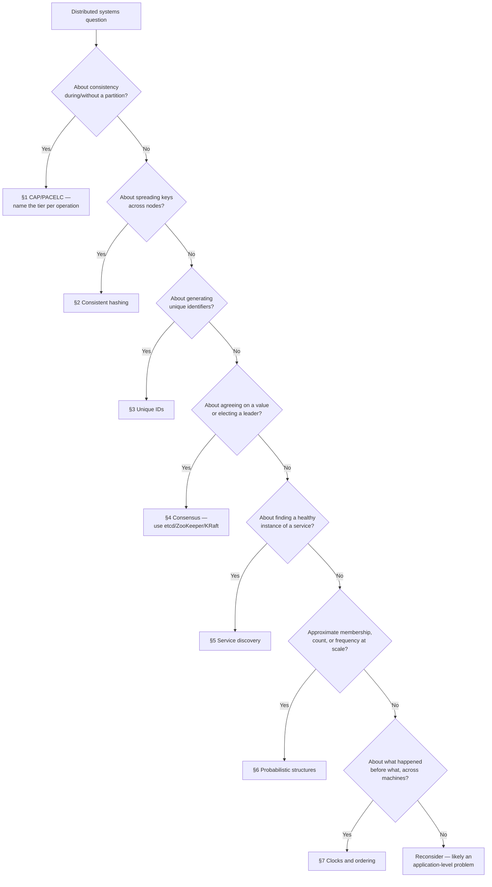

# Decision Guide — Distributed Systems Primitives

Which primitive to reach for, which existing system already implements it, and the anti-patterns — usually "we built our own" — that account for most incidents in this space.

> **Related:** Overview → [00-overview.md](00-overview.md) · Product-level CAP(Consistency, Availability, Partition Tolerance)/PACELC decisions → [architecture-decisions §12](../../architecture-decisions/includes/12-decision-guide.md) · Store-level application → [nosql-and-key-value-stores §6](../../nosql-and-key-value-stores/includes/06-decision-guide.md)

---

## Master decision flow

---

## Scenario recommendations

| Scenario | Recommended approach |
|----------|----------------------|
| Deciding a store's consistency tier for a new feature | Name PACELC per operation — [§1](01-cap-and-pacelc.md), [architecture-decisions §6](../../architecture-decisions/includes/06-tradeoff-frameworks.md) |
| Sharding a Redis/Memcached cache cluster | Consistent hashing with virtual nodes — [§2](02-consistent-hashing.md) |
| Choosing a primary key type for a high-volume table | UUID(Universally Unique Identifier) v7 or Snowflake-style, not UUID v4 or a single central sequence — [§3](03-unique-ids.md) |
| Need one worker in a fleet to own a scheduled job | Leader election via etcd/Kubernetes `Lease`, not a hand-rolled lock — [§4](04-consensus-and-leader-election.md) |
| Services calling each other in an autoscaled/orchestrated environment | Health-checked discovery (Consul/Kubernetes Services), not static IPs — [§5](05-service-discovery.md) |
| Rate limiting at extreme key cardinality (millions of API(Application Programming Interface) keys) | Count-Min Sketch approximation, with exact counters as the default until proven necessary — [§6](06-probabilistic-structures.md), [api-rate-limiting](../../api-rate-limiting/README.md) |
| Skip unnecessary disk reads for keys that do not exist | Bloom filter pre-filter — [§6](06-probabilistic-structures.md) |
| Merging conflicting writes from a multi-region, eventually consistent store | Vector clocks or CRDTs, not last-write-wins by default — [§7](07-clocks-and-ordering.md) |
| Ordering events across services for an audit trail | Logical sequence number or vector clock alongside the timestamp — [§7](07-clocks-and-ordering.md) |

---

## Priority checklist

- [ ] Consistency tier named per operation, not assumed globally — [§1](01-cap-and-pacelc.md)
- [ ] Sharding uses consistent hashing with virtual nodes, not modulo — [§2](02-consistent-hashing.md)
- [ ] ID scheme matches sortability needs (UUID v7/ULID(Universally Unique Lexicographically Sortable Identifier)/Snowflake vs UUID v4/sequence) — [§3](03-unique-ids.md)
- [ ] Any "leader" or lock is backed by a real consensus store, with a fencing token — [§4](04-consensus-and-leader-election.md)
- [ ] Service calls resolve through health-checked discovery, never hardcoded IPs — [§5](05-service-discovery.md)
- [ ] Approximate structures used only where the error direction/rate is acceptable — [§6](06-probabilistic-structures.md)
- [ ] Cross-machine event ordering uses a logical clock, not raw wall-clock timestamps — [§7](07-clocks-and-ordering.md)
- [ ] No custom-built consensus/lock/leader-election implementation in the codebase
- [ ] Decision recorded in an ADR(Architecture Decision Record) if it changes a system's failure behavior

---

## Common mistakes

| Mistake | Why it hurts | Fix |
|---------|---------------|-----|
| One global consistency mode for the whole system | Overpays on cheap paths, underprotects critical ones | Tier by operation — [§1](01-cap-and-pacelc.md) |
| Modulo hashing for a resizable node pool | Near-total remap and cache stampede on every resize | Consistent hashing + virtual nodes — [§2](02-consistent-hashing.md) |
| UUID v4 as a high-volume B-tree primary key | Index fragmentation, poor insert locality | UUID v7 or Snowflake-style — [§3](03-unique-ids.md) |
| Hand-rolled leader election or distributed lock | Split-brain, subtle correctness bugs under rare timing | etcd/ZooKeeper/KRaft/managed lock service — [§4](04-consensus-and-leader-election.md) |
| Hardcoded IPs "temporarily" for a service call | Breaks silently on next redeploy/scale event | Always resolve through discovery — [§5](05-service-discovery.md) |
| Probabilistic structure used where exactness is required | Wrong answer some fraction of the time, by design | Exact structure for hard limits; probabilistic only for approximate/analytics use — [§6](06-probabilistic-structures.md) |
| Wall-clock timestamps used to resolve write conflicts | Clock skew inverts true order | Vector clocks or a coordinator-assigned sequence — [§7](07-clocks-and-ordering.md) |
| Building a bespoke version of any primitive in this guide | High correctness risk, low differentiation | Adopt the existing battle-tested implementation named in each section |

---

## Quick decision summary

| Question | Default answer |
|----------|------------------|
| Need strong consistency everywhere? | No — tier by operation |
| Sharding a cache or store? | Consistent hashing + virtual nodes |
| New primary key for a hot table? | UUID v7 or Snowflake-style |
| Need a distributed lock/leader? | Use an existing consensus store, never build one |
| Service-to-service calls? | Always through health-checked discovery |
| Need to count/dedupe at huge scale? | Probabilistic structure, if the error direction is acceptable |
| Need to order events across machines? | Logical clock, not wall-clock timestamps |

---

## See also

| Guide | Topics |
|-------|--------|
| [architecture-decisions](../../architecture-decisions/README.md) | Product-level CAP/PACELC framing, ADRs |
| [nosql-and-key-value-stores](../../nosql-and-key-value-stores/README.md) | Where these primitives run inside DynamoDB/Cassandra/MongoDB |
| [apache-kafka](../../apache-kafka/README.md) | KRaft(Kafka Raft) consensus, ISR(In-Sync Replicas) quorum in production |
| [tree-and-index-structures](../../tree-and-index-structures/README.md) | Bloom filters and LSM(Log-Structured Merge) internals |
| [resilience-patterns](../../resilience-patterns/README.md) | Distributed locks, timeouts, circuit breakers around these primitives |
| [event-sourcing-and-cqrs](../../event-sourcing-and-cqrs/README.md) | Causal ordering applied to domain events |