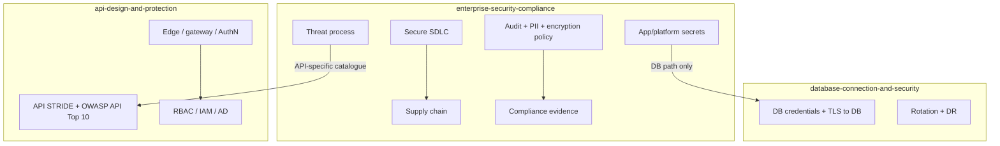
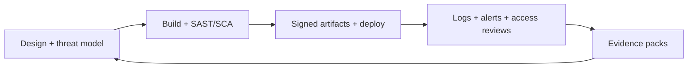

# Overview — Enterprise Security & Compliance

This guide covers how engineering teams **prove and operate** security controls: secure delivery, threat modeling as a process, common vulnerability classes, supply chain, secrets outside DB paths, audit/PII(Personally Identifiable Information), encryption, zero trust, and compliance evidence.

> **Related:** API(Application Programming Interface) threat catalogue → [api-design §6 Threat model](../../api-design-and-protection/includes/06-threat-model.md) · DB credentials → [database-connection-and-security](../../database-connection-and-security/README.md) · Decision flow → [§11 Decision guide](11-decision-guide.md)

## At a glance

| Need | Start here | Pair with |
|------|------------|-----------|
| Ship safely every PR | [§1 Secure SDLC](01-secure-sdlc.md) | CI(Continuous Integration) gates + deploy strategies |
| Systematic risk before launch | [§2 Threat modeling](02-threat-modeling-process.md) | [api-design §6](../../api-design-and-protection/includes/06-threat-model.md) for API STRIDE(Spoofing, Tampering, Repudiation, Information Disclosure, Denial of Service, Elevation of Privilege) |
| Fix recurring vuln classes | [§3 OWASP](03-owasp-and-common-vulns.md) | Code review + SAST(Static Application Security Testing) |
| Trust dependencies and images | [§4 Supply chain](04-supply-chain-security.md) | SBOM(Software Bill of Materials), signing |
| API keys, signing secrets, cloud keys | [§5 Secrets beyond DB](05-secrets-beyond-database.md) | Vault / cloud secret manager |
| Prove who did what | [§6 Audit logging](06-audit-logging-and-retention.md) | Retention + access control on logs |
| GDPR-style minimization | [§7 PII](07-pii-and-data-classification.md) | Classification + retention |
| Keys, TLS(Transport Layer Security), field crypto | [§8 Encryption](08-encryption-policy.md) | KMS(Key Management Service) ownership |
| Identity everywhere | [§9 Zero trust](09-zero-trust-least-privilege.md) | IAM(Identity and Access Management) + mTLS(Mutual Transport Layer Security) |
| Auditor / customer asks | [§10 Compliance evidence](10-compliance-evidence.md) | Map controls → artifacts |

**Rule of thumb:** Security that lives only in a wiki fails audits. Prefer **controls in CI, infra-as-code, and queryable logs**.

## What this guide owns vs siblings

| Topic | This guide | Sibling |
|-------|------------|---------|
| Threat modeling **process** (when, who, artifacts) | §2 | API STRIDE catalogue → [api-design §6](../../api-design-and-protection/includes/06-threat-model.md) |
| Secrets for **apps, CI, partners** | §5 | DB connection secrets → [database-connection](../../database-connection-and-security/README.md) |
| Identity protocols for APIs | Link out | [api-design §4](../../api-design-and-protection/includes/04-auth-model.md) / [§12](../../api-design-and-protection/includes/12-identity-rbac-iam-ad.md) |

## Control loop

## Default recommendation

For a typical **B2B(Business-to-Business) SaaS(Software as a Service)** product:

1. **SDLC(Software Development Life Cycle):** PR required reviews, SAST + dependency scanning on every merge, secret scanning in CI
2. **Threat model:** light STRIDE(Spoofing, Tampering, Repudiation, Information Disclosure, Denial of Service, Elevation of Privilege) per major feature; deep review before first external launch
3. **Secrets:** central secret manager; no long-lived keys in git or images
4. **Audit:** immutable security events with correlation IDs; retention matched to contracts
5. **Evidence:** map SOC 2–style control IDs to tickets, CI jobs, and dashboards — not screenshots alone

## Common mistakes

| Mistake | Fix |
|---------|-----|
| Security = annual pen test only | Continuous SDLC gates + threat models on change |
| Copying API threat list as org process | Process in §2; catalogue in api-design §6 |
| DB vault for every secret type | Use §5 patterns for CI, webhooks, signing keys |
| Policies without evidence | §10: every control names an artifact owner |
| Logging PII into debug sinks | Classification (§7) + redaction in log pipelines |