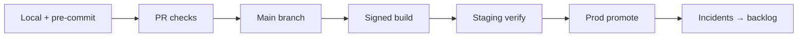

# Secure SDLC

> **Related:** Supply chain → [§4](04-supply-chain-security.md) · Threat process → [§2](02-threat-modeling-process.md) · Deploy safety → [deployment-strategies](../../deployment-strategies/README.md) · Overview → [§0](00-overview.md)

## At a glance

| Gate | Where | Fail closed? |
|------|-------|--------------|
| Code review (security-sensitive paths) | PR | Yes for auth, crypto, billing |
| Secret scanning | Pre-commit + CI(Continuous Integration) | Yes |
| SAST(Static Application Security Testing) | CI | Yes on high/critical |
| SCA(Software Composition Analysis) | CI | Yes on known exploited CVEs |
| Container / IaC(Infrastructure as Code) scan | CI before promote | Yes to prod |
| DAST(Dynamic Application Security Testing) / smoke auth | Staging | Soft fail early; harden later |
| Threat model update | Design review | Required for new trust boundaries |

**Rule of thumb:** If a control cannot block a merge or a prod promote, it is guidance — not a control.

## Secure delivery pipeline

| Stage | Engineering expectations |
|-------|--------------------------|
| **Local** | Secret scanners; no production credentials in `.env` committed |
| **PR** | Required reviewers for `auth/`, `crypto/`, IAM(Identity and Access Management) policies; SAST + SCA green |
| **Build** | Reproducible builds where practical; SBOM(Software Bill of Materials) attached → [§4](04-supply-chain-security.md) |
| **Staging** | Auth smoke tests; no “disable TLS(Transport Layer Security) for staging” forever |
| **Prod** | Change tickets for high-risk; canary when blast radius is large → [deployment-strategies](../../deployment-strategies/README.md) |

## Security requirements as acceptance criteria

Treat security like any other non-functional requirement:

| Requirement type | Example acceptance criterion |
|------------------|------------------------------|
| AuthZ | Object-level check on every `{id}` route (BOLA(Broken Object-Level Authorization) covered) |
| Secrets | New integration uses secret manager; no plaintext in config maps |
| Logging | Security events emit `actor`, `action`, `resource`, `correlation_id` — no tokens |
| PII(Personally Identifiable Information) | New field has classification label and retention note |
| Abuse | Expensive endpoint has rate limit or async escape hatch |

## Roles

| Role | Owns |
|------|------|
| **Feature engineer** | Secure defaults in code; threat notes on PR for new surfaces |
| **Tech lead** | Gate definition; exception process with expiry |
| **Platform / DevSecOps** | CI scanners, signing, baseline policies |
| **Security champion** | Triage findings; escalate true positives |

## Exception process

Unfixed findings need a **ticket + owner + expiry + compensating control**. Exceptions without expiry become permanent holes. Track them next to compliance evidence → [§10](10-compliance-evidence.md).

## Pros and cons

| Pros of gated SDLC(Software Development Life Cycle) | Cons |
|-----------------------------------------------------|------|
| Failures caught before customers | CI time and false positives |
| Auditors see continuous control | Needs ownership of tool config |
| Shared baseline across teams | Over-blocking slows MVP without triage |

## Common mistakes

| Mistake | Fix |
|---------|-----|
| Scanners advisory forever | Fail on severity bands; allowlist with expiry |
| Security review only at release | Lightweight checks every PR; deep review on boundary changes |
| Ignoring IaC and pipelines | Scan Terraform/K8s and CI secrets the same as app code |
| “We’ll harden after launch” with open admin routes | Block prod promote until AuthZ + audit exist |
| No owner for SCA backlog | Weekly triage SLO(Service Level Objective) for critical CVEs |