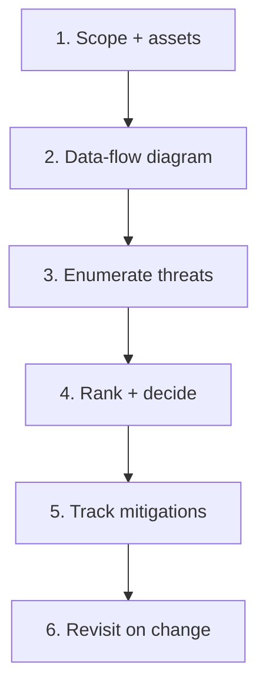

# Threat Modeling Process

> **Scope:** **Process lens** — when to model, who participates, artifacts, and how findings become backlog. The API(Application Programming Interface)-specific STRIDE(Spoofing, Tampering, Repudiation, Information Disclosure, Denial of Service, Elevation of Privilege) catalogue and OWASP(Open Worldwide Application Security Project) API Top 10 mapping live in [api-design §6 Threat model](../../api-design-and-protection/includes/06-threat-model.md). Do not duplicate that table here.
>
> **Related:** API STRIDE + OWASP API Top 10 → [api-design §6](../../api-design-and-protection/includes/06-threat-model.md) · Identity structure → [api-design §12](../../api-design-and-protection/includes/12-identity-rbac-iam-ad.md) · Secure SDLC(Software Development Life Cycle) gates → [§1](01-secure-sdlc.md) · Evidence → [§10](10-compliance-evidence.md)

## At a glance

| Trigger | Depth | Artifact |
|---------|-------|----------|
| New trust boundary (public surface, partner, admin) | Full workshop | Diagram + threat list + owners |
| Material change to auth, payments, PII(Personally Identifiable Information) | Delta review | Diff against last model |
| Routine feature inside existing zones | Lightweight checklist | PR note linking residual risks |
| Annual / compliance refresh | Re-validate top risks | Updated register for auditors |

**Rule of thumb:** Model **data flows and trust zones**, not every user story.

## Process steps

1. **Scope** — system under review, actors (user, admin, partner, attacker), in-scope assets (credentials, PII, money movement).
2. **Data-flow diagram** — entry points, stores, external calls; mark trust zone crossings.
3. **Enumerate** — use STRIDE categories; for HTTP(Hypertext Transfer Protocol) APIs pull concrete rows from [api-design §6](../../api-design-and-protection/includes/06-threat-model.md).
4. **Rank** — likelihood × impact; decide mitigate / accept / transfer.
5. **Track** — each mitigation becomes a ticket with owner and verification method.
6. **Revisit** — when zones change; store the diagram next to the service runbook.

## Workshop format (90 minutes)

| Time | Activity |
|------|----------|
| 10m | Confirm scope and “what would hurt most if leaked/abused” |
| 25m | Draw flows (whiteboard or mermaid in PR) |
| 30m | Walk STRIDE per zone; capture abuse cases |
| 15m | Rank top 5–10; assign owners |
| 10m | Agree residual risk and next review trigger |

Participants: feature TL, one engineer who owns the code, security champion, and for payments/identity — platform or security engineer.

## Minimal threat register fields

| Field | Example |
|-------|---------|
| ID | TM-ORDERS-07 |
| Threat | Partner spoofs webhook source |
| Zone | Edge → webhook ingress |
| STRIDE | Spoofing |
| Mitigation | HMAC(Hash-based Message Authentication Code) + timestamp skew window |
| Owner | orders-api TL |
| Status | Open / Done / Accepted |
| Evidence | PR link + test name |

## When lightweight is enough

- Internal tool behind SSO with no new external callers
- Pure UI copy change with no new data fields
- Refactor with identical trust boundaries

Still document **why** the model was skipped on the PR so auditors see intentionality.

## Common mistakes

| Mistake | Fix |
|---------|-----|
| Pasting OWASP list into Confluence once | Living register + delta reviews |
| Modeling only the happy path | Include abuse, insider, and broken AuthZ |
| No link to tickets | Mitigations without owners are theater |
| Treating api-design §6 as the whole program | Use §6 for APIs; use this file for process |
| Accepting high risk with no expiry | Time-box acceptances; revisit |