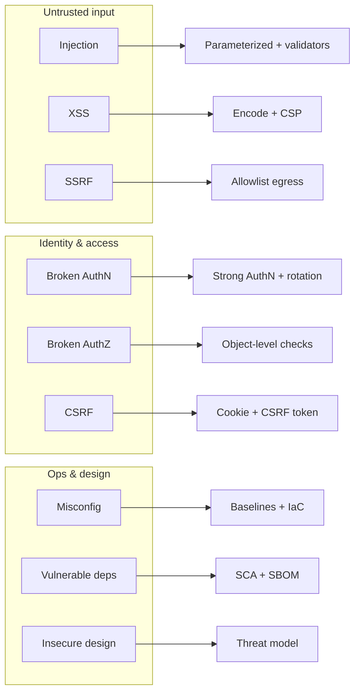

# OWASP and Common Vulnerabilities

> **Related:** API(Application Programming Interface) Top 10 detail → [api-design §6](../../api-design-and-protection/includes/06-threat-model.md) · Secure SDLC(Software Development Life Cycle) → [§1](01-secure-sdlc.md) · Secrets → [§5](05-secrets-beyond-database.md) · Browser XSS(Cross-Site Scripting)/CSRF(Cross-Site Request Forgery) → [fullstack §7 Auth UX](../../fullstack-bff-and-clients/includes/07-auth-ux.md)

## At a glance

| Class | Typical fix | Primary owner |
|-------|-------------|---------------|
| Injection (SQL(Structured Query Language), command, template) | Parameterized APIs; never concatenate | App eng |
| Broken AuthN / session | Short-lived tokens; MFA(Multi-Factor Authentication) for admin | App + identity |
| Broken AuthZ / BOLA(Broken Object-Level Authorization) | Object ownership checks | App eng |
| XSS(Cross-Site Scripting) | Encode output; CSP(Content Security Policy) | Frontend + BFF(Backend for Frontend) |
| CSRF(Cross-Site Request Forgery) | SameSite + anti-CSRF for cookie sessions | Frontend + BFF |
| SSRF(Server-Side Request Forgery) | Outbound allowlists | App + platform |
| Misconfiguration | Hardened defaults; no debug in prod | Platform |
| Vulnerable components | SCA(Software Composition Analysis) + patch SLO(Service Level Objective) | Platform + eng |
| Logging / monitoring gaps | Security events + alerts | App + SRE(Site Reliability Engineering) |
| Insecure design | Threat model before build | TL + security |

**Rule of thumb:** Framework defaults help; **AuthZ and SSRF** still need explicit design.

## Map: OWASP classes → engineering controls

## Practical prevention checklist

| Area | Do | Don't |
|------|----|-------|
| Data access | Prepared statements / ORM bind params | String-built SQL(Structured Query Language) or shell |
| HTML/JSON to browser | Contextual encoding; avoid `dangerouslySetInnerHTML` | Trust “sanitized” user HTML without a vetted library |
| File / URL fetch | Allowlist schemes and hosts; block link-local | User-supplied URL to metadata endpoints |
| Admin | Separate surface; step-up auth | Same cookie jar, weaker checks |
| Errors | Stable error codes to clients | Stack traces and SQL in 500 bodies |
| Dependencies | Pin versions; monitor CVE feed | `latest` tags in prod |

For **API-only** risks (BOLA, mass assignment, inventory), use the tables in [api-design §6](../../api-design-and-protection/includes/06-threat-model.md) and [§2 API protection](../../api-design-and-protection/includes/02-api-protection.md).

## Testing expectations

| Test type | Catches |
|-----------|---------|
| Unit / contract | AuthZ deny paths; validation |
| Integration | SSRF egress blocks; CSRF on mutating cookie routes |
| SAST(Static Application Security Testing) | Some injection and secret smells |
| DAST(Dynamic Application Security Testing) / pen test | Logic bugs SAST misses |
| Chaos of config | Debug flags, open CORS, default passwords |

## Common mistakes

| Mistake | Fix |
|---------|-----|
| “We use a framework so OWASP(Open Worldwide Application Security Project) is done” | Still enforce object-level AuthZ and egress policy |
| Only scanning for XSS in SPA shells | Cover BFF HTML and email/PDF renderers |
| Treating CVE noise as ignore-all | Severity + exploitability triage with SLO(Service Level Objective) |
| CSRF tokens on pure Bearer APIs | Cookie sessions need CSRF; Bearer-from-header usually does not |
| Logging tokens “for debug” | Redact; use correlation IDs → [§6](06-audit-logging-and-retention.md) |