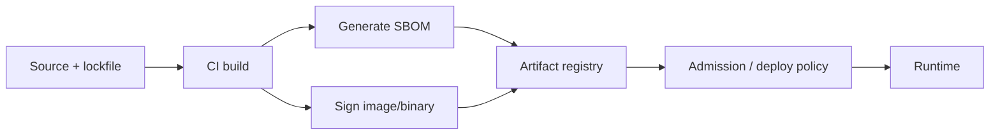

# Supply-Chain Security

> **Related:** Secure SDLC(Software Development Life Cycle) gates → [§1](01-secure-sdlc.md) · Secrets in CI(Continuous Integration) → [§5](05-secrets-beyond-database.md) · Deploy promotion → [deployment-strategies](../../deployment-strategies/README.md)

## At a glance

| Control | What it proves | Typical tool surface |
|---------|----------------|----------------------|
| Lockfiles + pinned base images | Reproducible dependency set | npm/pnpm/poetry lock; image digests |
| SCA(Software Composition Analysis) | Known vulnerable packages | CI scanner + advisory feed |
| SBOM(Software Bill of Materials) | Inventory for auditors and incident response | CycloneDX / SPDX on each artifact |
| Signed artifacts | Integrity and provenance | Sigstore / cosign, cloud signing |
| Provenance (SLSA-style) | Who built what from which commit | Attestations in registry |
| Private registry + allowlist | Reduced dependency confusion | Scoped registries, package allow |

**Rule of thumb:** If you cannot answer “what shipped in last night’s build?”, you do not have a supply-chain control.

## Build trust flow

| Stage | Engineering action |
|-------|--------------------|
| **Source** | Dependabot/Renovate with human review for major bumps; verify maintainers on critical deps |
| **Build** | Hermetic-ish CI; no `curl | bash` in Dockerfiles; pin digest not floating tag |
| **Attest** | Attach SBOM + signature to the same digest you deploy |
| **Admit** | Cluster/policy engine rejects unsigned or unscanned digests for prod |
| **Respond** | On CVE, query SBOM inventory → patch → redeploy |

## SBOM practice

- Generate on **every release artifact**, not only annually.
- Store beside the image/binary; index by service + version.
- Include **transitive** dependencies; direct-only lists fail audits.
- On incident (“is package X in prod?”), SBOM + deploy history beats guesswork.

## Signing and verification

| Pattern | Use when |
|---------|----------|
| Sign container images; verify at deploy | Kubernetes / cloud runtimes |
| Sign packages for internal libraries | Multi-repo org with shared libs |
| Keyless signing (OIDC(OpenID Connect) identity to CI) | Reduce long-lived signing keys |
| Separate test vs prod signing keys | Limit blast radius of CI compromise |

Protect signing credentials like production secrets → [§5](05-secrets-beyond-database.md).

## Dependency confusion and typosquats

| Risk | Mitigation |
|------|------------|
| Public package shadows internal name | Namespace scope; private registry first |
| Typosquat of popular lib | Allowlist; SCA + careful review on new deps |
| Compromised maintainer | Pin + monitor; prefer packages with signed releases |

## Pros and cons

| Pros | Cons |
|------|------|
| Fast CVE blast-radius answers | Extra CI minutes and registry storage |
| Deploy-time integrity | Admission policy needs ops ownership |
| Auditor-friendly inventory | SBOM noise if not tied to running digests |

## Common mistakes

| Mistake | Fix |
|---------|-----|
| SBOM generated once for the company wiki | Per-artifact SBOM on the digest you run |
| Signing without verification at admit | Signature check in prod path |
| Floating `:latest` in prod | Digest pins + automated rebuilds |
| Ignoring build scripts and GitHub Actions | Treat CI as part of the trusted computing base |
| Blocking all CVEs without triage | Severity + reachability; patch SLO(Service Level Objective) for critical |