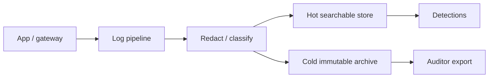

# Audit Logging and Retention

> **Related:** Append-only domain audit → [event-sourcing-and-cqrs](../../event-sourcing-and-cqrs/README.md) · API(Application Programming Interface) correlation IDs → [api-design overview](../../api-design-and-protection/includes/00-overview.md) · Observability triage → [HTS §11](../../high-throughput-systems/includes/11-observability.md) · PII(Personally Identifiable Information) in logs → [§7](07-pii-and-data-classification.md) · Evidence → [§10](10-compliance-evidence.md)

## At a glance

| Log type | Purpose | Retention hint |
|----------|---------|----------------|
| **Security audit** | Who did what to which resource | Contract / SOC 2 window (often 1 year+) |
| **Application debug** | Diagnose bugs | Days–weeks; scrub PII(Personally Identifiable Information) |
| **Access / auth** | Login, MFA(Multi-Factor Authentication), failures | Align with security audit |
| **Admin / break-glass** | Privileged actions | Longest; immutable store |
| **Change / deploy** | What shipped when | Match release history needs |

**Rule of thumb:** Security audit logs are an **evidence system**, not a debug console.

## Required fields for security events

| Field | Example |
|-------|---------|
| `timestamp` | UTC ISO-8601 |
| `actor` | user id / service id / `anonymous` |
| `action` | `order.cancel`, `role.grant` |
| `resource` | type + id |
| `result` | success / deny / error |
| `correlation_id` | edge → app request id |
| `src` | IP / device class when policy allows |
| `tenant` | org id for multi-tenant |

Never log: passwords, session tokens, full PANs, raw government IDs, Authorization headers.

## Flow

## Integrity and access

| Control | Why |
|---------|-----|
| Append-only / WORM(Write Once Read Many) for security stream | Tamper resistance for repudiation threats |
| Separate RBAC(Role-Based Access Control) for who can read audit | Engineers debug apps; few read security archives |
| Alert on audit-pipeline lag | Silent log loss is a control failure |
| Hash chaining or cloud immutability features | Strengthen non-repudiation |

For **business history** as product feature, prefer domain events → [event-sourcing](../../event-sourcing-and-cqrs/README.md). Audit logs answer **security and compliance**; event stores answer **domain rebuild**.

## Retention policy sketch

| Class | Hot | Cold | Delete |
|-------|-----|------|--------|
| Security audit | 90d searchable | 1y+ archive | Per legal hold |
| Auth failures | 90d | Optional aggregate | After window |
| Debug app logs | 14–30d | Usually none | Aggressive |
| PII-bearing support logs | Minimize | Encrypted | Subject to erasure process → [§7](07-pii-and-data-classification.md) |

Document retention in the same pack auditors see → [§10](10-compliance-evidence.md).

## Detection starters

| Signal | Why it matters |
|--------|----------------|
| Spike in 401/403 on admin routes | Credential stuffing / probing |
| Privilege grant outside change window | Insider / compromised admin |
| Mass export / list endpoints | Data exfil pattern |
| Audit ship failures | Control downtime |

## Common mistakes

| Mistake | Fix |
|---------|-----|
| Debug logs = audit trail | Separate streams and retention |
| Tokens and PII in “just in case” fields | Schema allowlist + redaction |
| Everyone on eng can query security archive | Least privilege on log stores |
| Infinite retention of everything | Cost + GDPR risk; classify |
| No correlation_id across gateway and app | Propagate from edge |