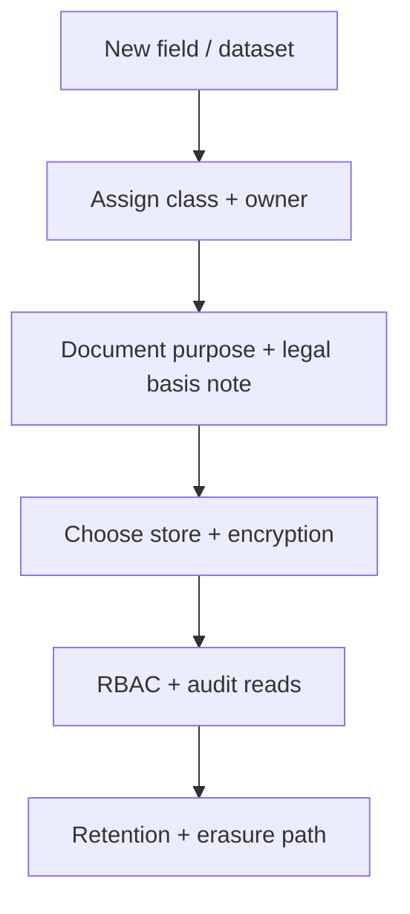

# PII and Data Classification

> **Related:** Erasure / DSAR(Data Subject Access Request) runbook → [§7A](07A-erasure-and-dsar.md) · Audit redaction → [§6](06-audit-logging-and-retention.md) · Encryption of sensitive fields → [§8](08-encryption-policy.md) · Multi-tenant isolation → [api-design §16](../../api-design-and-protection/includes/16-multi-tenant-apis.md) · Event store erasure tension → [event-sourcing decision guide](../../event-sourcing-and-cqrs/includes/06-decision-guide.md) · PII on Kafka topics / catalog classification → [apache-kafka §6](../../apache-kafka/includes/06-serialization-and-schema-evolution.md) · [kafka §9 catalog](../../apache-kafka/includes/09-cluster-setup-and-requirements.md#event-catalog-and-ownership-slos) · Compaction tombstones → [kafka §5](../../apache-kafka/includes/05-retention-compaction-and-storage.md)

## At a glance

| Class | Examples | Handling baseline |
|-------|----------|-------------------|
| **Public** | Marketing copy, public IDs | CDN(Content Delivery Network) OK |
| **Internal** | Non-sensitive ops metrics | Corp network / auth |
| **Confidential** | Business data, emails | AuthZ(Authorization) + encryption in transit |
| **Restricted / PII(Personally Identifiable Information)** | Government ID, health, precise location, auth secrets | Minimize, encrypt, short retention, access review |

**Rule of thumb (GDPR-style minimization):** Collect the **least** data that still delivers the feature; default retention to **shortest** that still meets legal/ops needs.

## Classification workflow

Every new personal data field should answer:

1. **Why** do we need it for the feature?
2. **Where** is it stored and who can read it?
3. **How long** until delete/anonymize?
4. **How** does erasure propagate (DB, search, backups, warehouses, logs)?

## Minimization tactics

| Tactic | Example |
|--------|---------|
| Don’t collect | Skip date-of-birth if age-band suffices |
| Tokenize | Store payment token, not PAN(Primary Account Number) |
| Hash / truncate | Last-4 only for display |
| Separate store | Restricted PII in vaulted table; app uses opaque id |
| Aggregate early | Analytics on cohorts, not raw identities |
| Purpose limitation | Support tool cannot export full marketing DB |

## Access and sharing

| Control | Practice |
|---------|----------|
| RBAC(Role-Based Access Control) | Role → class mapping; break-glass logged |
| Vendor DPA(Data Processing Agreement) | Processors listed; subprocessors reviewed |
| Export | Rate-limit and audit bulk export APIs |
| Support views | Mask by default; reveal with reason code |

## Erasure and retention

| Concern | Engineering approach |
|---------|----------------------|
| Soft-delete vs hard-delete | Hard-delete or irreversible anonymize when required |
| Backups | Document backup lag; erasure completes after backup expiry or rewrite policy |
| Search / CQRS(Command Query Responsibility Segregation) projections | Erasure job per store; don’t forget replicas |
| Event sourcing | Prefer encrypt-and-forget keys or avoid putting raw PII in events |
| Kafka / event bus | Classify topics in the event catalog; separate restricted topics or field-level encryption; tombstone compacted PII keys — [kafka §9](../../apache-kafka/includes/09-cluster-setup-and-requirements.md#event-catalog-and-ownership-slos) · [kafka §5](../../apache-kafka/includes/05-retention-compaction-and-storage.md) |

## Cross-border and vendors

Track **where** processing happens (regions, SaaS(Software as a Service) tools). New vendor that receives PII is a classification + contract change, not a silent SDK add.

## Common mistakes

| Mistake | Fix |
|---------|-----|
| “Email isn’t PII here” | Classify consistently; email is personal data in most regimes |
| Logging full request bodies | Field allowlists; drop restricted classes |
| Erasing primary DB only | Inventory all copies (warehouse, tickets, S3) |
| Infinite analytics raw dumps | Aggregate + retention on identity keys |
| No owner for classification labels | Schema registry / data catalog owner per domain |
| Putting raw PII on high-fan-out Kafka topics | Minimize payload; restricted topic + ACLs; catalog classification — [kafka §9](../../apache-kafka/includes/09-cluster-setup-and-requirements.md#event-catalog-and-ownership-slos) |