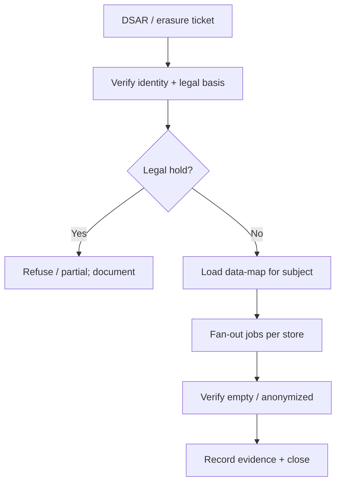

# Erasure and DSAR playbook

Classification tells you **what** is sensitive — [§7](07-pii-and-data-classification.md). This section is the **ops runbook** when a user (or customer admin) requests access, export, or erasure under GDPR(General Data Protection Regulation)-style rights (DSAR(Data Subject Access Request)).

> **Scope:** End-to-end inventory and fulfillment — OLTP(Online Transaction Processing) → search → warehouse/lake → Kafka → backups → event store; crypto-shred vs hard delete; legal hold. Classification taxonomy → [§7](07-pii-and-data-classification.md). Retention ownership → [data-platforms §5](../../data-platforms/includes/05-data-ownership-lineage-retention.md). Event-store tension → [ES §3](../../event-sourcing-and-cqrs/includes/03-storage-and-projections.md) · [ES §6](../../event-sourcing-and-cqrs/includes/06-decision-guide.md).
>
> **Related:** Audit without dumping PII(Personally Identifiable Information) → [§6](06-audit-logging-and-retention.md) · Encryption / key destroy → [§8](08-encryption-policy.md) · Kafka retention/tombstones → [kafka §5](../../apache-kafka/includes/05-retention-compaction-and-storage.md) · Multi-tenant restore drills → [arch §10](../../architecture-decisions/includes/10-multi-tenant-system-models.md)

---

## At a glance

| Request type | Outcome |
|--------------|---------|
| **Access / export (DSAR)** | Package personal data the subject is entitled to see |
| **Rectification** | Correct inaccurate fields; re-sync downstream |
| **Erasure** | Delete or irreversibly anonymize; prove completion |
| **Restriction / objection** | Stop processing paths (marketing, profiling) while retaining legal copies |

**Rule of thumb:** Erasure is **not** `DELETE FROM users WHERE id=?`. It is a **fan-out workflow** across every store that holds that subject — with SLAs, evidence, and legal-hold exceptions.

---

## Inventory before you promise

Maintain a living **personal-data map** (often part of the data catalog):

| Store | What might hold the subject | Erasure tactic |
|-------|----------------------------|----------------|
| **OLTP / primary DB** | Profile, prefs, FKs | Soft-delete → hard-delete or anonymize; cascade rules |
| **Search / secondary indexes** | Denormalized docs | Delete-by-id; verify query empty |
| **Cache / CDN(Content Delivery Network)** | Sessions, fragments | Key purge; short TTL(Time To Live) as backstop |
| **Object storage** | Uploads, exports | Delete objects; expire lifecycle |
| **Warehouse / lake** | Historical rows | Partition drop, anonymize job, or suppress in serving views |
| **Kafka / bus** | PII in payloads | Tombstone + compaction; fix producers — [kafka §5](../../apache-kafka/includes/05-retention-compaction-and-storage.md) |
| **Event store** | Immutable history | Crypto-shred or anonymizing upcast — [ES §3](../../event-sourcing-and-cqrs/includes/03-storage-and-projections.md) |
| **Backups / PITR(Point-in-Time Recovery)** | Snapshots | Document retention; erasure completes when backup TTL expires **or** use crypto-shred so restores stay erased |
| **Logs / support tickets** | Paste / debug | Redaction policy; ticket scrub runbook — [§6](06-audit-logging-and-retention.md) |
| **SaaS(Software as a Service) subprocessors** | Email, payments, analytics | Contractual delete APIs; track completion |

---

## Crypto-shred vs hard delete

| Tactic | How | When |
|--------|-----|------|
| **Hard delete** | Remove rows/objects | Small graphs; no immutable log |
| **Anonymize** | Replace PII with tokens/hashes | Analytics must keep aggregates |
| **Crypto-shred** | Encrypt PII under per-subject key; destroy key | Event stores, backups, long retention you cannot rewrite |

**Crypto-shred checklist:** key per subject (or per tenant+subject); envelope in KMS(Key Management Service)/HSM(Hardware Security Module); destroy key on erasure; verify ciphertext unreadable; document that backup restore still cannot decrypt.

---

## Fulfillment SLAs and workflow

| Step | Owner | Notes |
|------|-------|-------|
| Authenticate requester | Support / privacy | Match subject; for B2B(Business-to-Business), confirm admin authority |
| Scope | Privacy + eng | Which systems are in scope for this product |
| Execute | Platform / domain teams | Idempotent jobs; ticket id on every mutation |
| Verify | Privacy eng | Sample queries; search empty; export package review |
| Respond | Privacy | Package or confirmation letter; retain evidence per policy |

Track **time-to-complete** as an SLO(Service Level Objective) (e.g. 30 days wall clock with internal targets much tighter).

---

## Multi-tenant and B2B

| Concern | Practice |
|---------|----------|
| **Customer admin erase employee** | SCIM(System for Cross-domain Identity Management)/JML(Joiner-Mover-Leaver) disable ≠ full DSAR; clarify product rights — [api-design §12C](../../api-design-and-protection/includes/12C-scim-and-jml-provisioning.md) |
| **Tenant wipe** | Stronger than user erase; use silo restore/delete drills — [arch §10](../../architecture-decisions/includes/10-multi-tenant-system-models.md), [PG §18](../../postgresql-performance/includes/18-schema-and-database-per-tenant.md) |
| **Shared platform tables** | Erase only that tenant’s rows; never broad `TRUNCATE` |
| **Residency** | Jobs must run in the region that holds the data — [arch §10A](../../architecture-decisions/includes/10A-regional-cells-and-residency.md) |

---

## Operational checklist

- [ ] Personal-data map covers OLTP, search, cache, objects, warehouse, bus, events, backups, logs, vendors
- [ ] DSAR export path is automated or runbooked; PII packaged over secure channel
- [ ] Erasure fan-out is idempotent and ticket-traced
- [ ] Event store / Kafka strategy chosen (tombstone, crypto-shred, or documented exception)
- [ ] Backup/PITR story documented (wait vs crypto-shred)
- [ ] Legal hold blocks erasure with explicit override process
- [ ] Subprocessor deletes requested and tracked to completion
- [ ] Metrics: open DSARs, age, fail rate per store
- [ ] Quarterly drill: erase a test subject end-to-end

---

## Common mistakes

| Mistake | Fix |
|---------|-----|
| Delete OLTP row only | Fan-out map; verify search/warehouse/bus |
| “Backups will age out” with no date | Publish backup TTL; or crypto-shred |
| Immutable events with raw PII and no shred plan | Encrypt-at-write or refuse to store |
| Support pastes PII into tickets forever | Redaction + ticket retention |
| No identity verification on DSAR | Prevent account-takeover via privacy channel |
| Tenant admin “delete user” without revoke sessions | Pair with [auth §3b](../../auth-oauth-oidc-and-login-security/includes/03B-revoke-logout-denylist.md) |

---

## Pros and cons

### Crypto-shred-first for immutable logs

**Pros:** Keeps audit/event history shape; erasure is key destroy; backup-friendly.

**Cons:** Key management complexity; must encrypt from day one; metadata may still identify.

### Hard-delete everywhere

**Pros:** Simple mental model when graphs are small.

**Cons:** Breaks on Kafka/event sourcing/warehouse; often incomplete in practice.