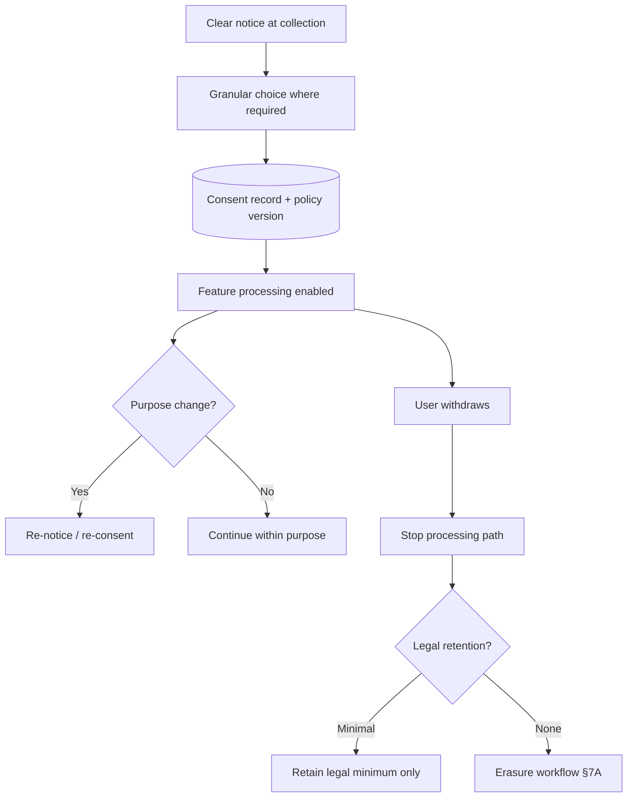

# Consent and Purpose Limitation

Data classification — [§7](07-pii-and-data-classification.md) — tells you **how sensitive** a field is. **Consent and purpose limitation** tell you **whether you may process it at all**, for which features, and for how long — before DSAR(Data Subject Access Request) export or erasure — [§7A](07A-erasure-and-dsar.md).

> **Scope:** Consent capture, withdrawal, purpose binding, and processing gates beyond one-off DSAR fulfillment. Classification → [§7](07-pii-and-data-classification.md). Erasure fan-out → [§7A](07A-erasure-and-dsar.md).
>
> **Related:** [§7 PII and classification](07-pii-and-data-classification.md) · [§7A Erasure and DSAR](07A-erasure-and-dsar.md) · Audit evidence → [§6](06-audit-logging-and-retention.md) · Marketing / product analytics boundaries → [fullstack §7](../../fullstack-bff-and-clients/includes/07-auth-ux.md)

---

## At a glance

| Concern | Baseline |
|---------|----------|
| **Purpose** | Document legal basis per field/feature |
| **Consent** | Granular where required; provable record |
| **Withdrawal** | Stops processing within SLA(Service Level Agreement); not hidden |
| **Secondary use** | New purpose → new notice or consent |
| **Children / sensitive** | Higher bar; often opt-in only |
| **Evidence** | Who consented, what version, when, channel |

**Rule of thumb:** If you cannot explain **why** a field exists in one sentence tied to a user-visible feature, do not collect it.

---

## Consent lifecycle

| Event | System behavior |
|-------|-----------------|
| **Opt-in marketing** | No sends until consent flag true |
| **Withdraw analytics** | Disable IDs in pipelines; honor within hours |
| **Policy update material** | Re-prompt; block new processing until acknowledged |
| **Account delete** | Erasure — [§7A](07A-erasure-and-dsar.md) — plus consent record handling per legal |

---

## Purpose limitation in engineering

| Layer | Gate |
|-------|------|
| **API(Application Programming Interface)** | Reject writes without permitted purpose claim |
| **BFF(Backend for Frontend)** | UI only shows controls for consented scopes |
| **Batch / ML(Machine Learning)** | Training sets exclude withdrawn subjects |
| **Partners** | DPAs(Data Processing Agreements) mirror purpose lists |
| **Logs** | No repurposing access logs for profiling without basis |

Store **consent version IDs**, not full policy PDFs, in the transactional record. Link to immutable policy archive for audits — [§10](10-compliance-evidence.md).

---

## Withdrawal vs erasure

| Action | Effect |
|--------|--------|
| **Withdraw consent (marketing)** | Stop campaigns; keep account |
| **Object to profiling** | Disable automated decision paths |
| **Erasure** | Full fan-out delete — [§7A](07A-erasure-and-dsar.md) |
| **Legal hold** | Pause erasure; document scope |

Withdrawal must be **as easy as opt-in** — dark patterns fail regulatory review and erode trust.

---

## Operational checklist

- [ ] Personal-data map includes purpose and legal basis per field — [§7](07-pii-and-data-classification.md)
- [ ] Consent records immutable with policy version
- [ ] Withdrawal propagates to email, push, warehouse, and partners within SLA
- [ ] New features checked for purpose creep before launch
- [ ] DSAR export includes consent history — [§7A](07A-erasure-and-dsar.md)

---

## Common mistakes

| Mistake | Fix |
|---------|-----|
| Bundled “accept all” for unrelated purposes | Granular toggles |
| Consent stored only in analytics vendor | Authoritative store in your OLTP(Online Transaction Processing) |
| Withdrawal does not stop batch jobs | Event-driven pipeline suppression |
| Reusing support tickets for marketing | Separate purpose and consent |
| No record of policy version | Version ID + timestamp on consent |
| Erasure deletes consent proof too early | Retain minimal legal record per counsel |
