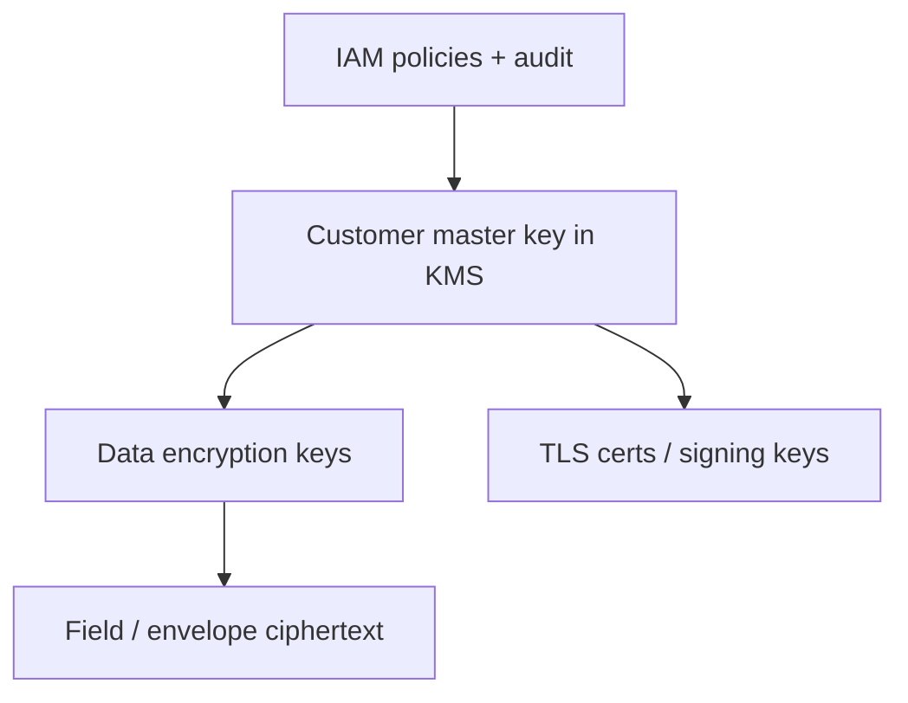

# Encryption Policy

> **Related:** TLS(Transport Layer Security) to databases → [database-connection §2](../../database-connection-and-security/includes/02-prod-db-security.md) · App secrets / key material → [§5](05-secrets-beyond-database.md) · PII(Personally Identifiable Information) classes → [§7](07-pii-and-data-classification.md) · Evidence → [§10](10-compliance-evidence.md)

## At a glance

| Layer | Baseline expectation |
|-------|----------------------|
| **In transit** | TLS 1.2+ everywhere external; prefer mTLS(Mutual Transport Layer Security) or mesh auth internal for sensitive paths |
| **At rest (disks/backups)** | Cloud provider encryption on by default; verify backups included |
| **Application-level** | Field encryption for restricted PII(Personally Identifiable Information) / secrets when disk crypto is not enough |
| **Keys** | KMS(Key Management Service)/HSM(Hardware Security Module); app never stores master keys in config |
| **Algorithms** | Modern vetted suites only; no homegrown crypto |

**Rule of thumb:** Prefer **platform TLS + disk encryption**; add **field encryption** when operators of the DB should not read plaintext.

## Key hierarchy

| Key type | Owner | Rotation |
|----------|-------|----------|
| Cloud CMK | Security / platform | Annual or on personnel change; automatic versioning |
| DEKs | App via KMS APIs | Frequent; re-encrypt on rotate when required |
| JWT(JSON Web Token) signing | Identity service | Versioned keys; overlap for verify |
| Partner HMAC(Hash-based Message Authentication Code) | Integrating team | Dual-secret rotate → [§5](05-secrets-beyond-database.md) |

## In transit

| Path | Policy |
|------|--------|
| Browser → edge | HTTPS only; HSTS |
| Edge → service | TLS; internal certs or mesh |
| Service → DB | `verify-full` where supported → [database-connection](../../database-connection-and-security/README.md) |
| Service → third party | TLS; pin or standard WebPKI; timeouts |
| Async webhooks outbound | TLS; validate certs; no insecure skip flags in prod |

## At rest and field crypto

| Approach | Use when |
|----------|----------|
| Volume / managed disk encryption | Default for all datastores |
| Backup encryption | Always; test restore still works |
| Column / field encryption | Restricted PII, tokens, secrets at rest |
| Client-side encryption | Rare; high complexity — only with clear threat model |

Field encryption costs: loss of naive search/sort, key-access latency, careful migration. Document searchable tokens (HMAC blind indexes) only with threat-model buy-in.

## Forbidden / deprecate

| Avoid | Prefer |
|-------|--------|
| MD5/SHA1 for security | SHA-256+ or password KDF (Argon2/bcrypt) for passwords |
| ECB mode, static IVs | AEAD (AES-GCM, ChaCha20-Poly1305) |
| Rolling your own protocol | Libraries + KMS |
| Disabling cert verify in prod | Fix trust store |

## Evidence to keep

- KMS key policies and rotation records
- TLS config baselines (edge + service mesh)
- Ticket proving backup encryption + restore drill

## Common mistakes

| Mistake | Fix |
|---------|-----|
| “Encrypted at rest” checkbox without backup check | Include snapshots and exports |
| App-level crypto with key in the same DB row | Keys in KMS; ciphertext only in DB |
| Same TLS skip-verify flag from staging to prod | Separate configs; fail closed in prod |
| Encrypting everything equally | Classify first ([§7](07-pii-and-data-classification.md)); focus restricted data |
| No plan for crypto-shredding | Erasure via key delete where designed |