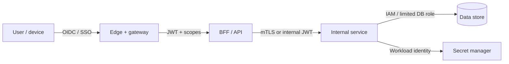

# Zero Trust and Least Privilege

> **Related:** API(Application Programming Interface) identity → [api-design §12](../../api-design-and-protection/includes/12-identity-rbac-iam-ad.md) · Auth protocols → [api-design §4](../../api-design-and-protection/includes/04-auth-model.md) · DB least privilege → [database-connection §2](../../database-connection-and-security/includes/02-prod-db-security.md) · Secrets → [§5](05-secrets-beyond-database.md)

## At a glance

| Principle | Engineering meaning |
|-----------|---------------------|
| **Never trust network location alone** | VPN ≠ authorization; still AuthN/AuthZ every hop |
| **Verify explicitly** | Strong identity for users and workloads |
| **Least privilege** | Minimal roles, scopes, and network paths |
| **Assume breach** | Segment; short credentials; detect lateral movement |
| **Continuous evaluation** | Session risk, device posture where available |

**Rule of thumb:** Private network is a **latency and abuse reducer**, not a substitute for identity.

## Trust zones with explicit identity

| Hop | Identity | Authorization |
|-----|----------|---------------|
| Human → app | OIDC(OpenID Connect)/SSO + MFA(Multi-Factor Authentication) for privileged | RBAC(Role-Based Access Control) / claims |
| App → API | Session or token | Scopes + object checks |
| Service → service | mTLS(Mutual Transport Layer Security) or signed internal JWT(JSON Web Token) | Allowlisted callers + method AuthZ |
| Service → data | IAM(Identity and Access Management) role or scoped DB user | Table/column minimum |

## Least privilege playbook

| Surface | Practice |
|---------|----------|
| Cloud IAM | Role per service; no `*admin` on app roles |
| Kubernetes | Separate service accounts; no cluster-admin for apps |
| DB | One role per service; read replica role for readers |
| Secrets | Path-scoped policies; env separation |
| Human prod access | JIT / break-glass with ticket; not standing admin |
| Partner APIs | Scoped keys; per-tenant isolation → [api-design §16](../../api-design-and-protection/includes/16-multi-tenant-apis.md) |

## Segmentation

| Control | Purpose |
|---------|---------|
| Network policies / security groups | Limit blast radius after compromise |
| Admin plane separate from product plane | Protect identity and CI(Continuous Integration) |
| Egress allowlists | Reduce SSRF(Server-Side Request Forgery) and exfil |
| Environment isolation | Prod credentials never in lower envs |

## Access reviews

Quarterly (or per compliance cadence):

1. List human roles with prod data access
2. List service identities and their secret/IAM grants
3. Remove unused; confirm owners
4. Store export as evidence → [§10](10-compliance-evidence.md)

## Pros and cons

| Pros | Cons |
|------|------|
| Clear attribution and smaller blast radius | More identity plumbing |
| Better auditor story than “flat VPC trust” | Misconfigured mesh/JWT is painful |
| Aligns with SaaS multi-tenant reality | Requires platform investment |

## Common mistakes

| Mistake | Fix |
|---------|-----|
| Flat “prod VPC = trusted” | Identity on every service call |
| Shared service account for all microservices | One identity per workload |
| Standing broad human admin | JIT + audit |
| Long-lived static machine keys | Workload identity + short TTL |
| RBAC only at gateway, not object level | App AuthZ still required |