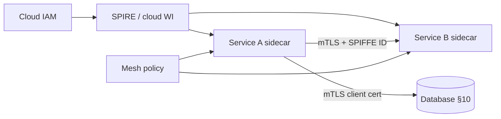

# Workload Identity and mTLS

Zero-trust baseline — [§9](09-zero-trust-least-privilege.md) — requires **strong identity for workloads**, not just humans. SPIFFE(Secure Production Identity Framework for Everyone) IDs, service mesh mTLS(Mutual Transport Layer Security), and cloud workload identity replace “private network = trusted” for service-to-service hops.

> **Scope:** Workload identity issuance, mesh mTLS, and operational rotation. Zero-trust principles → [§9](09-zero-trust-least-privilege.md). Mesh topology → [resilience §11A](../../resilience-patterns/includes/11A-service-mesh-topology.md). Database mTLS → [database-connection §10](../../database-connection-and-security/includes/10-mtls-client-certs.md).
>
> **Related:** [§9 Zero trust](09-zero-trust-least-privilege.md) · [resilience §11A Service mesh](../../resilience-patterns/includes/11A-service-mesh-topology.md) · [database §10 mTLS client certs](../../database-connection-and-security/includes/10-mtls-client-certs.md) · API(Application Programming Interface) auth models → [api-design §4](../../api-design-and-protection/includes/04-auth-model.md)

---

## At a glance

| Concern | Default |
|---------|---------|
| **Identity format** | SPIFFE ID (`spiffe://trust/domain/service`) or cloud WI equivalent |
| **Transport** | mTLS between services; TLS(Transport Layer Security) 1.2+ to data stores |
| **Issuance** | Short-lived certs (minutes–hours); automated rotation |
| **Authorization** | Identity ≠ permission; still RBAC(Role-Based Access Control) / scopes |
| **Mesh vs app** | Mesh owns hop crypto; app owns business AuthZ(Authorization) |
| **Egress** | Egress gateway for external calls — [§11A](../../resilience-patterns/includes/11A-service-mesh-topology.md) |

**Rule of thumb:** mTLS proves **which workload connected**; your service still decides **what it may do**.

---

## Identity and mesh path

| Hop | Identity | Notes |
|-----|----------|-------|
| Service → service | SPIFFE SVID(SPIFFE Verifiable Identity Document) via mesh | Uniform across languages — [§11A](../../resilience-patterns/includes/11A-service-mesh-topology.md) |
| Service → DB | Client cert or IAM(Identity and Access Management) DB auth | [database §10](../../database-connection-and-security/includes/10-mtls-client-certs.md) |
| Service → SaaS(Software as a Service) | OAuth(Open Authorization) client creds or egress policy | Not replaced by mesh alone |

---

## SPIFFE / SPIRE operations

| Task | Practice |
|------|----------|
| **Trust domain** | One per env; prod trust domain isolated |
| **Registration** | Node and workload attestation; no long-lived bootstrap secrets |
| **Rotation** | Automatic; monitor cert expiry alerts as backup |
| **Revocation** | Compromised node → drain + re-attest |
| **Multi-cluster** | Federated trust domains only with explicit ARB(Architecture Review Board) review |

Prefer **cloud-native workload identity** (GKE/AWS/Azure WI) when fully managed; adopt SPIRE when multi-cloud or on-prem uniformity matters.

---

## mTLS policy placement

Depth in [resilience §11A](../../resilience-patterns/includes/11A-service-mesh-topology.md):

| Owner | Responsibility |
|-------|----------------|
| **Mesh** | Encrypt, identity, default deny, outlier detection |
| **Gateway** | WAF(Web Application Firewall), public AuthN(Authentication), coarse rate limits |
| **Application** | Deadlines, idempotent retries, object-level AuthZ |
| **Platform** | CA rotation, policy GitOps(Git Operations) |

Database mTLS adds **connection binding** — stolen passwords from wrong hosts fail even inside the VPC(Virtual Private Cloud).

---

## Operational checklist

- [ ] Every internal RPC(Remote Procedure Call) hop has workload identity or mTLS
- [ ] Cert expiry monitored; rotation runbook tested quarterly
- [ ] Default-deny mesh policy; explicit allow lists per service pair
- [ ] DB connections use verify-full + client identity where supported — [§10](../../database-connection-and-security/includes/10-mtls-client-certs.md)
- [ ] Break-glass human access separate from workload creds — [§9](09-zero-trust-least-privilege.md)

---

## Common mistakes

| Mistake | Fix |
|---------|-----|
| mTLS without service-level AuthZ | Check SPIFFE ID + scopes in app |
| Shared cert for all services | Per-workload identity |
| Mesh retries on non-idempotent POST | App retry policy — [§11A](../../resilience-patterns/includes/11A-service-mesh-topology.md) |
| Long-lived bootstrap tokens on nodes | Attested issuance only |
| DB password only inside “private” network | mTLS or IAM DB auth — [§10](../../database-connection-and-security/includes/10-mtls-client-certs.md) |
| Identity sprawl across clouds | Standard SPIFFE or single WI pattern |
