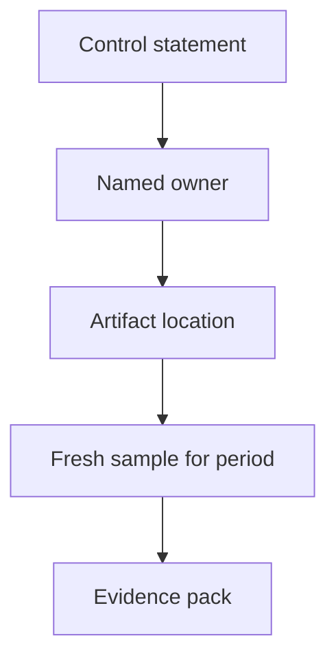

# Compliance Evidence

> **Related:** Secure SDLC(Software Development Life Cycle) → [§1](01-secure-sdlc.md) · Audit logs → [§6](06-audit-logging-and-retention.md) · Encryption → [§8](08-encryption-policy.md) · Access reviews → [§9](09-zero-trust-least-privilege.md) · Threat process → [§2](02-threat-modeling-process.md)

## At a glance

| SOC 2–style theme | Engineering evidence (examples) |
|-------------------|----------------------------------|
| **Change management** | PR links, required reviews, deploy tickets, GitOps(Git Operations) history |
| **Access control** | IAM(Identity and Access Management) exports, SSO configs, quarterly access review sheets |
| **Encryption** | KMS(Key Management Service) policies, TLS(Transport Layer Security) baselines, backup encryption proof |
| **Monitoring** | Alert definitions, on-call rotations, incident tickets with timelines |
| **Vendor / supply chain** | SBOM(Software Bill of Materials) samples, SCA(Software Composition Analysis) policy, signed deploy admissions |
| **Risk / vuln** | Threat model register, pen-test report + remediations, CVE SLA(Service Level Agreement) metrics |

**Rule of thumb:** Auditors trust **systems of record** (git, CI(Continuous Integration), IdP, cloud audit) more than slide decks.

## Control → evidence map

| Control ID (example) | Statement | Artifact | Owner |
|----------------------|-----------|----------|-------|
| CM-1 | Prod changes peer-reviewed | Branch protection + PR | Platform |
| CM-2 | Prod deploys traceable to commit | Deploy system + git SHA | Platform |
| AC-1 | MFA(Multi-Factor Authentication) on SSO | IdP policy screenshot + API(Application Programming Interface) export | IT/Sec |
| AC-2 | Least-privilege cloud roles | IAM report + review ticket | Security |
| LO-1 | Security events retained N days | Log config + sample query | SRE(Site Reliability Engineering) |
| VU-1 | Critical vulns patched in SLA | SCA dashboard + tickets | Eng managers |

Replace example IDs with your auditor’s catalogue; keep the **mapping habit**.

## Evidence pack hygiene

| Practice | Why |
|----------|-----|
| Date-stamp samples in the audit window | Stale screenshots fail |
| Prefer export/API over snip tools | Reproducible |
| Store packs in restricted drive | Evidence often contains sensitive paths |
| Link tickets for exceptions | Show compensating controls |
| Rehearse once before audit week | Find broken links early |

## What engineers should prepare (not legal)

Engineering owns **technical truth**:

- CI job names that enforce SAST(Static Application Security Testing)/SCA/secret scan
- How to pull “who deployed service X on date Y”
- How to show encryption and backup settings
- How to show access review completion

Legal/security owns **trust services criteria wording** and customer contracts. Collaborate; don’t freestyle legal claims in READMEs.

## Continuous vs point-in-time

| Prefer continuous | Point-in-time OK |
|-------------------|------------------|
| Branch protection, CI gates | Annual pen test letter |
| Automated access reviews | Board risk acceptance notes |
| Immutable deploy history | Architecture overview deck |

## Common mistakes

| Mistake | Fix |
|---------|-----|
| Wiki policy with no running control | Map each sentence to CI/IdP/cloud |
| Screenshots of staging as prod evidence | Label env; sample prod configs |
| One hero engineer “has all the PDFs” | Shared pack + owners per control |
| Ignoring exceptions | Track expiry and compensating control |
| Promising controls you don’t run | Align sales/security questionnaires with §1–§9 reality |