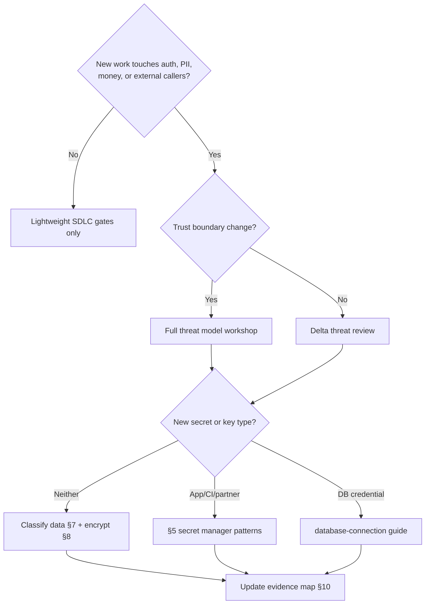

# Decision Guide

> **Related:** Overview → [§0](00-overview.md) · Threat process vs API(Application Programming Interface) catalogue → [§2](02-threat-modeling-process.md) · Secrets scope → [§5](05-secrets-beyond-database.md) · Evidence → [§10](10-compliance-evidence.md)

## Decision flow

## Choose depth

| Situation | Do this |
|-----------|---------|
| Internal CRUD behind SSO(Single Sign-On), no new PII(Personally Identifiable Information) | §1 gates; skip heavy threat workshop |
| First public API or partner webhook | §2 full model + [api-design §6](../../api-design-and-protection/includes/06-threat-model.md) |
| Customer questionnaire / SOC 2 year | §10 map + freshen §6–§9 artifacts |
| CVE in transitive dep | §4 SBOM(Software Bill of Materials) inventory → patch → redeploy |
| “Where do we put the Stripe key?” | §5 — not the DB vault chapter |
| Browser session cookies | [fullstack §7](../../fullstack-bff-and-clients/includes/07-auth-ux.md) + [auth §4](../../auth-oauth-oidc-and-login-security/includes/04-cookie-session-and-csrf.md) + §3 CSRF(Cross-Site Request Forgery) |
| OAuth(Open Authorization)/OIDC(OpenID Connect) / password login | [auth-oauth-oidc-and-login-security](../../auth-oauth-oidc-and-login-security/README.md) |

## Control minimums by product stage

| Stage | Minimum bar |
|-------|-------------|
| **MVP / trusted beta** | HTTPS, AuthN(Authentication), basic AuthZ(Authorization), secret manager, dependency scan, audit on admin actions |
| **General availability** | Threat model on public surfaces, SCA(Software Composition Analysis) fail gates, retention policy, access reviews |
| **Enterprise sales** | Evidence packs, SBOM on request, DPA-ready subprocessors list, pen test cadence |

## Pros and cons — central security platform vs team-local

| Approach | Pros | Cons |
|----------|------|------|
| **Platform-owned scanners + policies** | Consistent evidence; less reinventing | Can block teams; needs exception UX |
| **Team-local tools** | Fast iteration | Drift; weak auditor story |
| **Hybrid** (platform baseline + team threat models) | Best default | Requires clear RACI(Responsible, Accountable, Consulted, Informed) |

## When to escalate to security engineering

- Novel cryptography or custom SSO
- Multi-tenant isolation redesign
- Breakthrough pen-test findings
- Material change to encryption or key custody
- Customer requires custom control reports beyond §10 pack

## Common mistakes

| Mistake | Fix |
|---------|-----|
| Buying a GRC tool before CI(Continuous Integration) gates exist | Implement §1 and §6 first |
| Treating api-design threat tables as org process | Use §2 for process |
| One shared “security epic” forever | Per-control owners in §10 |
| Accepting risk silently | Ticket + expiry + compensating control |
| Over-modeling every story | Trigger table in §2 |

## Quick reference — which guide?

| Question | Guide |
|----------|-------|
| API BOLA(Broken Object-Level Authorization) / rate abuse / gateway AuthN | [api-design-and-protection](../../api-design-and-protection/README.md) |
| Postgres credentials / RDS IAM(Identity and Access Management) | [database-connection-and-security](../../database-connection-and-security/README.md) |
| SBOM, SDLC(Software Development Life Cycle), PII policy, SOC evidence | This guide |
| Cookie CSRF, BFF(Backend for Frontend) secrets leakage | [fullstack-bff-and-clients](../../fullstack-bff-and-clients/README.md) |