# Event Sourcing & CQRS Guide (Full)

> Combined view of all sections. Modular sources live in `includes/`.

---

# Overview — Event Sourcing & CQRS(Command Query Responsibility Segregation)

**Event Sourcing** persists state as an **append-only sequence of domain events** instead of updating rows in place. **CQRS** (Command Query Responsibility Segregation) splits **writes** (commands → event store) from **reads** (queries → optimized projections). The two patterns are often used together but are independent.

> **Related:** [API design & protection](../api-design-and-protection/README.md) (HTTP(Hypertext Transfer Protocol) contracts, async, audit) · [PostgreSQL performance](../postgresql-performance/README.md) (event table indexing) · [Async patterns](../api-design-and-protection/includes/10-async-patterns.md) (outbox, queues) · Decision guide → [§6](06-decision-guide.md)

---

## CRUD vs Event Sourcing

| | **CRUD (state-based)** | **Event Sourcing (event-based)** |
|--|------------------------|----------------------------------|
| **Source of truth** | Current row/document | Append-only event log |
| **Write model** | `UPDATE orders SET status = 'shipped'` | Append `OrderShipped` event |
| **Current state** | Stored directly | Replayed or projected from events |
| **History** | Lost unless separate audit table | Built-in |
| **Queries** | Simple SQL(Structured Query Language) on current tables | Often need read models / projections |

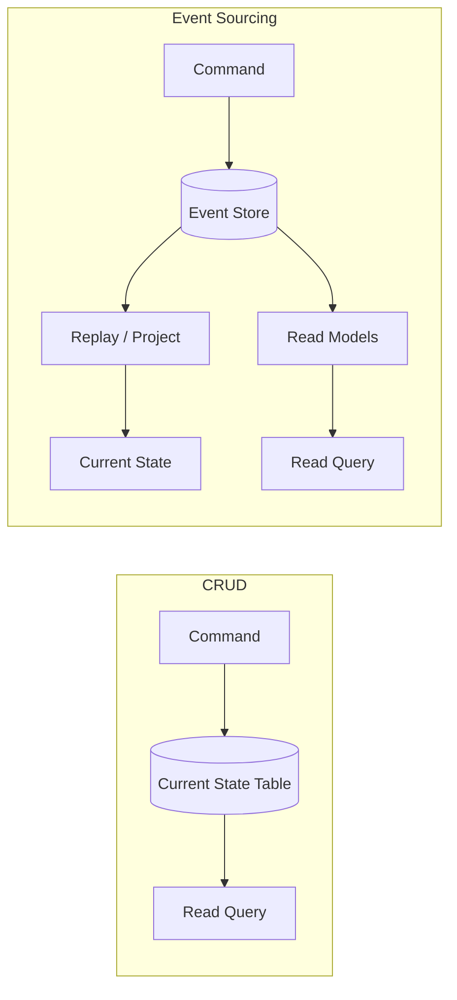

---

## Core vocabulary

| Term | Meaning |
|------|---------|
| **Event** | Immutable fact in past tense: `OrderPlaced`, `PaymentReceived` |
| **Event store** | Append-only log; one stream per aggregate instance |
| **Aggregate** | Consistency boundary; all events for one entity share a stream ID |
| **Command** | Intent to change state; validated against rebuilt aggregate |
| **Projection / read model** | Denormalized view built from events for fast queries |
| **Snapshot** | Saved aggregate state at a version — avoids replaying thousands of events |
| **Upcasting** | Transform old event schema to new when loading |

---

## When teams reach for this

| Signal | Why ES/CQRS helps |
|--------|-------------------|
| Audit trail is a product requirement | Events are the audit log |
| "What was the balance on March 1?" | Temporal replay |
| Same data, many read shapes (UI, search, BI) | Multiple projections from one stream |
| Complex domain lifecycles (orders, payments) | Explicit domain events match business language |
| Event-driven microservices | Natural integration boundary |

---

## Document map

| # | Topic | File |
|---|-------|------|
| 1 | Core concepts — aggregates, streams, replay | [01-core-concepts.md](01-core-concepts.md) |
| 2 | CQRS and read models | [02-cqrs-and-read-models.md](02-cqrs-and-read-models.md) |
| 3 | Storage, snapshots, projections | [03-storage-and-projections.md](03-storage-and-projections.md) |
| 4 | API(Application Programming Interface) design implications | [04-api-design-implications.md](04-api-design-implications.md) |
| 5 | Async integration — outbox, bus, consumers | [05-async-integration.md](05-async-integration.md) |
| 6 | Decision guide — pros, cons, when to use | [06-decision-guide.md](06-decision-guide.md) |

---

## Default recommendation

| Situation | Start with |
|-----------|------------|
| Most teams learning the pattern | **PostgreSQL event table** + one SQL read model |
| Rich DDD + .NET/Java ecosystem | **EventStoreDB** or **Marten** |
| High fan-out to many services | Event store + **Kafka** (via transactional outbox) |
| Simple CRUD app, no audit need | **CRUD** — do not adopt ES for fashion |

See [Decision guide](06-decision-guide.md) for full flows and trade-offs.

## Common mistakes

| Mistake | Fix |
|---------|-----|
| Adopt ES for a simple CRUD app | Start with CRUD + optional audit log |
| Skip CQRS planning on read APIs | Design projections before launch |
| Treat the message bus as source of truth | Event store is authoritative; bus is a copy |
| One giant aggregate stream | Small aggregates; one stream per instance |
| Ignore GDPR/PII on immutable events | Plan tombstones or crypto-shredding early |

---

# Core Concepts

How event-sourced systems model state, handle commands, and rebuild aggregates from an append-only log.

> **Related:** Storage choices → [Storage & projections](03-storage-and-projections.md) · API(Application Programming Interface) surface → [API design implications](04-api-design-implications.md)

---

## What it is

In Event Sourcing, **every state change is recorded as a new event**. The event store is the system of record. Current state is **derived** — either by replaying events in memory (write path) or by maintaining projections (read path).

**Rule of thumb:** Events describe **what happened** (`OrderCancelled`), not **what to do** (`CancelOrder`). Commands express intent; events record facts after business rules pass.

---

## Write path — command to event

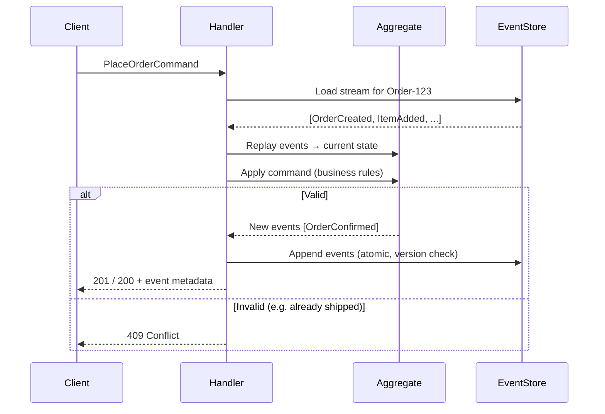

### Steps

1. **Load** all events for the aggregate ID (optionally from snapshot + tail events).
2. **Replay** events to rebuild in-memory state.
3. **Validate** the command against current state.
4. **Append** new events with expected-version check (optimistic concurrency).
5. **Publish** to projectors or outbox (same transaction when possible).

---

## Rebuilding state from events

Example: bank account `Account-42`

| Version | Event | Derived balance |
|--------:|-------|-----------------|
| 1 | `AccountOpened(initial: 1000)` | 1000 |
| 2 | `MoneyWithdrawn(200)` | 800 |
| 3 | `MoneyDeposited(50)` | 850 |
| 4 | `MoneyWithdrawn(100)` | 750 |

There is no authoritative `balance` column — only events. A snapshot at version 3 might store `{ balance: 850 }` so replay starts from event 4.

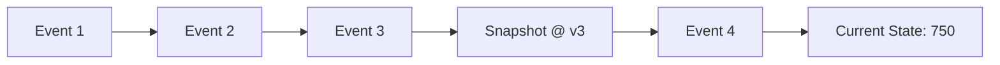

---

## Aggregates and streams

An **aggregate** is the consistency boundary:

- One **stream ID** per aggregate instance (e.g. `order-123`, not all orders).
- Commands target **one aggregate** per transaction.
- Cross-aggregate rules use **sagas** or **process managers** (async), not one giant transaction — see [Sagas and distributed workflows](07-sagas-and-distributed-workflows.md).

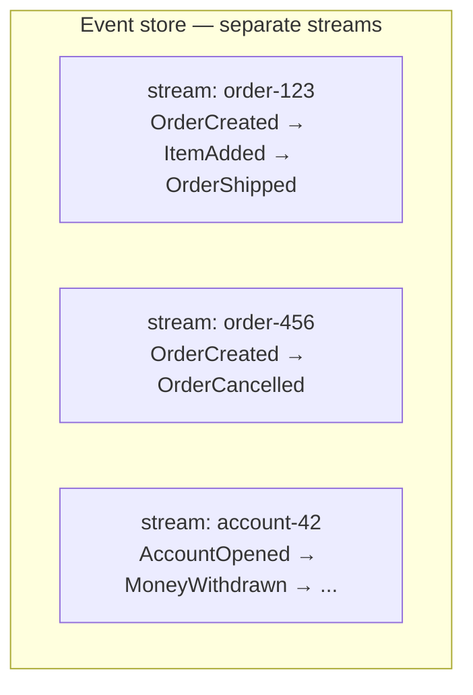

| Design rule | Why |
|-------------|-----|
| Small aggregates | Fewer events to replay; clearer invariants |
| One command → one aggregate | Keeps transactions simple |
| Events are past tense | They are facts, not instructions |
| Include metadata | `event_id`, `aggregate_id`, `version`, `timestamp`, `correlation_id`, `causation_id` |

---

## Optimistic concurrency

Append fails if another writer incremented the version first:

```sql
INSERT INTO events (aggregate_id, version, event_type, payload)
VALUES ('order-123', 5, 'OrderShipped', '...')
-- UNIQUE (aggregate_id, version) → conflict → return 409 to client
```

Maps naturally to HTTP(Hypertext Transfer Protocol) **`409 Conflict`** and `ETag` / `If-Match` on command APIs — see [API design implications](04-api-design-implications.md).

---

## Immutability and corrections

Events are **never updated or deleted** in the normal model.

| Need | Approach |
|------|----------|
| Bug in past event schema | **Upcast** on read — [§8 Event schema evolution](08-event-schema-evolution.md) |
| Business mistake | Append **compensating event** (`PaymentRefunded`), not DELETE |
| GDPR / right to erasure | Tombstone events, crypto-shredding, or legal retention policy — plan early |

---

## Event Sourcing vs Event-Driven Architecture

| | Event Sourcing | Event-Driven (EDA) |
|--|----------------|---------------------|
| **Goal** | Persist state as events | Communicate via messages |
| **Source of truth** | Event log | Often still CRUD DB per service |
| **Overlap** | ES systems usually publish events; not all EDA uses ES |

You can emit domain events from CRUD without Event Sourcing. Event Sourcing means the log **is** the authority.

---

## Pros of the core model

- Complete, ordered history per aggregate
- Debugging: reproduce exact sequence that led to a bug
- Business language in code (`OrderShipped` vs generic UPDATE)
- Natural audit for compliance

## Cons

- Replay cost grows with stream length — snapshots required
- Mental model shift from CRUD
- Cross-aggregate invariants need async coordination
- Schema evolution is ongoing work (upcasting)

See [Decision guide](06-decision-guide.md) for when the trade-off is worth it.

## Common mistakes

| Mistake | Fix |
|---------|-----|
| Events as commands (`CancelOrder` not `OrderCancelled`) | Past-tense facts only |
| One stream for all entities of a type | One stream ID per aggregate instance |
| Cross-aggregate rules in one transaction | [Sagas / process managers async](07-sagas-and-distributed-workflows.md) |
| Delete or UPDATE events in place | Compensating events + upcasting |
| Skip expected-version check on append | `UNIQUE (aggregate_id, version)` → `409` |
| Replay without snapshots on long streams | Snapshot every N events |

---

# CQRS(Command Query Responsibility Segregation) and Read Models

**CQRS** separates the **write model** (commands, aggregates, event store) from **read models** (queries optimized for specific screens or reports). Event Sourcing often pairs with CQRS because replaying the full log on every HTTP(Hypertext Transfer Protocol) GET does not scale.

> **Related:** Storage → [Storage & projections](03-storage-and-projections.md) · HTTP split → [API design implications](04-api-design-implications.md)

---

## What it is

| Side | Responsibility | Typical storage |
|------|----------------|-----------------|
| **Command side** | Validate, append events, enforce invariants | Event store |
| **Query side** | Serve reads from denormalized views | PostgreSQL, Elasticsearch, Redis, warehouse |

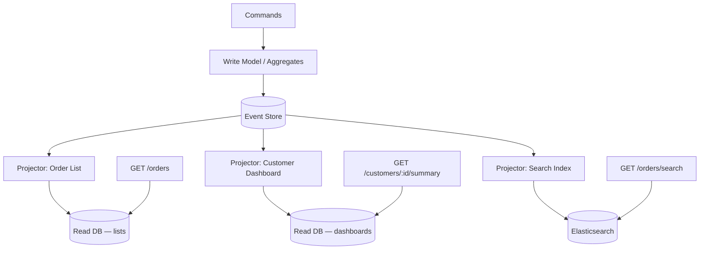

**Rule of thumb:** Writes go through the aggregate + event store. Reads hit projections unless you explicitly need point-in-time replay (support, audit API(Application Programming Interface)).

---

## Projectors

A **projector** (or **event handler**) consumes events and updates read models:

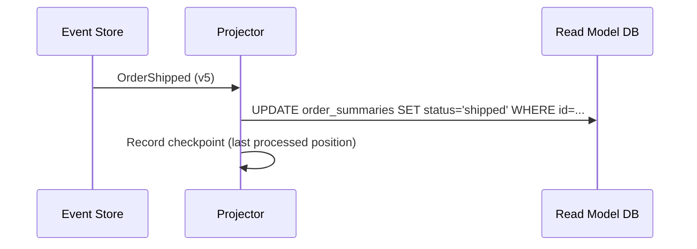

| Projector property | Why it matters |
|--------------------|----------------|
| **Idempotent** | At-least-once delivery may replay events |
| **Checkpointed** | Resume after crash without full rebuild |
| **Rebuildable** | Drop read DB and replay from event store |
| **Single-writer per projection** | Avoid race on same row |

---

## Eventual consistency

Read models lag behind writes by milliseconds to seconds (or longer under load). This is **eventual consistency by design** — the write model (event store) is strongly consistent; projections are not. See [Strong consistency — promises and costs](../postgresql-performance/includes/14-consistency-promises-and-costs.md) for the general trade-offs and when that lag is unacceptable.

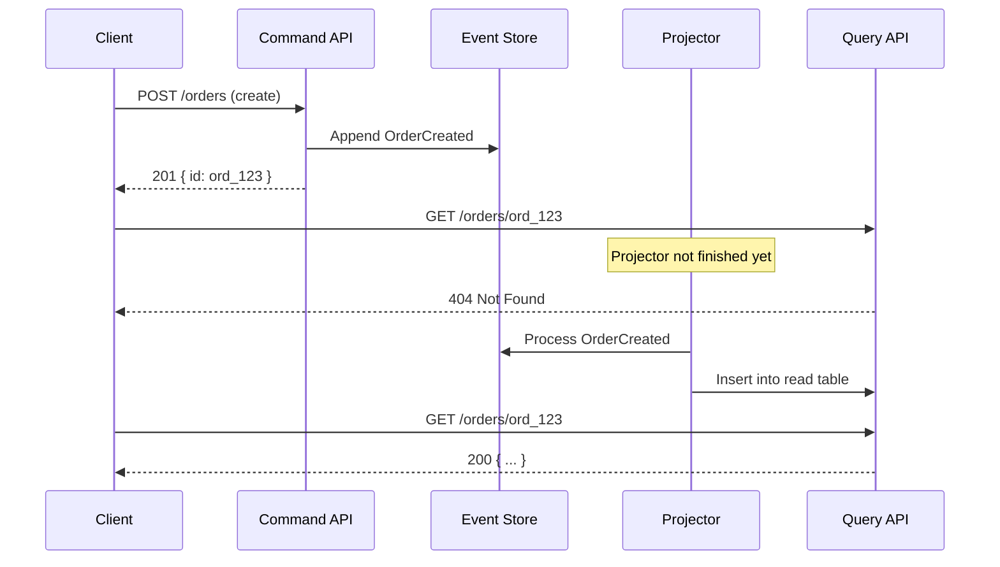

### API strategies for stale reads

| Strategy | When to use |
|----------|-------------|
| **Accept lag** | List views, dashboards — document SLA |
| **`202` + poll** | Client must see own write immediately — reuse [async job pattern](../api-design-and-protection/includes/10-async-patterns.md) |
| **Read-your-writes** | Route recent IDs to write-side or sync projector for that aggregate |
| **`409` + retry** | Command conflicts — client refreshes and retries |

Document consistency in OpenAPI: `"Read model may lag up to N seconds after write."`

---

## Multiple projections from one stream

Same events, different shapes:

| Projection | Built from | Serves |
|------------|------------|--------|
| `order_summaries` | All order events | `GET /orders` list |
| `order_timeline` | All order events | `GET /orders/:id/history` |
| `customer_order_counts` | OrderCreated, OrderCancelled | Analytics |
| Search index | OrderCreated, ItemAdded | Full-text search |

Adding a new read model = new projector + replay — **no migration of the write model**.

---

## CQRS without Event Sourcing

CQRS only means separate read/write paths:

- Write: normalized OLTP tables
- Read: materialized views or replica

Event Sourcing is optional. Many teams use **CQRS-lite** (read replicas + caches) without an event store.

---

## Pros of CQRS + projections

- Read queries stay fast and simple (indexes, joins tuned per screen)
- Scale read and write tiers independently
- New views without changing write schema
- Clear boundary for caching and CDN(Content Delivery Network) on query APIs

## Cons

- Eventual consistency complicates UX and tests
- More moving parts (projectors, checkpoints, monitoring lag)
- Duplicate data — storage and sync logic
- "Which read model is truth?" confusion if not documented

See [Decision guide](06-decision-guide.md).

## Common mistakes

| Mistake | Fix |
|---------|-----|
| Query API reads event store on every GET | Dedicated read models / projections |
| Projector not idempotent | UPSERT by `event_id`; safe replays |
| No checkpoint on projectors | Record last processed position |
| Promise strong read-after-write on projections | Document lag; route hot reads to primary path |
| One projection trying to serve every screen | Separate projections per access pattern |
| Rebuild read model by hand-editing rows | Replay from event store |

---

# Storage and Projections

Where to persist events, how to schema the event store, and when to add snapshots and archival.

> **Related:** PostgreSQL tuning → [postgresql-performance](../postgresql-performance/README.md) · Outbox → [Async integration](05-async-integration.md)

---

## What to store where

| Store | Role | Source of truth? |
|-------|------|------------------|
| **Event store** | Append-only domain events | ✅ Yes |
| **Read model DB** | Query-optimized projections | No — rebuildable |
| **Snapshots** | Aggregate state at version N | No — optimization only |
| **Message bus** (Kafka, etc.) | Fan-out to consumers | No — copy of events |
| **Object storage** (S3) | Cold archive, large payloads | Archive only |

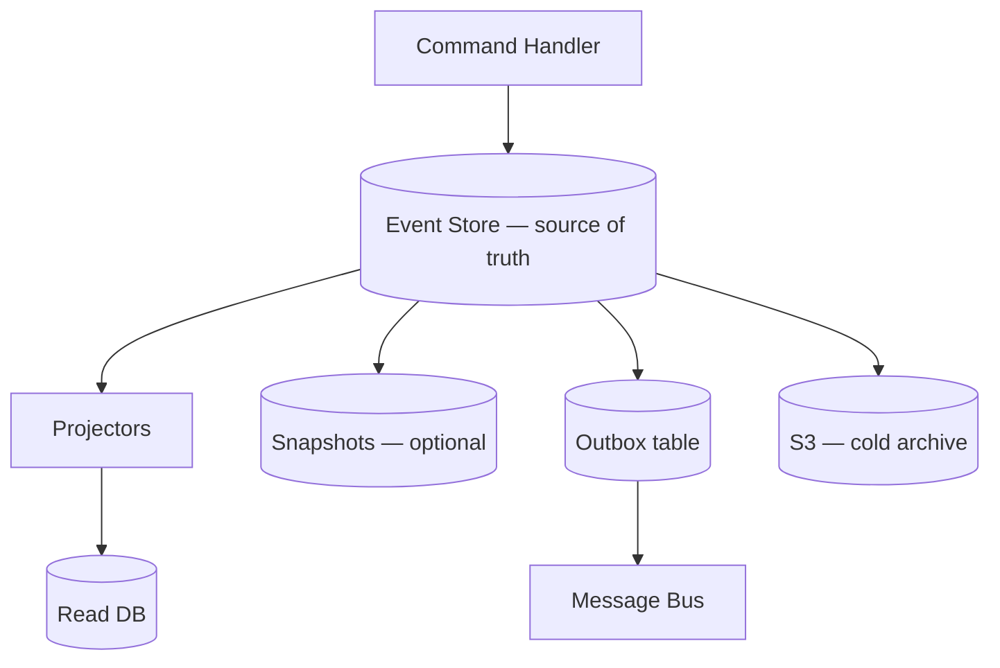

**Rule of thumb:** Append events once in the event store. Publish to the bus from an **outbox** in the same transaction — never dual-write store + bus independently.

---

## Storage options

| Option | Best for | Notes |
|--------|----------|-------|
| **PostgreSQL / MySQL** | Default for most teams | Familiar ops, ACID(Atomicity, Consistency, Isolation, Durability), one event table |
| **EventStoreDB** | ES-native features | Streams, subscriptions, competing consumers |
| **Marten** (.NET + PostgreSQL) | .NET DDD projects | Document + event storage on Postgres |
| **DynamoDB / Cosmos DB** | Serverless, partition by aggregate | PK = aggregate_id, SK = version |
| **Kafka** (as primary store) | Rare; high throughput | Retention, stream-per-key queries are awkward |
| **S3 + metadata DB** | Long retention, compliance | Hot path elsewhere; events archived after N days |

### Default: PostgreSQL event table

```sql
CREATE TABLE events (
    id              BIGSERIAL PRIMARY KEY,
    aggregate_id    TEXT NOT NULL,
    aggregate_type  TEXT NOT NULL,
    version         INT NOT NULL,
    event_type      TEXT NOT NULL,
    payload         JSONB NOT NULL,
    metadata        JSONB NOT NULL DEFAULT '{}',
    created_at      TIMESTAMPTZ NOT NULL DEFAULT now(),
    UNIQUE (aggregate_id, version)
);

CREATE INDEX idx_events_aggregate ON events (aggregate_id, version);
CREATE INDEX idx_events_type_time ON events (event_type, created_at);
```

| Column | Purpose |
|--------|---------|
| `aggregate_id` + `version` | Stream identity + optimistic concurrency |
| `event_type` | Deserialization / upcasting |
| `payload` | Domain data (versioned schema) |
| `metadata` | `correlation_id`, `causation_id`, `user_id`, trace |

For indexing and bulk replay performance, see [postgresql-performance](../postgresql-performance/README.md).

---

## Snapshots

When streams exceed ~hundreds or thousands of events, store periodic snapshots:

```sql
CREATE TABLE snapshots (
    aggregate_id   TEXT PRIMARY KEY,
    aggregate_type TEXT NOT NULL,
    version        INT NOT NULL,
    state          JSONB NOT NULL,
    created_at     TIMESTAMPTZ NOT NULL DEFAULT now()
);
```

Load path: snapshot at v500 + events 501..N → current state.

| Pros | Cons |
|------|------|
| Faster aggregate load | Snapshot schema must evolve with aggregate |
| Bounded replay time | Extra write on snapshot interval |
| | Wrong snapshot + missed events = corruption — test recovery |

---

## Read model storage

| Read need | Typical store |
|-----------|---------------|
| Lists, filters, joins | PostgreSQL / MySQL |
| Full-text search | Elasticsearch / OpenSearch |
| Hot dashboards | Redis (with Postgres backing) |
| Analytics / BI | Warehouse (BigQuery, Snowflake) via CDC(Change Data Capture) or projector |

Read tables can be dropped and rebuilt by replaying the event log — treat them as **cache with a rebuild script**.

---

## Retention and growth

Event logs grow forever unless you plan:

| Strategy | Use when |
|----------|----------|
| **Partition by time** | PostgreSQL monthly partitions on `created_at` |
| **Archive to S3** | Compliance requires 7+ years; hot store keeps recent window |
| **Snapshot + trim** | Rare; only closed aggregates, legal review required |

Never delete events from the authoritative store without explicit policy — projections depend on them.

---

## Snapshots — depth

### When to snapshot

| Stream length | Recommendation |
|---------------|----------------|
| &lt; 100 events | Optional — full replay is fast |
| 100–1,000 | Snapshot every N commands or on schedule |
| 1,000+ | **Required** — bound load latency |

**Interval heuristic:** snapshot when replay p99 &gt; your SLO(Service Level Objective) budget (e.g. &gt; 50ms), or every **M** events (often 100–500 for heavy aggregates).

### Snapshot write path

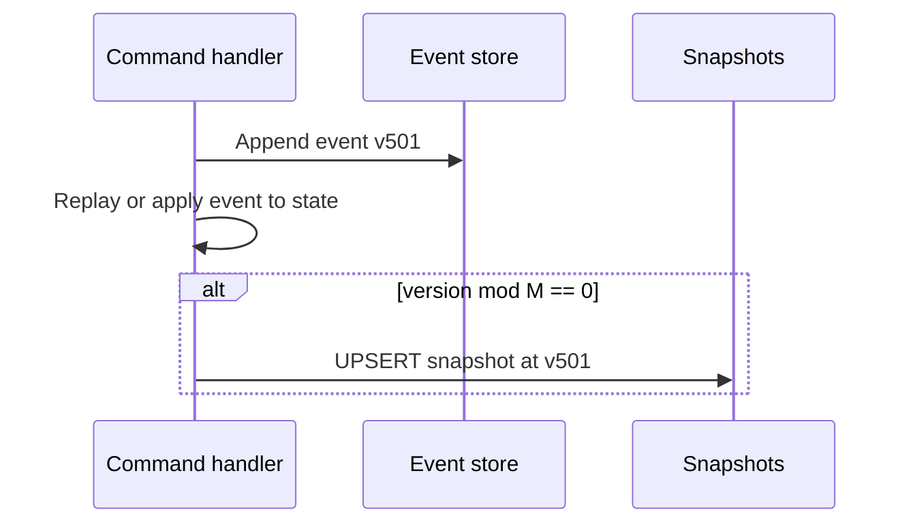

| Rule | Why |
|------|-----|
| Snapshot **after** successful append | Snapshot must not reference non-existent version |
| Same transaction optional | Some teams async snapshot job — tolerate brief lag |
| Version on snapshot row | Load: `WHERE version <= snapshot.version` tail only |

### Rebuild-from-scratch runbook

1. Stop projectors (or mark read models stale)
2. Truncate read model tables (not event store)
3. Replay all events from offset 0 (or per aggregate)
4. Compare row counts / checksums to pre-rebuild baseline
5. Re-enable projectors

Test on staging with production-sized stream **before** production incident.

### GDPR, erasure, and legal hold

| Requirement | Approach |
|-------------|----------|
| **Right to erasure** | Tombstone event + crypto-shred PII keys; legal review |
| **Legal hold** | No delete; archive only |
| **Retention policy** | Hot PG window + S3 archive; document in compliance |

Never hard-delete events without policy — use **tombstone events** and redacted projections.

Deploy projectors compatibly during rolling deploy → [deployment-strategies §12](../deployment-strategies/includes/12-schema-migrations-and-deploy.md).

---

## Decision flow — pick a store

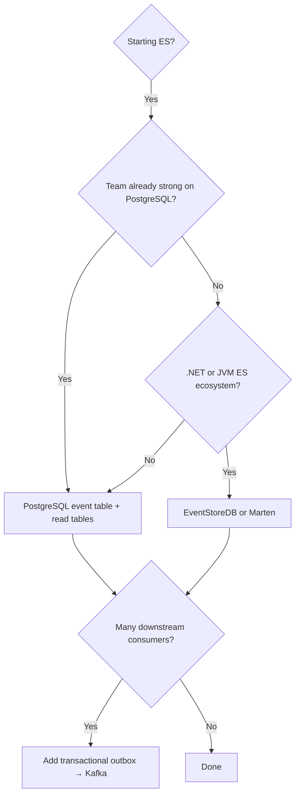

---

## Pros of PostgreSQL-first

- One ops stack, backups, monitoring
- ACID append + outbox in one transaction
- JSONB for flexible event payloads
- Easy local dev

## Cons

- Not optimized for infinite global event log at hyperscale
- Replay speed depends on indexing and hardware
- You build subscriptions/projectors yourself (or use a library)

See [Decision guide](06-decision-guide.md) for full trade-offs.

## Common mistakes

| Mistake | Fix |
|---------|-----|
| Dual-write event store + Kafka without outbox | Transactional outbox in same DB transaction |
| Kafka as primary event store | PostgreSQL (or ES-native DB) as source of truth |
| No index on `(aggregate_id, version)` | Required for stream load and concurrency |
| Snapshots treated as source of truth | Snapshots are optimization; events are authority |
| Skip archival plan for multi-year retention | Hot store + S3 cold archive |
| Full replay on every schema tweak | Upcast on read; version event payloads |

---

# API(Application Programming Interface) Design Implications

How Event Sourcing and CQRS(Command Query Responsibility Segregation) shape HTTP(Hypertext Transfer Protocol) APIs: command vs query routes, status codes, idempotency, and gateway routing.

> **Scope:** **ES/CQRS API lens** — command/query split, projection lag, and event-store write paths. General REST(Representational State Transfer) design (pagination, errors, versioning) → [api-design §1 API design](../api-design-and-protection/includes/01-api-design.md).

> **Related:** [API design best practices](../api-design-and-protection/includes/01-api-design.md) · [Async patterns](../api-design-and-protection/includes/10-async-patterns.md) · [Gateway routing](../api-design-and-protection/includes/03-api-gateway.md)

---

## Command vs query split

CQRS often maps to **separate API surfaces** (logical or physical):

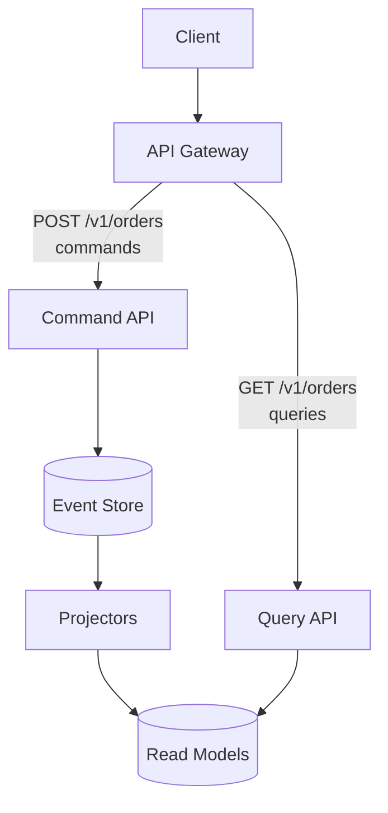

| Side | HTTP | Idempotent? | Consistency |
|------|------|-------------|-------------|
| **Commands** | POST (create action), sometimes PUT/PATCH on resource | Via `Idempotency-Key` + dedup | Strong per aggregate |
| **Queries** | GET | Yes (safe) | Eventual (projection lag) |

**Rule of thumb:** Same URL for command and query is OK at small scale (`POST /orders` writes, `GET /orders` reads). At scale, split services or route prefixes (`/commands/*` vs `/queries/*`) for independent scaling.

---

## Modeling commands as HTTP

### Resource-oriented commands (common)

Fits existing REST style — commands are POSTs on sub-resources:

```http
POST /v1/orders/ord_123/cancel
Authorization: Bearer …
Idempotency-Key: 7c9e6679-7425-40de-944b-e07fc1f90ae7
If-Match: "5"
```

```http
POST /v1/orders/ord_123/ship
Content-Type: application/json

{ "carrier": "ups", "tracking_number": "1Z999…" }
```

| Header | Role in ES |
|--------|------------|
| `Idempotency-Key` | Same key → same result, no duplicate events |
| `If-Match` / `ETag` | Expected aggregate version → `409` on conflict |

### Dedicated command endpoint (alternative)

```http
POST /v1/commands
Content-Type: application/json

{
  "type": "CancelOrder",
  "aggregate_id": "ord_123",
  "expected_version": 5,
  "payload": { "reason": "customer_request" }
}
```

| Pros | Cons |
|------|------|
| Uniform envelope for all writes | Less REST-native; harder OpenAPI grouping |
| Easy versioning of command schema | Clients learn a RPC-style contract |

Use when many command types or mobile clients need one endpoint.

---

## Status codes for commands

| Code | Use |
|------|-----|
| `201` | Aggregate created; first event appended |
| `200` | Command applied; body may include new version / event IDs |
| `400` | Malformed command |
| `401` / `403` | Auth |
| `409` | Version conflict or invalid state transition |
| `422` | Semantically invalid (e.g. negative amount) |
| `429` | Rate limited |

**409 example:**

```json
{
  "error": {
    "code": "version_conflict",
    "message": "Order was modified. Expected version 5, current is 6.",
    "request_id": "req_9f2a",
    "details": {
      "aggregate_id": "ord_123",
      "expected_version": 5,
      "current_version": 6
    }
  }
}
```

Client flow: `GET` fresh state (or retry with updated `If-Match`) → re-submit command.

---

## Query APIs and eventual consistency

Document projection lag in OpenAPI and developer portal:

```yaml
/v1/orders/{order_id}:
  get:
    summary: Get order (read model)
    description: |
      Served from read projection. May lag up to ~2s after write.
      Use GET /v1/orders/{id}/events for authoritative timeline.
    responses:
      '200': …
      '404': Order not found (or not yet projected)
```

| Endpoint type | Data source |
|---------------|-------------|
| `GET /orders` | Read model — fast, eventually consistent |
| `GET /orders/:id/events` | Event store stream — authoritative history |
| `GET /orders/:id/at?timestamp=…` | Replay to point in time — support/audit |

---

## Audit and history APIs

Event Sourcing enables first-class history endpoints:

```http
GET /v1/orders/ord_123/events
```

```json
{
  "data": [
    {
      "version": 1,
      "type": "OrderCreated",
      "occurred_at": "2026-06-14T10:00:00Z",
      "payload": { "customer_id": "cus_456" }
    },
    {
      "version": 2,
      "type": "OrderShipped",
      "occurred_at": "2026-06-14T14:30:00Z",
      "payload": { "carrier": "ups" }
    }
  ],
  "pagination": { "next_cursor": null, "has_more": false }
}
```

Supports **Repudiation** controls in [threat modeling](../api-design-and-protection/includes/06-threat-model.md) — correlate with `request_id` and actor in event metadata.

---

## Gateway considerations

| Concern | Command API | Query API |
|---------|-------------|-----------|
| Rate limits | Stricter on writes | Higher on reads |
| Timeouts | Short (append only) | Tuned for list/search |
| Caching | Never cache POST | CDN(Content Delivery Network)/cache safe on GET |
| AuthZ | Scope + aggregate ownership | Same BOLA(Broken Object-Level Authorization) checks on read models |

Route both through the same gateway; scale query tier independently behind separate upstream pools if needed — see [Load balancer & gateway](../api-design-and-protection/includes/03-api-gateway.md#flow-3--both-together-common-at-scale).

---

## Idempotency

Same pattern as [Write safety](../api-design-and-protection/includes/01-api-design.md#7-write-safety):

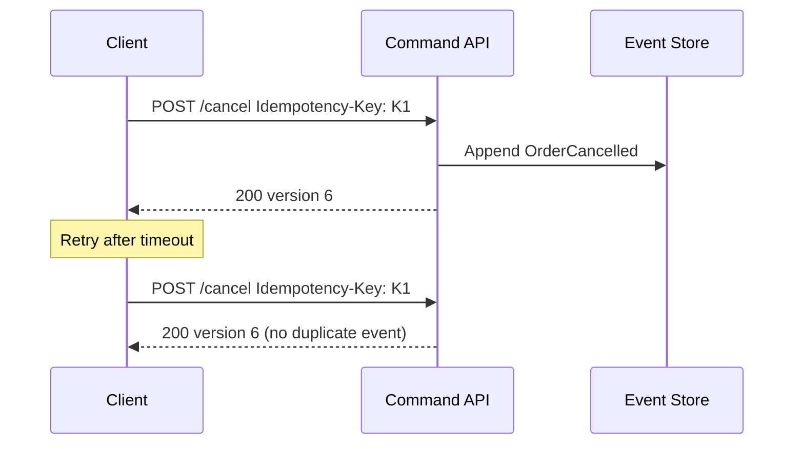

Store idempotency key → `(aggregate_id, resulting_version)` with TTL.

---

## OpenAPI tips

- Document `If-Match` on command endpoints
- Enum command outcomes in error `code` field
- Separate tags: `Commands` vs `Queries`
- Note read-model lag in GET descriptions

---

## Pros of ES-aware API design

- Explicit conflict handling (`409`) instead of silent overwrites
- History and audit as public or internal API products
- Command/query scaling maps to infrastructure

## Cons

- Clients must handle eventual consistency and version conflicts
- More endpoints (`/events`, version headers)
- OpenAPI cannot express projection lag numerically without docs

See [Decision guide](06-decision-guide.md).

## Common mistakes

| Mistake | Fix |
|---------|-----|
| Same URL for heavy writes and reads without scaling plan | Split command/query services or pools |
| No `If-Match` / `409` on conflicting commands | Expected-version check on append |
| Cache GET on projection endpoints | Never cache eventually consistent reads blindly |
| Hide projection lag from API consumers | Document lag in OpenAPI |
| Duplicate events without idempotency keys | `Idempotency-Key` + dedup store |
| Expose raw event store without authZ | Same BOLA checks as read models |

---

# Async Integration

How event-sourced systems integrate with queues, webhooks, and other services — transactional outbox, idempotent consumers, and overlap with async API(Application Programming Interface) patterns.

> **Related:** [Async patterns in API design](../api-design-and-protection/includes/10-async-patterns.md) · [Storage & outbox](03-storage-and-projections.md) · [Sagas and distributed workflows](07-sagas-and-distributed-workflows.md)

---

## What it is

After appending events to the store, other systems need to react: update read models, send emails, call payment providers, push **webhooks** to partners. This is **async integration** — decoupled from the HTTP(Hypertext Transfer Protocol) command response.

Event Sourcing does **not** replace job queues or webhooks. It complements them: the event store is durable truth; the bus delivers copies to consumers.

---

## Transactional outbox pattern

**Problem:** Append to event store AND publish to Kafka in two steps → crash between them = lost message or inconsistency.

**Solution:** Write integration events to an **outbox table** in the **same DB transaction** as domain events; a separate relay publishes to the bus.

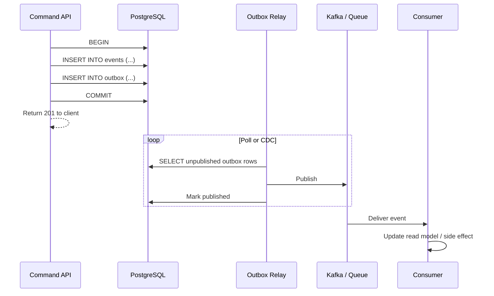

```sql
CREATE TABLE outbox (
    id           BIGSERIAL PRIMARY KEY,
    event_id     UUID NOT NULL,
    topic        TEXT NOT NULL,
    payload      JSONB NOT NULL,
    created_at   TIMESTAMPTZ NOT NULL DEFAULT now(),
    published_at TIMESTAMPTZ
);
```

| Approach | Pros | Cons |
|----------|------|------|
| **Polling relay** | Simple | Slight lag, DB poll load |
| **CDC (Debezium)** | Near real-time | Extra infra |
| **In-process after commit** | Easy in dev | Not durable across crashes |

Multi-service workflows (order → payment → inventory) → [Sagas and distributed workflows](07-sagas-and-distributed-workflows.md). Consumer dedup (inbox) → [Inbox pattern](07-sagas-and-distributed-workflows.md#inbox-pattern-consumer-dedup).

---

## End-to-end architecture with API layers

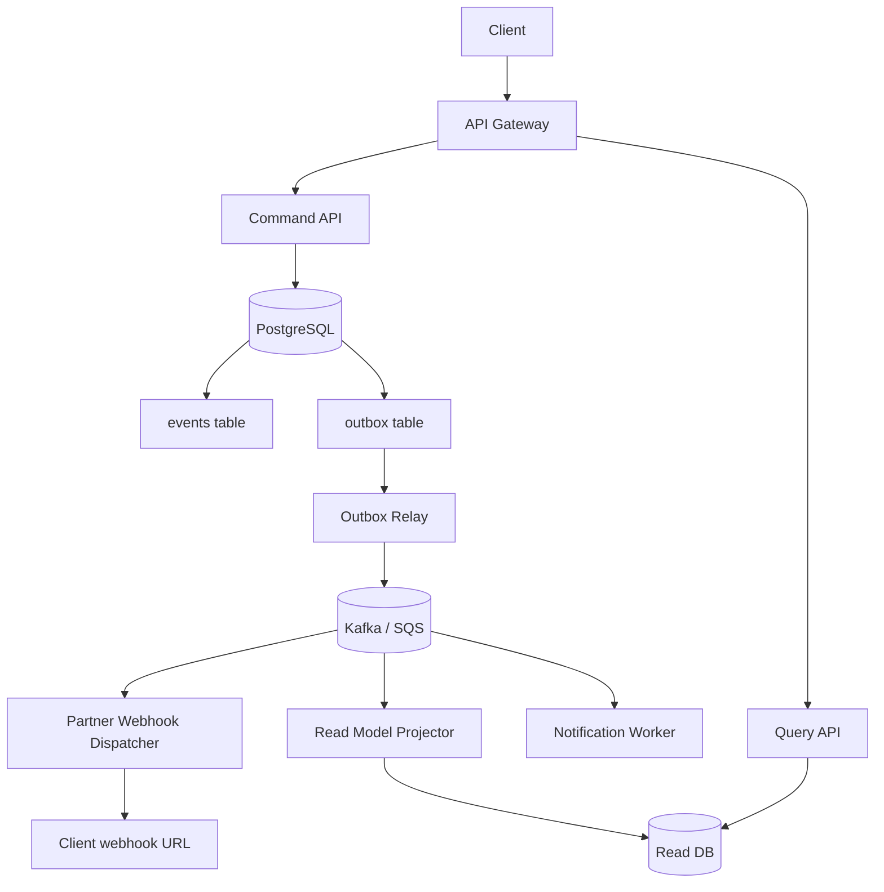

Compare with [async job architecture](../api-design-and-protection/includes/10-async-patterns.md#end-to-end-architecture): jobs handle **long work**; outbox handles **reliable event delivery** after a successful write.

---

## Projectors vs integration consumers

| Consumer type | Updates | Failure handling |
|---------------|---------|------------------|
| **Read model projector** | Query DB | Retry; idempotent UPSERT by event ID |
| **Side-effect worker** | Email, payment, external API | Retry + dead-letter queue |
| **Webhook dispatcher** | Partner HTTP POST | Backoff, HMAC(Hash-based Message Authentication Code) — see [Auth model](../api-design-and-protection/includes/04-auth-model.md#hmac-webhooks) |

All must be **idempotent** on `event_id` — at-least-once delivery is normal.

---

## Event Sourcing vs job resources

| Pattern | Purpose | Client sees |
|---------|---------|-------------|
| **Event store + outbox** | Durable domain state + integration | `201` when command accepted |
| **Job resource (`202`)** | Long-running work (export, ML) | Poll `/jobs/{id}` until done |

They combine cleanly:

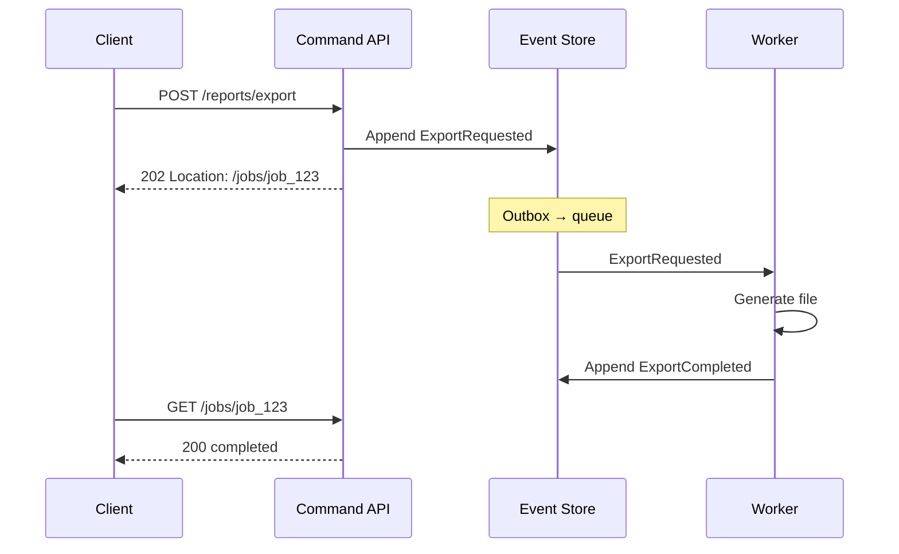

---

## Webhooks from domain events

Map terminal domain events to outbound webhooks (same security as [async webhooks](../api-design-and-protection/includes/10-async-patterns.md#pattern-2--webhooks-server-push)):

```json
{
  "id": "evt_9f2a",
  "type": "order.shipped",
  "created_at": "2026-06-14T14:30:00Z",
  "data": {
    "order_id": "ord_123",
    "version": 5,
    "payload": { "carrier": "ups" }
  }
}
```

Use `event_id` for partner deduplication — mirrors idempotency on the command side.

---

## Monitoring async integration

| Metric | Alert when |
|--------|------------|
| Outbox lag (unpublished count) | Growing backlog |
| Projector lag (events behind head) | Read model stale beyond SLA |
| Consumer error rate | DLQ(Dead Letter Queue) filling |
| Webhook delivery failures | Partner integration broken |

---

## Pros

- Reliable delivery without dual-write bugs
- Scales consumers independently of command API
- Natural fit for microservices and partner webhooks

## Cons

- Operational complexity (relay, CDC, DLQ)
- Eventual consistency across services
- Debugging requires correlation IDs across store, bus, and consumers

See [Decision guide](06-decision-guide.md).

## Common mistakes

| Mistake | Fix |
|---------|-----|
| Publish to bus outside DB transaction | Transactional outbox pattern |
| Non-idempotent consumers | Dedup by `event_id` |
| In-process publish after commit only | Crashes lose messages — use relay/CDC |
| No DLQ for failed side effects | Retry + dead-letter queue |
| Webhooks without partner dedup header | Include `event_id` in payload |
| Ignore outbox / projector lag metrics | Alert on growing backlog |

---

# Decision Guide

When to adopt Event Sourcing and CQRS(Command Query Responsibility Segregation), when to avoid them, and a concise pros/cons reference.

> **Related:** [Overview](00-overview.md) · [API design implications](04-api-design-implications.md) · [Sagas and distributed workflows](07-sagas-and-distributed-workflows.md)

---

## Decision flow

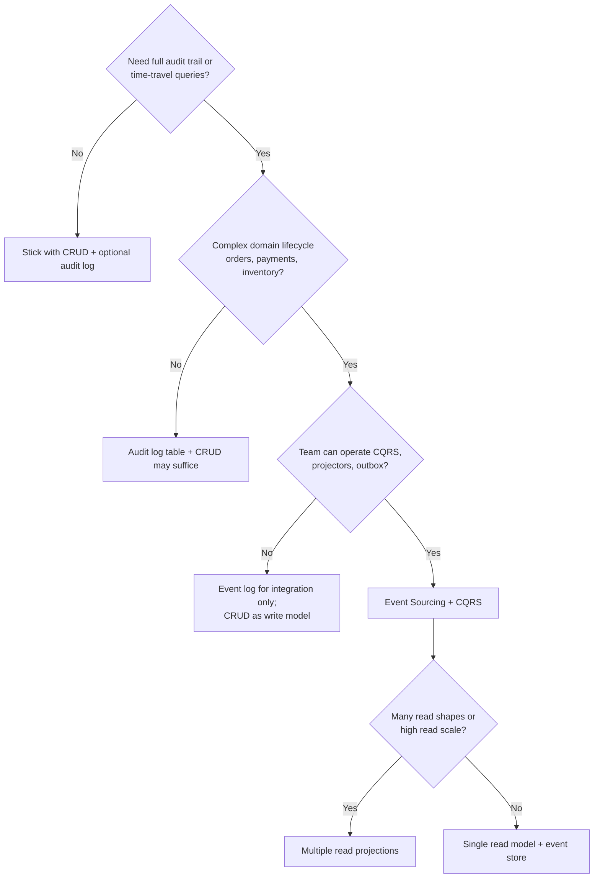

---

## Use cases — strong fit

| Domain | Why |
|--------|-----|
| **Banking / payments** | Audit, reversals, regulatory history |
| **E-commerce orders** | Lifecycle, refunds, [fulfillment sagas](07-sagas-and-distributed-workflows.md) |
| **Inventory / warehouse** | Stock movements as facts |
| **Healthcare / legal** | Immutable action records |
| **Collaborative workflows** | Operation history, undo/redo |
| **IoT / telemetry** | Time-series facts at scale |
| **Multi-service platforms** | Event log as integration contract |

---

## When to avoid (or defer)

| Situation | Prefer |
|-----------|--------|
| Simple CRUD, few state transitions | PostgreSQL + normal tables |
| Single service, one database, no external APIs | Normal ACID(Atomicity, Consistency, Isolation, Durability) — no cross-service saga — see [When not to use a saga](07-sagas-and-distributed-workflows.md#when-not-to-use-a-saga) |
| Team new to distributed patterns | CRUD; add audit table first |
| Strong immediate read-after-write everywhere | CRUD or sync read model only |
| Tight deadline, small team | Defer ES until domain stabilizes |
| Heavy ad-hoc reporting on current state only | OLTP + warehouse ETL(Extract, Transform, Load), not raw event replay |

---

## Pros and cons summary

### Event Sourcing

| Pros | Cons |
|------|------|
| Complete audit trail by design | Higher complexity than CRUD |
| Temporal queries ("state at time T") | [Event schema evolution (upcasting)](08-event-schema-evolution.md) |
| Debug by replaying exact sequence | Storage grows — snapshots + archival |
| Aligns with domain language | GDPR/PII erasure vs immutability |
| Flexible downstream consumers | Steeper learning curve |

### CQRS

| Pros | Cons |
|------|------|
| Optimized read and write paths | Eventual consistency on reads |
| Scale query tier independently | Duplicate data, sync logic |
| Add views without changing writes | More services to monitor |
| Clear caching boundary on GET | "Two truths" confusion if undocumented |

### Combined ES + CQRS

| Pros | Cons |
|------|------|
| Best audit + read performance | Highest operational surface |
| Rebuild read DB from events | Requires idempotent projectors |
| Natural microservice boundaries | Not worth it for simple domains |

---

## Comparison — ES vs audit log vs CRUD

| | CRUD | CRUD + audit table | Event Sourcing |
|--|------|-------------------|----------------|
| **Current state query** | Easy | Easy | Via projection |
| **Full history** | No | Yes (separate table) | Yes (primary) |
| **Rebuild state** | N/A | Hard | Replay events |
| **Complexity** | Low | Medium | High |
| **Compliance audit** | Bolt-on | Good | Excellent |

---

## Migration path (pragmatic)

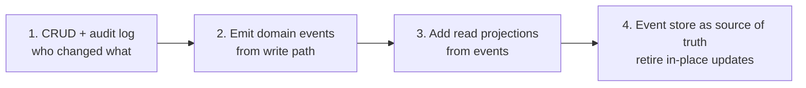

Do not jump to step 4 without steps 1–3 unless greenfield and team is experienced.

---

## Storage quick pick

| Scenario | Store events in… |
|----------|------------------|
| Default / most teams | **PostgreSQL** event table |
| .NET DDD | **Marten** or **EventStoreDB** |
| AWS serverless | **DynamoDB** + S3 archive |
| Many subscribers | PostgreSQL + **outbox → Kafka** |
| 7+ year retention | PostgreSQL hot + **S3** cold |

Details → [Storage & projections](03-storage-and-projections.md).

---

## API(Application Programming Interface) quick pick

| Scenario | API shape |
|----------|-----------|
| Public REST(Representational State Transfer) SaaS | Resource POST commands + GET read models |
| High write conflict rate | `If-Match` + `409` + idempotency keys |
| Partners need push | Domain events → webhooks via outbox |
| Long exports / ML | Event triggers + [job resource](../api-design-and-protection/includes/10-async-patterns.md) |

Details → [API design implications](04-api-design-implications.md).

## Common mistakes

| Mistake | Fix |
|---------|-----|
| Greenfield jump straight to event store as truth | CRUD → audit log → projections → ES |
| ES for simple admin CRUD | Normal tables + audit if needed |
| No projector rebuild runbook | Document full replay procedure |
| Multiple read models without ownership | Name owner per projection |
| Skip correlation IDs across store and bus | `correlation_id` in event metadata |
| Deploy breaking projector without version gate | Expand/contract projector schema |

## See also

| Guide | Topics |
|-------|--------|
| [api-design-and-protection](../api-design-and-protection/README.md) | HTTP(Hypertext Transfer Protocol), gateway, async, threat model |
| [postgresql-performance](../postgresql-performance/README.md) | Indexing, bulk ops for event tables |
| [api-rate-limiting](../api-rate-limiting/README.md) | Separate limits on command vs query routes |
| [deployment-strategies](../deployment-strategies/README.md) | Rolling deploys with projector compatibility |
| [high-throughput-systems](../high-throughput-systems/README.md) | Streaming, outbox, read-model throughput |
| [database-connection-and-security](../database-connection-and-security/README.md) | Event store credentials and cloud IAM(Identity and Access Management) |

---

## Reading paths

| If you are… | Read in order |
|-------------|---------------|
| **New to the pattern** | Overview → §1 Core concepts → §6 Decision guide |
| **Choosing storage** | §3 Storage → [postgresql-performance](../postgresql-performance/README.md) |
| **Designing HTTP APIs** | §4 API design → [api-design-and-protection §1](../api-design-and-protection/includes/01-api-design.md) |
| **Integrating microservices** | §5 Async integration → [async patterns §10](../api-design-and-protection/includes/10-async-patterns.md) |
| **Security / compliance** | §4 Audit APIs → [threat model §6](../api-design-and-protection/includes/06-threat-model.md) |
| **High-throughput read models** | §2 CQRS → [high-throughput-systems](../high-throughput-systems/README.md) |

---

# Sagas and Distributed Workflows

Coordinate multi-service business processes with local transactions, compensating actions, and durable saga state — without distributed two-phase commit.

> **Related:** [Core concepts — aggregates](01-core-concepts.md#aggregates-and-streams) · [Async integration — outbox](05-async-integration.md) · [Strong consistency — promises and costs](../postgresql-performance/includes/14-consistency-promises-and-costs.md) · [Idempotency](../api-design-and-protection/includes/13-idempotency.md) · [Async patterns](../api-design-and-protection/includes/10-async-patterns.md)

---

## At a glance

| Question | Answer |
|----------|--------|
| **What is it?** | A sequence of **local transactions** (one per service) coordinated so the process completes or is undone via **compensating actions** |
| **When to use?** | Cross-service workflows (order → payment → inventory → shipping) where one ACID(Atomicity, Consistency, Isolation, Durability) transaction across DBs is impossible |
| **How are transactions handled?** | **Local ACID** per service — no 2PC(Two-Phase Commit) across DBs; see [Transactions and distributed databases](#transactions-and-distributed-databases) |
| **When not to use?** | Single service + one DB → normal ACID; see [When not to use a saga](#when-not-to-use-a-saga) |
| **Retry vs compensate?** | Transient → retry with cap; permanent → compensate; see [Retry vs compensate](#retry-vs-compensate) |
| **How to operate?** | Stuck-saga metrics, DLQ(Dead Letter Queue), `saga_id` in traces — see [Observability and operations](#observability-and-operations) |
| **Choreography vs orchestration?** | Events-only vs central **process manager** — see [Which one to choose?](#which-one-to-choose) |
| **How to undo?** | Compensating transactions in **reverse order** (LIFO) — not a distributed `ROLLBACK` |
| **Critical requirement?** | **Idempotent** steps + persisted saga state + correlation IDs |

**Rule of thumb:** One local transaction per service; the saga coordinates. Never hold locks across service boundaries.

---

## What a saga is

Each microservice owns its data. You cannot wrap `orders DB + payments DB + inventory DB` in one ACID transaction. A **saga** accepts **eventual consistency** across services and makes failure explicit.

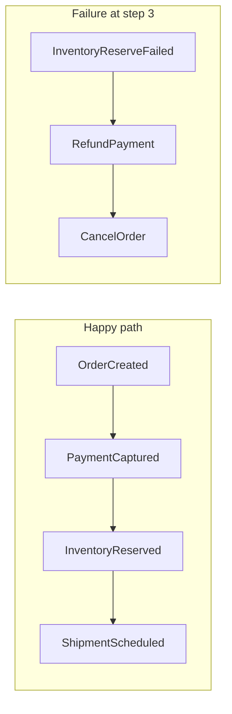

**Saga vs compensating event (ES):** In event sourcing, a compensating **event** (`PaymentRefunded`) corrects history within one aggregate stream — see [Immutability and corrections](01-core-concepts.md#immutability-and-corrections). In a saga, a compensating **action** is a new local transaction in another service (call refund API(Application Programming Interface), publish `RefundPayment` command). They often combine: a saga orchestrator triggers compensating commands; each service appends domain events.

### Scope: one event store vs cross-service saga

| Situation | Pattern | This section |
|-----------|---------|--------------|
| **One ES system**, multiple aggregates in one event store | **Process manager** reacts to events and sends commands — still one DB, local ACID per aggregate | Cross-links [Core concepts](01-core-concepts.md#aggregates-and-streams); not a cross-DB problem |
| **Multiple services**, each with its own DB or external API | **Cross-service saga** — local TX per service, compensation across boundaries | **Main focus of §7** |

Do not introduce saga orchestration complexity when a single service and one database transaction suffices.

---

## Transactions and distributed databases

A saga **does not** use one ACID transaction across `orders DB`, `payments DB`, and `inventory DB`. That would require **two-phase commit (2PC)** — locks held across services, poor failure behavior, and poor fit for microservices. Instead:

| Level | Guarantee |
|-------|-----------|
| **Inside one service / one database** | Normal **ACID** local transaction |
| **Across services** | **Eventual consistency** — each step commits independently; failure handled by **compensation** |

### What one saga step commits

Each step is a **single local transaction** in **one** database:

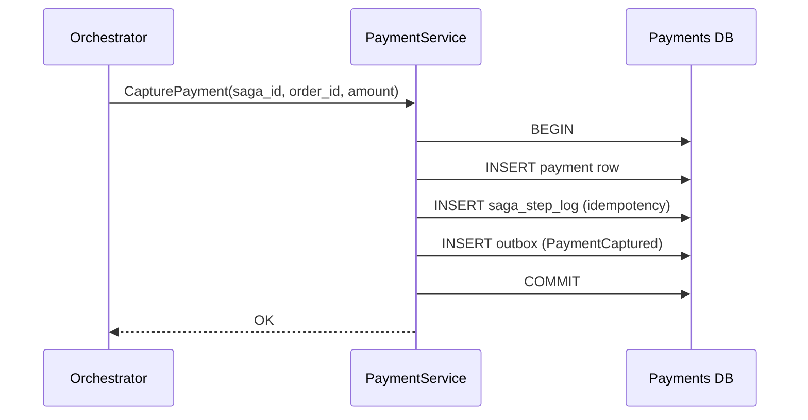

Typical contents of that one `COMMIT`:

1. **Business write** — e.g. `INSERT INTO payments …`
2. **Idempotency record** — `saga_step_log` so retries do not double-charge — see [Idempotency patterns](#idempotency-patterns-specific-to-sagas)
3. **Outbox row** (when publishing) — reliable event after commit — see [Transactional outbox](05-async-integration.md#transactional-outbox-pattern)

If anything fails → `ROLLBACK` **only within that service**. Other databases are unaffected until the saga drives the next step or compensation.

### Coordination is not a distributed transaction

The orchestrator (or event chain in choreography) persists **saga state** in its own DB, sends commands, and on failure runs **compensating local transactions** in reverse order. It is not a 2PC coordinator.

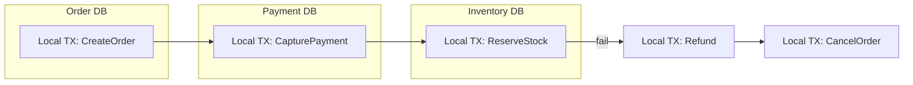

There is no moment where all three databases commit or roll back together.

### Failure: compensation, not rollback

If step 3 fails after steps 1–2 committed:

| Wrong mental model | Saga model |
|--------------------|------------|
| Roll back the whole saga like one DB transaction | Each completed step is a **fact** (payment was captured) |
| `ROLLBACK` across services | New local TXs: **RefundPayment**, **CancelOrder**, **ReleaseInventory** |

Each compensate call is again **one local ACID transaction** in that service's database. Details → [Compensation steps](#compensation-steps-and-rollback-flows).

### Consistency you actually get

| Question | Answer |
|----------|--------|
| Are payment + inventory atomic together? | **No** — window where payment succeeded but inventory failed |
| Is each service's write atomic? | **Yes** — within that service's DB |
| What consistency across services? | **Eventual** — saga + compensation reach a valid business state |
| How do clients cope? | Status `PENDING`, `REFUNDING`, `CONFIRMED`; idempotent `POST /orders` |

Strong consistency applies **inside one primary database**. Microservices are a layer where consistency breaks unless you design for it — see [Where consistency breaks](../postgresql-performance/includes/14-consistency-promises-and-costs.md#where-consistency-breaks).

### Microservices vs distributed SQL(Structured Query Language)

| Setup | Saga role |
|-------|-----------|
| **Microservices, each with own DB** (PostgreSQL A, B, C) | Classic saga — separate transaction boundaries even if all are PostgreSQL |
| **One distributed SQL cluster** (CockroachDB, Spanner, Yugabyte) | Multi-row TX possible **inside one logical DB**; saga still needed when steps call **external APIs** (Stripe, warehouse) or cross **service boundaries** |

A global database does not remove sagas when the workflow crosses deployable services or non-database side effects.

### Practical rules

1. **One business step = one local transaction** in one service DB.
2. **Never** open a DB transaction, call another service synchronously, then commit — holds locks and breaks on timeouts.
3. **Persist saga state + outbox in the same TX** as the orchestrator's step-advance write when possible.
4. **Idempotency on every step** — `(saga_id, step_name)` or message ID; at-least-once delivery is normal.
5. **Design for in-between states** — `PENDING`, `PAYMENT_CAPTURED`, `COMPENSATING`; UX and support must tolerate them.
6. **Reconcile late replies** — payment may succeed after timeout; use saga `version` + idempotent handlers.

### Per-step transaction map (orchestrated example)

| Step | Service | Local transaction |
|------|---------|-------------------|
| 1 | Order | `BEGIN` → insert order `PENDING` → step log → `COMMIT` |
| 2 | Payment | `BEGIN` → capture payment → step log → outbox → `COMMIT` |
| 3 | Inventory | `BEGIN` → reserve stock → step log → `COMMIT` or fail |
| 3b (fail) | Payment | `BEGIN` → refund → step log → `COMMIT` |
| 3c (fail) | Order | `BEGIN` → cancel order → `COMMIT` |

Each row is an independent ACID commit. Saga "atomicity" is **logical** (business invariants over time), not **physical** (single 2PC).

### Saga vs other distributed transaction patterns

| Approach | Use when |
|----------|----------|
| **Saga** (local TX + compensation) | Microservices, external APIs, long workflows — **default in this guide** |
| **2PC / XA** | Rare; tight coupling, short transactions — usually avoided |
| **TCC (Try-Confirm-Cancel)** | Need reserved resources before commit; more complex than classic saga |

Prefer **saga + outbox + idempotency** over 2PC for service-oriented systems.

---

## Choreography vs orchestration

### Choreography (event-driven, no central coordinator)

Each service publishes **domain events**; downstream services **react** without a coordinator.

```mermaid
sequenceDiagram
    participant Order as OrderService
    participant Pay as PaymentService
    participant Inv as InventoryService
    participant Ship as ShippingService

    Order->>Order: CreateOrder (local TX)
    Order-->>Pay: OrderCreated event
    Pay->>Pay: CapturePayment (local TX)
    Pay-->>Inv: PaymentCaptured event
    Inv->>Inv: ReserveStock (local TX)
    Inv-->>Ship: InventoryReserved event
    Ship->>Ship: ScheduleShipment (local TX)
```

| Pros | Cons |
|------|------|
| Loose coupling; easy to add a new listener | Hard to see full flow; implicit protocol |
| No single point of failure for coordination | Debugging "where is my order?" is harder |
| Scales with event bus | Cyclic dependencies and ordering bugs |
| Fits pure event-driven teams | Compensation logic scattered across services |

**When to use:** Few services (3–5), stable event contract, team owns end-to-end domain, flow rarely changes.

### Orchestration (central process manager)

A **saga orchestrator** (or **process manager**) owns the script: it sends **commands** to each participant and tracks state.

```mermaid
sequenceDiagram
    participant Orch as SagaOrchestrator
    participant Order as OrderService
    participant Pay as PaymentService
    participant Inv as InventoryService
    participant Ship as ShippingService

    Orch->>Order: CreateOrder
    Order-->>Orch: OrderCreated
    Orch->>Pay: CapturePayment
    Pay-->>Orch: PaymentCaptured
    Orch->>Inv: ReserveInventory
    Inv-->>Orch: InventoryReserveFailed
    Orch->>Pay: RefundPayment
    Pay-->>Orch: PaymentRefunded
    Orch->>Order: CancelOrder
```

| Pros | Cons |
|------|------|
| Explicit state machine; one place for timeouts/retries | Orchestrator is a critical component |
| Easier to test and reason about long flows | Can become a "god service" if not bounded |
| Clear compensation order | Must version saga definitions carefully |
| Good for 5+ steps or frequent rule changes | Extra persistence and ops for orchestrator |

**When to use:** Complex workflows, strict ordering, compliance/audit needs, many failure branches.

### Hybrid (common in production)

- **Orchestrator** for the business saga (order fulfillment).
- **Choreography** inside each service (payment service emits `PaymentCaptured` for analytics, fraud, receipts).

| Criterion | Prefer choreography | Prefer orchestration |
|-----------|--------------------|-----------------------|
| Steps | Linear, few | Branching, many |
| Visibility | Team OK with distributed tracing | Need explicit saga dashboard |
| Change frequency | Stable | Rules change often |
| Compensation | Simple, symmetric | Ordered, partial refunds, etc. |

### Which one to choose?

**Default for money + inventory critical paths:** **orchestration** — compensation, timeouts, and support visibility are easier when one process manager owns the script.

**Default for small, stable, event-native teams:** **choreography** — when the flow is linear, rarely changes, and one squad owns the whole protocol.

| Choose **choreography** when… | Choose **orchestration** when… |
|------------------------------|--------------------------------|
| 3–5 services, linear flow | 5+ steps or branching paths |
| Event contract is stable | Business rules change often |
| One team owns the whole flow | Multiple teams; need a workflow owner |
| Compensation is simple and symmetric | Compensation order matters (partial refunds, release-before-refund) |
| Strong tracing + event schema discipline | Saga dashboard, timeouts, audit in one place |

#### Decision flow

```mermaid
flowchart TD
    Start{Saga coordinates<br/>critical path?}
    Start --> QSteps{More than 5 steps<br/>or branching?}
    QSteps -->|Yes| Orch[Prefer orchestration]
    QSteps -->|No| QComp{Complex compensation<br/>order or partial refunds?}
    QComp -->|Yes| Orch
    QComp -->|No| QChange{Rules change often?}
    QChange -->|Yes| Orch
    QChange -->|No| QAudit{Compliance needs<br/>central saga audit?}
    QAudit -->|Yes| Orch
    QAudit -->|No| QTeam{One team, stable events,<br/>strong tracing?}
    QTeam -->|Yes| Choreo[Prefer choreography]
    QTeam -->|No| Orch
    Orch --> Hybrid["Hybrid: orchestrate critical path;<br/>choreograph side effects"]
    Choreo --> Hybrid
```

#### Decision checklist

Ask in order:

1. **How many steps and branches?** Linear 3-step checkout → choreography can work. Refunds, alternate warehouses, manual review → orchestration.
2. **Who needs visibility?** Support asking "stuck at step 3?" → orchestration with persisted saga state. Tracing-only engineering culture → choreography is viable.
3. **How hard is compensation?** Simple cancel + refund → either works. Domain-specific order (release stock before refund) → orchestration.
4. **How often does the flow change?** Stable for years → choreography. Product changes steps monthly → orchestration (version the saga definition).
5. **Team topology** — one squad owns order → payment → inventory: either works. Separate teams per service → orchestration, or very strict event contracts for choreography.
6. **Compliance / audit** — need "who decided to refund and when?" → orchestration (central saga log).

#### Signals (rule of thumb)

| Signal | Lean toward |
|--------|-------------|
| "We might double-charge or refund twice on retry" | Orchestration + step idempotency |
| "We can't draw the flow on one whiteboard" | Orchestration |
| "Adding a listener shouldn't break checkout" | Choreography for **non-critical** listeners only |
| "Compensation is scattered; nobody knows the order" | Orchestration |

If unsure, start with **orchestration for the critical path** (money + inventory). Each step can still publish domain events so analytics, fraud, and email stay decoupled — see [Hybrid](#hybrid-common-in-production) above.

---

## Compensation steps and rollback flows

Sagas do **not** roll back like a database `ROLLBACK`. Completed steps leave **facts** (payment was captured). You run **compensating transactions** — new local operations that **semantically undo** the business effect.

### Rules

1. **Every forward step needs a compensating action** (or be marked non-compensatable — e.g. email already sent).
2. **Compensate in reverse order** (LIFO): if payment then inventory failed, refund payment before canceling order-side effects that depend on payment.
3. **Compensation can fail too** — retry, alert, manual intervention queue.
4. **Not all steps are reversible** — design for **pivot** (accept partial success + human task) instead of infinite compensate loops.

### Example compensation map

| Forward step | Compensating action | Notes |
|--------------|---------------------|-------|
| Create order (`PENDING`) | Cancel order (`CANCELLED`) | Idempotent cancel |
| Capture payment | Refund payment | Refund idempotency key = `sagaId + step` |
| Reserve inventory | Release reservation | Safe if reserve never committed |
| Schedule shipment | Cancel shipment | May fail if already picked — escalate |

### Forward recovery vs backward recovery

- **Backward recovery:** Failure → run compensations (most common).
- **Forward recovery:** Failure → retry or alternate path (e.g. try warehouse B if A has no stock) without undoing prior steps.

```mermaid
stateDiagram-v2
    [*] --> Running
    Running --> Completed: all steps OK
    Running --> Compensating: step failed
    Compensating --> Failed: all compensations OK
    Compensating --> ManualIntervention: compensation stuck
    Failed --> [*]
    Completed --> [*]
```

---

## Saga state machines and timeouts

The orchestrator (or choreographed service pair) should persist **saga instance state** — not only in memory.

### Typical states

| State | Meaning |
|-------|---------|
| `STARTED` | Saga instance created |
| `STEP_N_IN_PROGRESS` | Command sent; awaiting reply |
| `STEP_N_COMPLETED` | Step acknowledged |
| `COMPENSATING` | Running undo steps |
| `COMPLETED` | All forward steps done |
| `FAILED` | Compensated or abandoned safely |
| `AWAITING_MANUAL` | Auto recovery exhausted |

### Timeouts

| Timeout type | Purpose |
|--------------|---------|
| **Step timeout** | Payment service didn't respond in 30s → retry or compensate |
| **Saga timeout** | Entire fulfillment must finish in 24h or cancel |
| **Compensation timeout** | Refund stuck → page on-call, freeze order |

**Implementation sketch:**

```sql
CREATE TABLE saga_instances (
    saga_id        UUID PRIMARY KEY,
    saga_type      TEXT NOT NULL,
    current_step   TEXT NOT NULL,
    status         TEXT NOT NULL,
    correlation_id UUID NOT NULL,
    payload        JSONB NOT NULL,
    step_deadline  TIMESTAMPTZ,
    version        INT NOT NULL DEFAULT 1,
    created_at     TIMESTAMPTZ NOT NULL DEFAULT now(),
    updated_at     TIMESTAMPTZ NOT NULL DEFAULT now()
);
```

A **timeout worker** polls `step_deadline < now() AND status LIKE 'STEP_%_IN_PROGRESS'` and drives compensate or retry policy.

**Important:** Timeouts are not free — a slow payment may still succeed after your timeout. Handlers must be **idempotent** and treat late success as no-op or reconcile (see below).

---

## Idempotency patterns specific to sagas

At-least-once messaging + client retries mean **every saga step runs at least once in effect, at most once in outcome**.

### Correlation and saga IDs

- **`saga_id`** — one UUID per business process instance (e.g. one checkout).
- **`correlation_id`** — ties all messages/logs for tracing (often same as `saga_id`).
- **`causation_id`** — parent message/event that caused this step.

Propagate on every command and event header. Aligns with event metadata in [Aggregates and streams](01-core-concepts.md#aggregates-and-streams).

### Per-step idempotency

Each participant stores **processed commands**:

```sql
CREATE TABLE saga_step_log (
    service_name    TEXT NOT NULL,
    saga_id         UUID NOT NULL,
    step_name       TEXT NOT NULL,
    idempotency_key TEXT NOT NULL,
    result          JSONB,
    processed_at    TIMESTAMPTZ NOT NULL DEFAULT now(),
    PRIMARY KEY (service_name, idempotency_key)
);
```

On duplicate delivery: return stored `result` without re-executing side effects.

### Patterns by role

| Role | Pattern |
|------|---------|
| **Orchestrator** | Persist before send: outbox + saga state in same TX — see [Transactional outbox](05-async-integration.md#transactional-outbox-pattern); dedupe replies by `(saga_id, step, message_id)` |
| **Participant** | `INSERT ... ON CONFLICT DO NOTHING` on step log; then execute or skip |
| **Compensation** | Same idempotency key namespace — `RefundPayment` for saga X must not double-refund |
| **Choreography** | Consumer dedupes on `event_id` — see [Projectors vs integration consumers](05-async-integration.md#projectors-vs-integration-consumers) |

### Late or duplicate replies

After timeout compensation started, the original step may still complete:

- **Reconcile:** Payment captured after refund initiated → alert + manual or auto second refund check.
- **Version field:** Saga instance `version` incremented on each transition; stale replies ignored.

General HTTP(Hypertext Transfer Protocol) idempotency (`Idempotency-Key`, storage patterns) → [Idempotency](../api-design-and-protection/includes/13-idempotency.md). Saga idempotency extends that to **async multi-step** flows.

---

## Example: order → payment → inventory → shipping

### Services and local transactions

1. **OrderService** — `CreateOrder` → status `PENDING`
2. **PaymentService** — `CapturePayment(orderId, amount)`
3. **InventoryService** — `ReserveItems(orderId, lines)`
4. **ShippingService** — `CreateShipment(orderId, address)`

### Happy path (orchestrated)

```mermaid
sequenceDiagram
    participant Client
    participant Orch as Orchestrator
    participant Order
    participant Pay
    participant Inv
    participant Ship

    Client->>Orch: PlaceOrder(checkoutId)
    Orch->>Order: CreateOrder
    Order-->>Orch: OK order-123
    Orch->>Pay: CapturePayment(order-123, 99.00)
    Pay-->>Orch: OK pay-456
    Orch->>Inv: ReserveItems(order-123)
    Inv-->>Orch: OK
    Orch->>Ship: CreateShipment(order-123)
    Ship-->>Orch: OK
    Orch->>Order: MarkConfirmed(order-123)
    Orch-->>Client: 201 order-123 CONFIRMED
```

### Failure: inventory out of stock (after payment)

1. `ReserveItems` returns `INSUFFICIENT_STOCK`
2. Orchestrator → `RefundPayment(pay-456)` (compensate step 2)
3. Orchestrator → `CancelOrder(order-123)` (compensate step 1)
4. Client notified: order failed, refund in progress

### Failure: shipping unavailable (after inventory reserved)

1. Compensate: `ReleaseInventory` → `RefundPayment` → `CancelOrder`
2. Release inventory **before** refund if business rule requires stock back before refund (ordering is domain-specific)

### Choreographed version (same flow)

- OrderService publishes `OrderCreated`
- PaymentService consumes → captures → publishes `PaymentCaptured`
- InventoryService consumes → on failure publishes `OrderFulfillmentFailed` with reason
- PaymentService listens for `OrderFulfillmentFailed` → refunds
- OrderService listens → cancels

The **protocol** (who listens to what) is the implicit saga definition — document it like an API contract.

### API surface (client view)

- `POST /orders` with `Idempotency-Key` → returns `201` or `202` if async saga
- `GET /orders/{id}` shows saga-derived status: `PENDING`, `CONFIRMED`, `CANCELLED`, `REFUNDING`
- Do not expose internal saga steps unless B2B/debug — see [API design implications](04-api-design-implications.md)

---

## When not to use a saga

A saga adds operational cost (state DB, compensation, idempotency). Prefer simpler patterns when:

| Situation | Prefer |
|-----------|--------|
| **Single service**, one database | Normal **ACID** transaction — `BEGIN` … all writes … `COMMIT` |
| **Short sync workflow**, no external side effects | One local TX or one aggregate command |
| **Strong immediate consistency** everywhere | Single DB or sync API chain without cross-service commit |
| **Cross-service boundaries**, external APIs, or **long async** flows | **Saga** — see [Decision guide](06-decision-guide.md) |

**Rule of thumb:** If you can draw the workflow inside one deployable service and one database, you probably do not need a saga.

---

## Retry vs compensate

When a step fails, classify the error before acting:

| Failure type | Examples | Action |
|--------------|----------|--------|
| **Transient** | 503, timeout, broker blip, deadlock | **Retry** the same step with exponential backoff (cap at N attempts) |
| **Permanent** | 400, insufficient stock, invalid state, business rule violation | **Compensate** immediately — retries will not help |
| **Exhausted retries** | Still failing after N attempts | **Compensate** or move to `AWAITING_MANUAL` |

```mermaid
flowchart TD
    Fail[Step failed] --> Classify{Error type?}
    Classify -->|Transient| Retry{Retries left?}
    Retry -->|Yes| Backoff[Retry with backoff]
    Retry -->|No| Compensate[Start compensation]
    Classify -->|Permanent| Compensate
    Backoff --> Fail
    Compensate --> Manual{Compensation OK?}
    Manual -->|No| AwaitManual[AWAITING_MANUAL]
    Manual -->|Yes| Failed[FAILED]
```

Do **not** compensate on the first transient blip — you will undo work that would have succeeded on retry. Do **not** retry forever on permanent errors — you delay refunds and tie up inventory.

---

## Observability and operations

> **Scope:** Saga-specific metrics and alerts below. General observability → [HTS §11 Observability](../high-throughput-systems/includes/11-observability.md). DLQ mechanics and retry policies → [HTS §6 Dead letter queue](../high-throughput-systems/includes/06-async-queues-workers.md#dead-letter-queue-dlq).

### Metrics to track

| Metric | Alert when |
|--------|------------|
| **Stuck sagas** | Count where `step_deadline < now()` and status is `STEP_*_IN_PROGRESS` — growing |
| **In-flight by type** | Sudden spike or plateau near capacity |
| **Step latency p95** | Per `saga_type` / step — SLO(Service Level Objective) breach |
| **Compensation rate** | Failures vs successes — compensation errors trending up |
| **DLQ depth** | Non-zero for saga-related consumers |

Propagate **`saga_id`** (and `correlation_id`) in structured logs and distributed traces — same IDs as [Idempotency patterns](#idempotency-patterns-specific-to-sagas). Support queries like “show me everything for checkout `saga-abc`”.

### DLQ and manual intervention

Side-effect steps (payment, refund) that fail after max retries must land in a **DLQ** — not block the queue forever. Route to on-call or a reconciliation tool; replay after fix with idempotency keys intact.

### Security (orchestrator → participants)

The saga orchestrator calls participant APIs with **service identity** — mTLS(Mutual Transport Layer Security), service JWT(JSON Web Token), or workload IAM(Identity and Access Management) — not end-user tokens alone. See [Identity, RBAC, IAM](../api-design-and-protection/includes/12-identity-rbac-iam-ad.md).

---

## Message ordering

At-least-once delivery can reorder messages unless you design for it:

| Transport | Pattern |
|-----------|---------|
| **Kafka / Kinesis** | **Partition key = `saga_id`** (or `correlation_id`) so all commands and events for one saga instance stay ordered within a partition |
| **Choreography** | Especially sensitive — `PaymentCaptured` must not be processed before `OrderCreated` is visible; enforce via partition key or idempotent state checks |
| **Queue without ordering** (SQS default) | **Orchestration** serializes via persisted state machine; participant idempotency handles duplicates |

---

## Inbox pattern (consumer dedup)

The **outbox** ([§5 Async integration](05-async-integration.md#transactional-outbox-pattern)) ensures reliable **publish** after a local write. The **inbox** ensures reliable **consume** — dedup before side effects:

```sql
CREATE TABLE inbox (
    consumer_name TEXT NOT NULL,
    message_id    TEXT NOT NULL,
    received_at   TIMESTAMPTZ NOT NULL DEFAULT now(),
    PRIMARY KEY (consumer_name, message_id)
);
```

In the consumer: `BEGIN` → `INSERT INTO inbox … ON CONFLICT DO NOTHING` → if inserted, apply side effect → `COMMIT`. If conflict, return stored outcome.

| Pattern | Role |
|---------|------|
| **Outbox** | Producer — same TX as business write + event row |
| **Inbox** | Consumer — same TX as dedup + side effect |
| **saga_step_log** | Saga participant — idempotency keyed by `(saga_id, step)` |

All three prevent duplicate side effects under at-least-once delivery.

---

## Deploying saga definition changes

In-flight saga instances must finish on the **definition version** they started with:

1. Add a **`saga_definition_version`** (or `saga_type` suffix) on `saga_instances`.
2. **Never change compensation order** for running instances — only for new sagas.
3. **Add steps at the end** of the forward path when possible; avoid inserting steps mid-flight.
4. Deploy orchestrator **backward compatible** — old workers drain v1; new instances use v2.

Same expand/contract mindset as schema migrations — see [deployment §12 Schema migrations and deploy](../deployment-strategies/includes/12-schema-migrations-and-deploy.md).

---

## Testing sagas

| Test | What to verify |
|------|----------------|
| **State machine unit tests** | Happy path, fail-at-step-N, full compensation, late reply after timeout |
| **Failure injection** | Integration test with in-memory bus or testcontainers — force 503, timeout, duplicate delivery |
| **Idempotency** | Same `(saga_id, step)` twice → one side effect, identical response |
| **Compensation order** | Assert LIFO matches forward step map |
| **Workflow engines** | Optional: Temporal, Step Functions, Camunda — same saga rules; engine owns persistence and timers |

Full ES test pyramid (aggregates, projectors, outbox) → [§9 Testing and verification](09-testing-and-verification.md).

---

## Pros

- Multi-service workflows without distributed 2PC
- Explicit failure and compensation paths
- Combines cleanly with event sourcing, outbox, and idempotent APIs

## Cons

- Eventual consistency across services; complex client UX
- Orchestrator ops (state DB, timeouts, versioning)
- Choreography hard to debug without strong tracing and contracts

See [Decision guide](06-decision-guide.md).

## Common mistakes

| Mistake | Fix |
|---------|-----|
| No saga state persistence | DB table + outbox; survive restarts |
| Missing compensation for a step | Map forward/compensate pairs upfront |
| Double charge on retry | Step-level idempotency keys |
| Timeout without late-reply handling | Reconciliation job + saga version |
| One giant distributed transaction | One local TX per service; saga coordinates |
| Choreography without documented event contract | Versioned schema registry / async API spec |
| Retry forever on permanent errors | Classify transient vs permanent; cap retries |
| Compensate on first transient blip | Backoff retry before compensation |
| No partition key for ordered choreography | `saga_id` as Kafka partition key |
| Deploy changes compensation order mid-flight | Version saga definition; drain in-flight instances |

---

# Event Schema Evolution

Event logs are forever — schema changes are **read-path** transformations (upcasting), not `UPDATE` on historical rows.

> **Related:** Immutability → [01-core-concepts.md#immutability-and-corrections](01-core-concepts.md#immutability-and-corrections) · Projector rebuild → [03-storage-and-projections.md](03-storage-and-projections.md) · API(Application Programming Interface) versioning → [api-design §14](../api-design-and-protection/includes/14-api-versioning-and-deprecation.md) · Deploy coupling → [deployment §12](../deployment-strategies/includes/12-schema-migrations-and-deploy.md)

---

## At a glance

| Strategy | What changes | Replay impact |
|----------|--------------|---------------|
| **Additive fields** | New optional JSON fields | Old events still valid |
| **Upcasting** | Transform v1 → v2 on read | Loader applies per event |
| **New event type** | v2 alongside v1 | Both types in stream |
| **Projector version** | New read model shape | Rebuild projection from scratch |

**Rule of thumb:** Never mutate stored events. Add version metadata; upcast at load time; rebuild projections when read models change structurally.

---

## Version metadata

Store on every event:

```json
{
  "event_type": "OrderCreated",
  "schema_version": 2,
  "aggregate_id": "ord-123",
  "payload": { ... }
}
```

| Field | Purpose |
|-------|---------|
|  | Routing to handler / projector |
|  | Select upcaster chain |
|  | Stream partition key |

---

## Upcasting

```mermaid
flowchart LR
    Store[(Stored v1 event)] --> Load[Event loader]
    Load --> Up1[v1 → v2 upcaster]
    Up1 --> Up2[v2 → v3 upcaster]
    Up2 --> Domain[Current domain object]
```

| Rule | Detail |
|------|--------|
| **Chain upcasters** | v1→v2, v2→v3 — not v1→v3 skip unless documented |
| **Test fixtures** | Golden files for each historical version |
| **Deploy order** | Deploy readers that understand new version **before** writers emit it |
| **Snapshots** | Re-snapshot after major schema jumps to cut replay cost |

Example: v1  int → v2  object .

---

## Projector compatibility

| Change | Safe during rolling deploy? |
|--------|----------------------------|
| Add optional column to read model | ✅ Expand |
| New projector for new view | ✅ Side-by-side |
| Rename column consumed by API | ❌ Expand/contract —  |
| Change projection logic only | Rebuild from events; may lag during deploy |

Runbook: stop projector → deploy new code → rebuild or catch-up → resume. See  and snapshots in .

---

## Contract with consumers

| Consumer type | Evolution rule |
|---------------|----------------|
| **Internal projector** | Upcast + rebuild |
| **External Kafka subscriber** | Additive fields only; new topic for breaking |
| **Public event API** | Versioned envelope; deprecation window |

Pair with  for published schemas.

---

## Common mistakes

| Mistake | Fix |
|---------|-----|
|  | Upcast on read |
| Deploy writer before reader | Two-phase deploy: readers first |
| No version field | Add  early |
| Skip upcaster tests | Fixture per version in CI |

---

## Pros and cons

### Upcasting on read

**Pros:** Full history preserved; gradual migration.

**Cons:** Loader complexity grows; replay slows without snapshots.

---

# Testing and Verification

Event-sourced systems need tests at three layers: command handling, projection correctness, and integration paths (outbox, sagas).

> **Related:** Sagas → [07-sagas-and-distributed-workflows.md](07-sagas-and-distributed-workflows.md) · Schema evolution → [08-event-schema-evolution.md](08-event-schema-evolution.md) · Contract CI → [api-design §15](../api-design-and-protection/includes/15-contract-and-schema-testing.md)

---

## At a glance

| Layer | What to prove | Technique |
|-------|---------------|-----------|
| **Aggregate** | Given events → state; command → events | In-memory event store |
| **Projector** | Event sequence → read model rows | Table-driven fixtures |
| **Outbox relay** | Row published after commit | Integration test + test broker |
| **Saga** | Happy path + compensation order | Orchestrator test harness |
| **Replay** | Upcasters + rebuild = expected state | Golden event files |

**Rule of thumb:** Test **behavior from events**, not hidden mutable fields. Use the same upcasters in tests and production loaders.

---

## Aggregate tests

```mermaid
flowchart LR
    Events[Fixture event list] --> Replay[Replay aggregate]
    Replay --> State[Assert state]
    Cmd[Command] --> Handler[Handle]
    Handler --> NewEvents[Assert emitted events]
```

| Check | Example |
|-------|---------|
| Replay from empty |  → status  |
| Optimistic concurrency | Stale version → conflict |
| Invalid command | No events appended |

---

## Projector tests

| Pattern | Detail |
|---------|--------|
| **Given / when / then** | Given events in file → run projector → assert DB rows |
| **Idempotent replay** | Run projector twice → same rows |
| **Version jump** | Include v1 and v2 events after upcast |

Rebuild test: wipe read table → replay full stream → compare to snapshot CSV.

---

## Saga and integration tests

| Test type | Setup |
|-----------|--------|
| **Orchestrator unit** | Mock participant APIs; assert command order and compensation LIFO |
| **In-memory bus** | Choreography with synchronous handlers |
| **Outbox integration** | Real PG + test Kafka/SQS; assert message after TX commit |
| **Failure injection** | Fail step 3 → assert compensate 2, 1 |

Propagate  in test traces — same as production — .

---

## CI checklist

- [ ] Golden event fixtures per `schema_version`
- [ ] Projector tests on every PR touching projection logic
- [ ] Contract test for published integration events (JSON Schema / Avro)
- [ ] Saga compensation order test for each new workflow
- [ ] Load test projector catch-up after deploy (optional nightly)

---

## Common mistakes

| Mistake | Fix |
|---------|-----|
| Test only happy path | Compensation + duplicate delivery |
| Mock event store that differs from prod | Same loader/upcaster code path |
| Skip rebuild test after schema change | Automated rebuild in CI |
| Saga tests without idempotency | Replay same command twice |

---

## Pros and cons

### Fixture-driven event tests

**Pros:** Deterministic; catches regression in rules and projections.

**Cons:** Fixture maintenance as schemas evolve — pair with .

---


---

## See also

| Guide | Topics |
|-------|--------|
| [api-design-and-protection](../api-design-and-protection/README.md) | HTTP(Hypertext Transfer Protocol) contracts, async, idempotency, audit APIs |
| [high-throughput-systems](../high-throughput-systems/README.md) | Streaming, outbox at scale, read-model throughput |
| [database-connection-and-security](../database-connection-and-security/README.md) | Event store connection identity and secrets |
| [deployment-strategies](../deployment-strategies/README.md) | Rolling deploys with projector compatibility |
| [deployment-strategies §12](../deployment-strategies/includes/12-schema-migrations-and-deploy.md) | Projector order during rollout |
| [tree-and-index-structures](../tree-and-index-structures/README.md) | Append-heavy event store storage |
