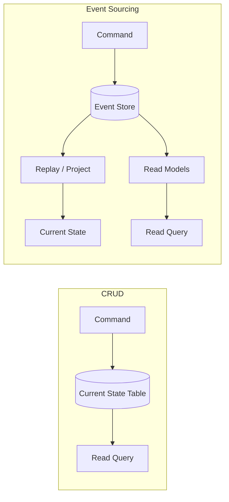

# Overview — Event Sourcing & CQRS(Command Query Responsibility Segregation)

**Event Sourcing** persists state as an **append-only sequence of domain events** instead of updating rows in place. **CQRS** (Command Query Responsibility Segregation) splits **writes** (commands → event store) from **reads** (queries → optimized projections). The two patterns are often used together but are independent.

> **Related:** [API design & protection](../../api-design-and-protection/README.md) (HTTP(Hypertext Transfer Protocol) contracts, async, audit) · [PostgreSQL performance](../../postgresql-performance/README.md) (event table indexing) · [Async patterns](../../api-design-and-protection/includes/10-async-patterns.md) (outbox, queues) · Decision guide → [§6](06-decision-guide.md)

---

## CRUD vs Event Sourcing

| | **CRUD (state-based)** | **Event Sourcing (event-based)** |
|--|------------------------|----------------------------------|
| **Source of truth** | Current row/document | Append-only event log |
| **Write model** | `UPDATE orders SET status = 'shipped'` | Append `OrderShipped` event |
| **Current state** | Stored directly | Replayed or projected from events |
| **History** | Lost unless separate audit table | Built-in |
| **Queries** | Simple SQL(Structured Query Language) on current tables | Often need read models / projections |

---

## Core vocabulary

| Term | Meaning |
|------|---------|
| **Event** | Immutable fact in past tense: `OrderPlaced`, `PaymentReceived` |
| **Event store** | Append-only log; one stream per aggregate instance |
| **Aggregate** | Consistency boundary; all events for one entity share a stream ID |
| **Command** | Intent to change state; validated against rebuilt aggregate |
| **Projection / read model** | Denormalized view built from events for fast queries |
| **Snapshot** | Saved aggregate state at a version — avoids replaying thousands of events |
| **Upcasting** | Transform old event schema to new when loading |

---

## When teams reach for this

| Signal | Why ES/CQRS helps |
|--------|-------------------|
| Audit trail is a product requirement | Events are the audit log |
| "What was the balance on March 1?" | Temporal replay |
| Same data, many read shapes (UI, search, BI) | Multiple projections from one stream |
| Complex domain lifecycles (orders, payments) | Explicit domain events match business language |
| Event-driven microservices | Natural integration boundary |

---

## Document map

| # | Topic | File |
|---|-------|------|
| 1 | Core concepts — aggregates, streams, replay | [01-core-concepts.md](01-core-concepts.md) |
| 2 | CQRS and read models | [02-cqrs-and-read-models.md](02-cqrs-and-read-models.md) |
| 3 | Storage, snapshots, projections | [03-storage-and-projections.md](03-storage-and-projections.md) |
| 4 | API(Application Programming Interface) design implications | [04-api-design-implications.md](04-api-design-implications.md) |
| 5 | Async integration — outbox, bus, consumers | [05-async-integration.md](05-async-integration.md) |
| 6 | Decision guide — pros, cons, when to use | [06-decision-guide.md](06-decision-guide.md) |

---

## Default recommendation

| Situation | Start with |
|-----------|------------|
| Most teams learning the pattern | **PostgreSQL event table** + one SQL read model |
| Rich DDD + .NET/Java ecosystem | **EventStoreDB** or **Marten** |
| High fan-out to many services | Event store + **Kafka** (via transactional outbox) |
| Simple CRUD app, no audit need | **CRUD** — do not adopt ES for fashion |

See [Decision guide](06-decision-guide.md) for full flows and trade-offs.

## Common mistakes

| Mistake | Fix |
|---------|-----|
| Adopt ES for a simple CRUD app | Start with CRUD + optional audit log |
| Skip CQRS planning on read APIs | Design projections before launch |
| Treat the message bus as source of truth | Event store is authoritative; bus is a copy |
| One giant aggregate stream | Small aggregates; one stream per instance |
| Ignore GDPR/PII on immutable events | Plan tombstones or crypto-shredding early |
