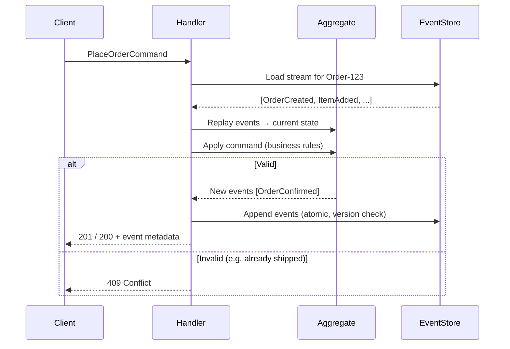
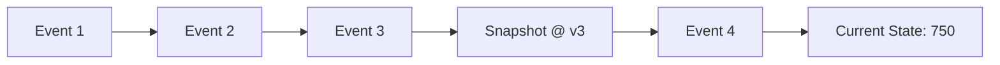
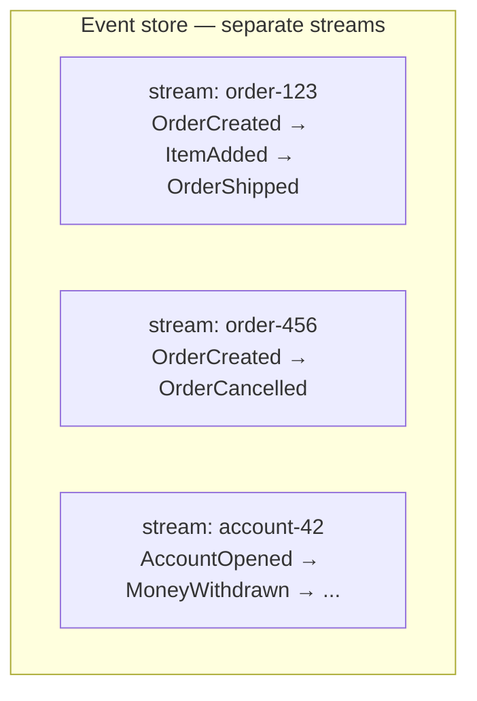

# Core Concepts

How event-sourced systems model state, handle commands, and rebuild aggregates from an append-only log.

> **Related:** Storage choices → [Storage & projections](03-storage-and-projections.md) · API surface → [API design implications](04-api-design-implications.md)

---

## What it is

In Event Sourcing, **every state change is recorded as a new event**. The event store is the system of record. Current state is **derived** — either by replaying events in memory (write path) or by maintaining projections (read path).

**Rule of thumb:** Events describe **what happened** (`OrderCancelled`), not **what to do** (`CancelOrder`). Commands express intent; events record facts after business rules pass.

---

## Write path — command to event



### Steps

1. **Load** all events for the aggregate ID (optionally from snapshot + tail events).
2. **Replay** events to rebuild in-memory state.
3. **Validate** the command against current state.
4. **Append** new events with expected-version check (optimistic concurrency).
5. **Publish** to projectors or outbox (same transaction when possible).

---

## Rebuilding state from events

Example: bank account `Account-42`

| Version | Event | Derived balance |
|--------:|-------|-----------------|
| 1 | `AccountOpened(initial: 1000)` | 1000 |
| 2 | `MoneyWithdrawn(200)` | 800 |
| 3 | `MoneyDeposited(50)` | 850 |
| 4 | `MoneyWithdrawn(100)` | 750 |

There is no authoritative `balance` column — only events. A snapshot at version 3 might store `{ balance: 850 }` so replay starts from event 4.



---

## Aggregates and streams

An **aggregate** is the consistency boundary:

- One **stream ID** per aggregate instance (e.g. `order-123`, not all orders).
- Commands target **one aggregate** per transaction.
- Cross-aggregate rules use **sagas** or **process managers** (async), not one giant transaction — see [Sagas and distributed workflows](07-sagas-and-distributed-workflows.md).



| Design rule | Why |
|-------------|-----|
| Small aggregates | Fewer events to replay; clearer invariants |
| One command → one aggregate | Keeps transactions simple |
| Events are past tense | They are facts, not instructions |
| Include metadata | `event_id`, `aggregate_id`, `version`, `timestamp`, `correlation_id`, `causation_id` |

---

## Optimistic concurrency

Append fails if another writer incremented the version first:

```sql
INSERT INTO events (aggregate_id, version, event_type, payload)
VALUES ('order-123', 5, 'OrderShipped', '...')
-- UNIQUE (aggregate_id, version) → conflict → return 409 to client
```

Maps naturally to HTTP **`409 Conflict`** and `ETag` / `If-Match` on command APIs — see [API design implications](04-api-design-implications.md).

---

## Immutability and corrections

Events are **never updated or deleted** in the normal model.

| Need | Approach |
|------|----------|
| Bug in past event schema | **Upcast** on read — transform v1 → v2 in loader |
| Business mistake | Append **compensating event** (`PaymentRefunded`), not DELETE |
| GDPR / right to erasure | Tombstone events, crypto-shredding, or legal retention policy — plan early |

---

## Event Sourcing vs Event-Driven Architecture

| | Event Sourcing | Event-Driven (EDA) |
|--|----------------|---------------------|
| **Goal** | Persist state as events | Communicate via messages |
| **Source of truth** | Event log | Often still CRUD DB per service |
| **Overlap** | ES systems usually publish events; not all EDA uses ES |

You can emit domain events from CRUD without Event Sourcing. Event Sourcing means the log **is** the authority.

---

## Pros of the core model

- Complete, ordered history per aggregate
- Debugging: reproduce exact sequence that led to a bug
- Business language in code (`OrderShipped` vs generic UPDATE)
- Natural audit for compliance

## Cons

- Replay cost grows with stream length — snapshots required
- Mental model shift from CRUD
- Cross-aggregate invariants need async coordination
- Schema evolution is ongoing work (upcasting)

See [Decision guide](06-decision-guide.md) for when the trade-off is worth it.

## Common mistakes

| Mistake | Fix |
|---------|-----|
| Events as commands (`CancelOrder` not `OrderCancelled`) | Past-tense facts only |
| One stream for all entities of a type | One stream ID per aggregate instance |
| Cross-aggregate rules in one transaction | [Sagas / process managers async](07-sagas-and-distributed-workflows.md) |
| Delete or UPDATE events in place | Compensating events + upcasting |
| Skip expected-version check on append | `UNIQUE (aggregate_id, version)` → `409` |
| Replay without snapshots on long streams | Snapshot every N events |
