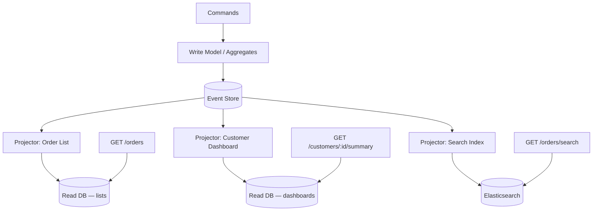
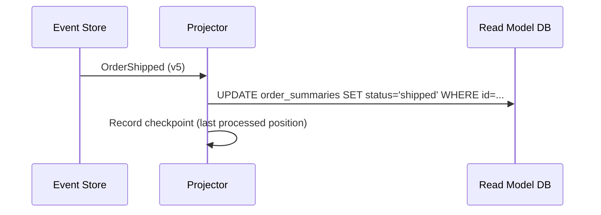
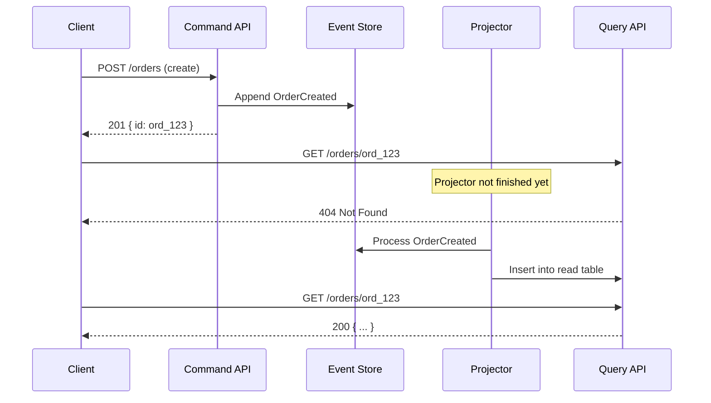

# CQRS(Command Query Responsibility Segregation) and Read Models

**CQRS** separates the **write model** (commands, aggregates, event store) from **read models** (queries optimized for specific screens or reports). Event Sourcing often pairs with CQRS because replaying the full log on every HTTP(Hypertext Transfer Protocol) GET does not scale.

> **Related:** Storage → [Storage & projections](03-storage-and-projections.md) · HTTP split → [API design implications](04-api-design-implications.md)

---

## What it is

| Side | Responsibility | Typical storage |
|------|----------------|-----------------|
| **Command side** | Validate, append events, enforce invariants | Event store |
| **Query side** | Serve reads from denormalized views | PostgreSQL, Elasticsearch, Redis, warehouse |

**Rule of thumb:** Writes go through the aggregate + event store. Reads hit projections unless you explicitly need point-in-time replay (support, audit API(Application Programming Interface)).

---

## Projectors

A **projector** (or **event handler**) consumes events and updates read models:

| Projector property | Why it matters |
|--------------------|----------------|
| **Idempotent** | At-least-once delivery may replay events |
| **Checkpointed** | Resume after crash without full rebuild |
| **Rebuildable** | Drop read DB and replay from event store |
| **Single-writer per projection** | Avoid race on same row |

---

## Eventual consistency

Read models lag behind writes by milliseconds to seconds (or longer under load). This is **eventual consistency by design** — the write model (event store) is strongly consistent; projections are not. See [Strong consistency — promises and costs](../../postgresql-performance/includes/14-consistency-promises-and-costs.md) for the general trade-offs and when that lag is unacceptable.

### API strategies for stale reads

| Strategy | When to use |
|----------|-------------|
| **Accept lag** | List views, dashboards — document SLA |
| **`202` + poll** | Client must see own write immediately — reuse [async job pattern](../../api-design-and-protection/includes/10-async-patterns.md) |
| **Read-your-writes** | Route recent IDs to write-side or sync projector for that aggregate |
| **`409` + retry** | Command conflicts — client refreshes and retries |

Document consistency in OpenAPI: `"Read model may lag up to N seconds after write."`

---

## Multiple projections from one stream

Same events, different shapes:

| Projection | Built from | Serves |
|------------|------------|--------|
| `order_summaries` | All order events | `GET /orders` list |
| `order_timeline` | All order events | `GET /orders/:id/history` |
| `customer_order_counts` | OrderCreated, OrderCancelled | Analytics |
| Search index | OrderCreated, ItemAdded | Full-text search |

Adding a new read model = new projector + replay — **no migration of the write model**.

---

## CQRS without Event Sourcing

CQRS only means separate read/write paths:

- Write: normalized OLTP tables
- Read: materialized views or replica

Event Sourcing is optional. Many teams use **CQRS-lite** (read replicas + caches) without an event store.

---

## Pros of CQRS + projections

- Read queries stay fast and simple (indexes, joins tuned per screen)
- Scale read and write tiers independently
- New views without changing write schema
- Clear boundary for caching and CDN(Content Delivery Network) on query APIs

## Cons

- Eventual consistency complicates UX and tests
- More moving parts (projectors, checkpoints, monitoring lag)
- Duplicate data — storage and sync logic
- "Which read model is truth?" confusion if not documented

See [Decision guide](06-decision-guide.md).

## Common mistakes

| Mistake | Fix |
|---------|-----|
| Query API reads event store on every GET | Dedicated read models / projections |
| Projector not idempotent | UPSERT by `event_id`; safe replays |
| No checkpoint on projectors | Record last processed position |
| Promise strong read-after-write on projections | Document lag; route hot reads to primary path |
| One projection trying to serve every screen | Separate projections per access pattern |
| Rebuild read model by hand-editing rows | Replay from event store |
