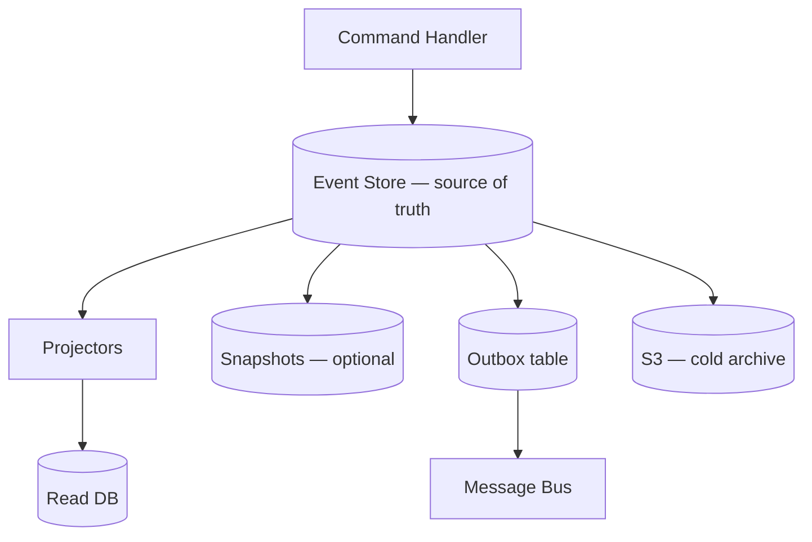
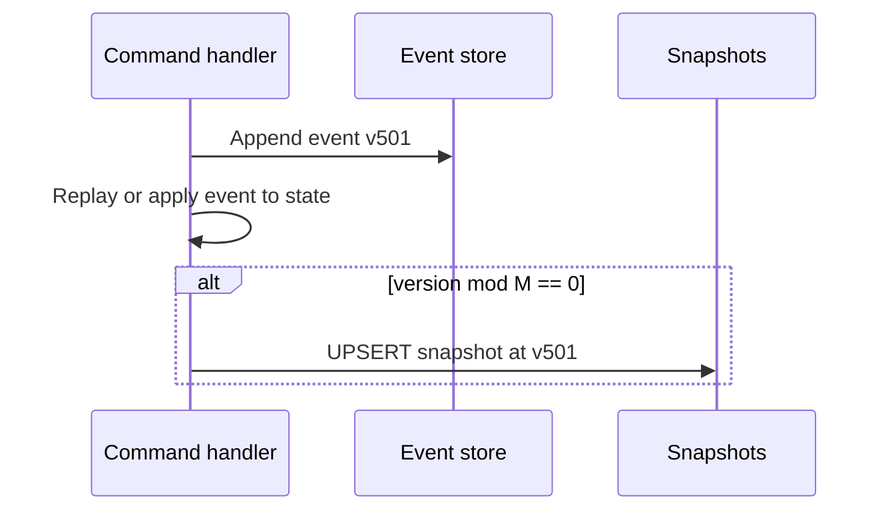
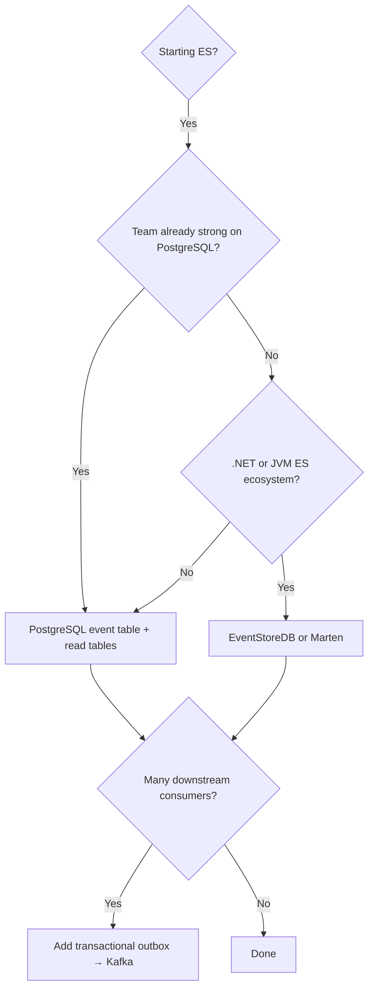

# Storage and Projections

Where to persist events, how to schema the event store, and when to add snapshots and archival.

> **Related:** PostgreSQL tuning → [postgresql-performance](../../postgresql-performance/README.md) · Outbox → [Async integration](05-async-integration.md)

---

## What to store where

| Store | Role | Source of truth? |
|-------|------|------------------|
| **Event store** | Append-only domain events | ✅ Yes |
| **Read model DB** | Query-optimized projections | No — rebuildable |
| **Snapshots** | Aggregate state at version N | No — optimization only |
| **Message bus** (Kafka, etc.) | Fan-out to consumers | No — copy of events |
| **Object storage** (S3) | Cold archive, large payloads | Archive only |



**Rule of thumb:** Append events once in the event store. Publish to the bus from an **outbox** in the same transaction — never dual-write store + bus independently.

---

## Storage options

| Option | Best for | Notes |
|--------|----------|-------|
| **PostgreSQL / MySQL** | Default for most teams | Familiar ops, ACID(Atomicity, Consistency, Isolation, Durability), one event table |
| **EventStoreDB** | ES-native features | Streams, subscriptions, competing consumers |
| **Marten** (.NET + PostgreSQL) | .NET DDD projects | Document + event storage on Postgres |
| **DynamoDB / Cosmos DB** | Serverless, partition by aggregate | PK = aggregate_id, SK = version |
| **Kafka** (as primary store) | Rare; high throughput | Retention, stream-per-key queries are awkward |
| **S3 + metadata DB** | Long retention, compliance | Hot path elsewhere; events archived after N days |

### Default: PostgreSQL event table

```sql
CREATE TABLE events (
    id              BIGSERIAL PRIMARY KEY,
    aggregate_id    TEXT NOT NULL,
    aggregate_type  TEXT NOT NULL,
    version         INT NOT NULL,
    event_type      TEXT NOT NULL,
    payload         JSONB NOT NULL,
    metadata        JSONB NOT NULL DEFAULT '{}',
    created_at      TIMESTAMPTZ NOT NULL DEFAULT now(),
    UNIQUE (aggregate_id, version)
);

CREATE INDEX idx_events_aggregate ON events (aggregate_id, version);
CREATE INDEX idx_events_type_time ON events (event_type, created_at);
```

| Column | Purpose |
|--------|---------|
| `aggregate_id` + `version` | Stream identity + optimistic concurrency |
| `event_type` | Deserialization / upcasting |
| `payload` | Domain data (versioned schema) |
| `metadata` | `correlation_id`, `causation_id`, `user_id`, trace |

For indexing and bulk replay performance, see [postgresql-performance](../../postgresql-performance/README.md).

---

## Snapshots

When streams exceed ~hundreds or thousands of events, store periodic snapshots:

```sql
CREATE TABLE snapshots (
    aggregate_id   TEXT PRIMARY KEY,
    aggregate_type TEXT NOT NULL,
    version        INT NOT NULL,
    state          JSONB NOT NULL,
    created_at     TIMESTAMPTZ NOT NULL DEFAULT now()
);
```

Load path: snapshot at v500 + events 501..N → current state.

| Pros | Cons |
|------|------|
| Faster aggregate load | Snapshot schema must evolve with aggregate |
| Bounded replay time | Extra write on snapshot interval |
| | Wrong snapshot + missed events = corruption — test recovery |

---

## Read model storage

| Read need | Typical store |
|-----------|---------------|
| Lists, filters, joins | PostgreSQL / MySQL |
| Full-text search | Elasticsearch / OpenSearch |
| Hot dashboards | Redis (with Postgres backing) |
| Analytics / BI | Warehouse (BigQuery, Snowflake) via CDC(Change Data Capture) or projector |

Read tables can be dropped and rebuilt by replaying the event log — treat them as **cache with a rebuild script**.

---

## Retention and growth

Event logs grow forever unless you plan:

| Strategy | Use when |
|----------|----------|
| **Partition by time** | PostgreSQL monthly partitions on `created_at` |
| **Archive to S3** | Compliance requires 7+ years; hot store keeps recent window |
| **Snapshot + trim** | Rare; only closed aggregates, legal review required |

Never delete events from the authoritative store without explicit policy — projections depend on them.

---

## Snapshots — depth

### When to snapshot

| Stream length | Recommendation |
|---------------|----------------|
| &lt; 100 events | Optional — full replay is fast |
| 100–1,000 | Snapshot every N commands or on schedule |
| 1,000+ | **Required** — bound load latency |

**Interval heuristic:** snapshot when replay p99 &gt; your SLO(Service Level Objective) budget (e.g. &gt; 50ms), or every **M** events (often 100–500 for heavy aggregates).

### Snapshot write path



| Rule | Why |
|------|-----|
| Snapshot **after** successful append | Snapshot must not reference non-existent version |
| Same transaction optional | Some teams async snapshot job — tolerate brief lag |
| Version on snapshot row | Load: `WHERE version <= snapshot.version` tail only |

### Rebuild-from-scratch runbook

1. Stop projectors (or mark read models stale)
2. Truncate read model tables (not event store)
3. Replay all events from offset 0 (or per aggregate)
4. Compare row counts / checksums to pre-rebuild baseline
5. Re-enable projectors

Test on staging with production-sized stream **before** production incident.

### GDPR, erasure, and legal hold

| Requirement | Approach |
|-------------|----------|
| **Right to erasure** | Tombstone event + crypto-shred PII keys; legal review |
| **Legal hold** | No delete; archive only |
| **Retention policy** | Hot PG window + S3 archive; document in compliance |

Never hard-delete events without policy — use **tombstone events** and redacted projections.

Deploy projectors compatibly during rolling deploy → [deployment-strategies §12](../../deployment-strategies/includes/12-schema-migrations-and-deploy.md).

---

## Decision flow — pick a store



---

## Pros of PostgreSQL-first

- One ops stack, backups, monitoring
- ACID append + outbox in one transaction
- JSONB for flexible event payloads
- Easy local dev

## Cons

- Not optimized for infinite global event log at hyperscale
- Replay speed depends on indexing and hardware
- You build subscriptions/projectors yourself (or use a library)

See [Decision guide](06-decision-guide.md) for full trade-offs.

## Common mistakes

| Mistake | Fix |
|---------|-----|
| Dual-write event store + Kafka without outbox | Transactional outbox in same DB transaction |
| Kafka as primary event store | PostgreSQL (or ES-native DB) as source of truth |
| No index on `(aggregate_id, version)` | Required for stream load and concurrency |
| Snapshots treated as source of truth | Snapshots are optimization; events are authority |
| Skip archival plan for multi-year retention | Hot store + S3 cold archive |
| Full replay on every schema tweak | Upcast on read; version event payloads |
