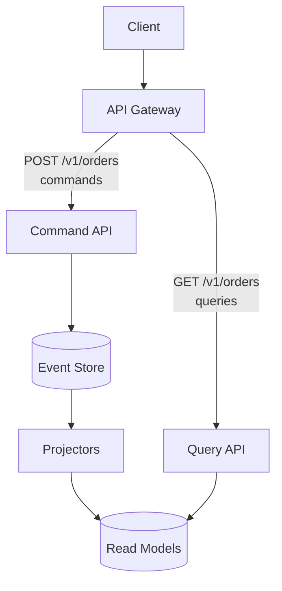
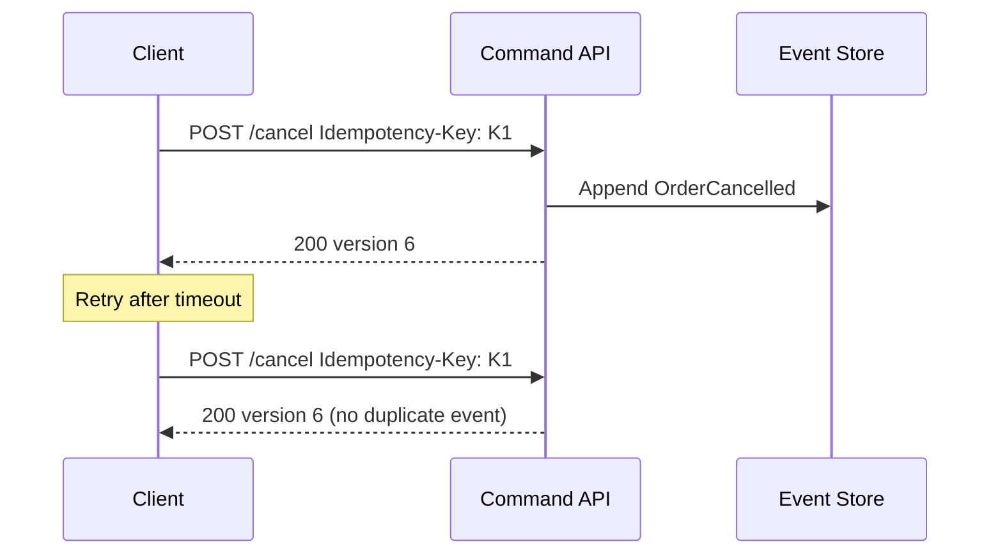

# API Design Implications

How Event Sourcing and CQRS(Command Query Responsibility Segregation) shape HTTP(Hypertext Transfer Protocol) APIs: command vs query routes, status codes, idempotency, and gateway routing.

> **Scope:** **ES/CQRS API lens** — command/query split, projection lag, and event-store write paths. General REST(Representational State Transfer) design (pagination, errors, versioning) → [api-design §1 API design](../../api-design-and-protection/includes/01-api-design.md).

> **Related:** [API design best practices](../../api-design-and-protection/includes/01-api-design.md) · [Async patterns](../../api-design-and-protection/includes/10-async-patterns.md) · [Gateway routing](../../api-design-and-protection/includes/03-api-gateway.md)

---

## Command vs query split

CQRS often maps to **separate API surfaces** (logical or physical):



| Side | HTTP | Idempotent? | Consistency |
|------|------|-------------|-------------|
| **Commands** | POST (create action), sometimes PUT/PATCH on resource | Via `Idempotency-Key` + dedup | Strong per aggregate |
| **Queries** | GET | Yes (safe) | Eventual (projection lag) |

**Rule of thumb:** Same URL for command and query is OK at small scale (`POST /orders` writes, `GET /orders` reads). At scale, split services or route prefixes (`/commands/*` vs `/queries/*`) for independent scaling.

---

## Modeling commands as HTTP

### Resource-oriented commands (common)

Fits existing REST style — commands are POSTs on sub-resources:

```http
POST /v1/orders/ord_123/cancel
Authorization: Bearer …
Idempotency-Key: 7c9e6679-7425-40de-944b-e07fc1f90ae7
If-Match: "5"
```

```http
POST /v1/orders/ord_123/ship
Content-Type: application/json

{ "carrier": "ups", "tracking_number": "1Z999…" }
```

| Header | Role in ES |
|--------|------------|
| `Idempotency-Key` | Same key → same result, no duplicate events |
| `If-Match` / `ETag` | Expected aggregate version → `409` on conflict |

### Dedicated command endpoint (alternative)

```http
POST /v1/commands
Content-Type: application/json

{
  "type": "CancelOrder",
  "aggregate_id": "ord_123",
  "expected_version": 5,
  "payload": { "reason": "customer_request" }
}
```

| Pros | Cons |
|------|------|
| Uniform envelope for all writes | Less REST-native; harder OpenAPI grouping |
| Easy versioning of command schema | Clients learn a RPC-style contract |

Use when many command types or mobile clients need one endpoint.

---

## Status codes for commands

| Code | Use |
|------|-----|
| `201` | Aggregate created; first event appended |
| `200` | Command applied; body may include new version / event IDs |
| `400` | Malformed command |
| `401` / `403` | Auth |
| `409` | Version conflict or invalid state transition |
| `422` | Semantically invalid (e.g. negative amount) |
| `429` | Rate limited |

**409 example:**

```json
{
  "error": {
    "code": "version_conflict",
    "message": "Order was modified. Expected version 5, current is 6.",
    "request_id": "req_9f2a",
    "details": {
      "aggregate_id": "ord_123",
      "expected_version": 5,
      "current_version": 6
    }
  }
}
```

Client flow: `GET` fresh state (or retry with updated `If-Match`) → re-submit command.

---

## Query APIs and eventual consistency

Document projection lag in OpenAPI and developer portal:

```yaml
/v1/orders/{order_id}:
  get:
    summary: Get order (read model)
    description: |
      Served from read projection. May lag up to ~2s after write.
      Use GET /v1/orders/{id}/events for authoritative timeline.
    responses:
      '200': …
      '404': Order not found (or not yet projected)
```

| Endpoint type | Data source |
|---------------|-------------|
| `GET /orders` | Read model — fast, eventually consistent |
| `GET /orders/:id/events` | Event store stream — authoritative history |
| `GET /orders/:id/at?timestamp=…` | Replay to point in time — support/audit |

---

## Audit and history APIs

Event Sourcing enables first-class history endpoints:

```http
GET /v1/orders/ord_123/events
```

```json
{
  "data": [
    {
      "version": 1,
      "type": "OrderCreated",
      "occurred_at": "2026-06-14T10:00:00Z",
      "payload": { "customer_id": "cus_456" }
    },
    {
      "version": 2,
      "type": "OrderShipped",
      "occurred_at": "2026-06-14T14:30:00Z",
      "payload": { "carrier": "ups" }
    }
  ],
  "pagination": { "next_cursor": null, "has_more": false }
}
```

Supports **Repudiation** controls in [threat modeling](../../api-design-and-protection/includes/06-threat-model.md) — correlate with `request_id` and actor in event metadata.

---

## Gateway considerations

| Concern | Command API | Query API |
|---------|-------------|-----------|
| Rate limits | Stricter on writes | Higher on reads |
| Timeouts | Short (append only) | Tuned for list/search |
| Caching | Never cache POST | CDN(Content Delivery Network)/cache safe on GET |
| AuthZ | Scope + aggregate ownership | Same BOLA(Broken Object-Level Authorization) checks on read models |

Route both through the same gateway; scale query tier independently behind separate upstream pools if needed — see [Load balancer & gateway](../../api-design-and-protection/includes/03-api-gateway.md#flow-3--both-together-common-at-scale).

---

## Idempotency

Same pattern as [Write safety](../../api-design-and-protection/includes/01-api-design.md#7-write-safety):



Store idempotency key → `(aggregate_id, resulting_version)` with TTL.

---

## OpenAPI tips

- Document `If-Match` on command endpoints
- Enum command outcomes in error `code` field
- Separate tags: `Commands` vs `Queries`
- Note read-model lag in GET descriptions

---

## Pros of ES-aware API design

- Explicit conflict handling (`409`) instead of silent overwrites
- History and audit as public or internal API products
- Command/query scaling maps to infrastructure

## Cons

- Clients must handle eventual consistency and version conflicts
- More endpoints (`/events`, version headers)
- OpenAPI cannot express projection lag numerically without docs

See [Decision guide](06-decision-guide.md).

## Common mistakes

| Mistake | Fix |
|---------|-----|
| Same URL for heavy writes and reads without scaling plan | Split command/query services or pools |
| No `If-Match` / `409` on conflicting commands | Expected-version check on append |
| Cache GET on projection endpoints | Never cache eventually consistent reads blindly |
| Hide projection lag from API consumers | Document lag in OpenAPI |
| Duplicate events without idempotency keys | `Idempotency-Key` + dedup store |
| Expose raw event store without authZ | Same BOLA checks as read models |