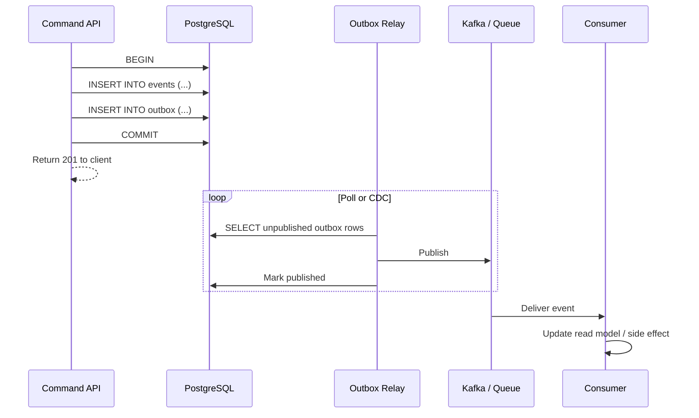
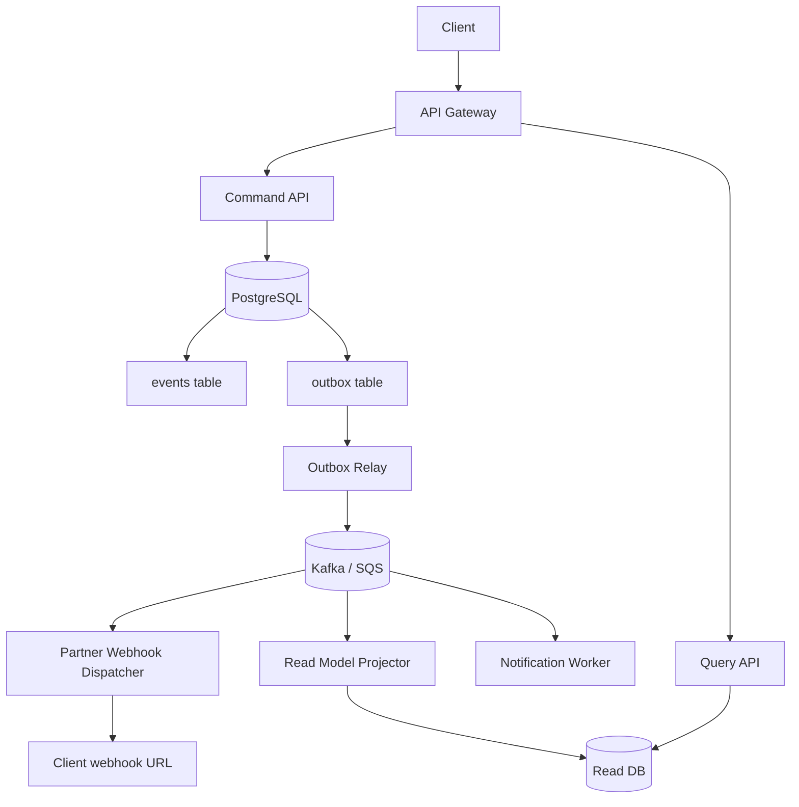
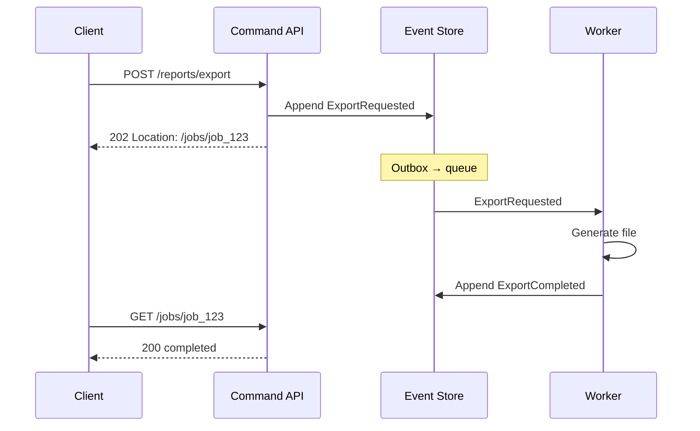

# Async Integration

How event-sourced systems integrate with queues, webhooks, and other services — transactional outbox, idempotent consumers, and overlap with async API(Application Programming Interface) patterns.

> **Deep dive:** Kafka outbox and integration patterns → [apache-kafka §8](../../apache-kafka/includes/08-integration-patterns.md)
>
> **Related:** [Async patterns in API design](../../api-design-and-protection/includes/10-async-patterns.md) · [Storage & outbox](03-storage-and-projections.md) · [Sagas and distributed workflows](07-sagas-and-distributed-workflows.md)

---

## What it is

After appending events to the store, other systems need to react: update read models, send emails, call payment providers, push **webhooks** to partners. This is **async integration** — decoupled from the HTTP(Hypertext Transfer Protocol) command response.

Event Sourcing does **not** replace job queues or webhooks. It complements them: the event store is durable truth; the bus delivers copies to consumers.

---

## Transactional outbox pattern

**Problem:** Append to event store AND publish to Kafka in two steps → crash between them = lost message or inconsistency.

**Solution:** Write integration events to an **outbox table** in the **same DB transaction** as domain events; a separate relay publishes to the bus.



```sql
CREATE TABLE outbox (
    id           BIGSERIAL PRIMARY KEY,
    event_id     UUID NOT NULL,
    topic        TEXT NOT NULL,
    payload      JSONB NOT NULL,
    created_at   TIMESTAMPTZ NOT NULL DEFAULT now(),
    published_at TIMESTAMPTZ
);
```

| Approach | Pros | Cons |
|----------|------|------|
| **Polling relay** | Simple | Slight lag, DB poll load |
| **CDC (Debezium)** | Near real-time | Extra infra |
| **In-process after commit** | Easy in dev | Not durable across crashes |

Multi-service workflows (order → payment → inventory) → [Sagas and distributed workflows](07-sagas-and-distributed-workflows.md). Consumer dedup (inbox) → [Inbox pattern](07C-sagas-operations.md#inbox-pattern-consumer-dedup).

---

## End-to-end architecture with API layers



Compare with [async job architecture](../../api-design-and-protection/includes/10-async-patterns.md#end-to-end-architecture): jobs handle **long work**; outbox handles **reliable event delivery** after a successful write.

---

## Projectors vs integration consumers

| Consumer type | Updates | Failure handling |
|---------------|---------|------------------|
| **Read model projector** | Query DB | Retry; idempotent UPSERT by event ID |
| **Side-effect worker** | Email, payment, external API | Retry + dead-letter queue |
| **Webhook dispatcher** | Partner HTTP POST | Backoff, HMAC(Hash-based Message Authentication Code) — see [Auth model](../../api-design-and-protection/includes/04-auth-model.md#hmac-webhooks) |

All must be **idempotent** on `event_id` — at-least-once delivery is normal.

---

## Event Sourcing vs job resources

| Pattern | Purpose | Client sees |
|---------|---------|-------------|
| **Event store + outbox** | Durable domain state + integration | `201` when command accepted |
| **Job resource (`202`)** | Long-running work (export, ML) | Poll `/jobs/{id}` until done |

They combine cleanly:



---

## Webhooks from domain events

Map terminal domain events to outbound webhooks (same security as [async webhooks](../../api-design-and-protection/includes/10B-async-webhooks.md#pattern-2--webhooks-server-push)):

```json
{
  "id": "evt_9f2a",
  "type": "order.shipped",
  "created_at": "2026-06-14T14:30:00Z",
  "data": {
    "order_id": "ord_123",
    "version": 5,
    "payload": { "carrier": "ups" }
  }
}
```

Use `event_id` for partner deduplication — mirrors idempotency on the command side.

---

## Monitoring async integration

| Metric | Alert when |
|--------|------------|
| Outbox lag (unpublished count) | Growing backlog |
| Projector lag (events behind head) | Read model stale beyond SLA(Service Level Agreement) |
| Consumer error rate | DLQ(Dead Letter Queue) filling |
| Webhook delivery failures | Partner integration broken |

---

## Pros

- Reliable delivery without dual-write bugs
- Scales consumers independently of command API
- Natural fit for microservices and partner webhooks

## Cons

- Operational complexity (relay, CDC, DLQ)
- Eventual consistency across services
- Debugging requires correlation IDs across store, bus, and consumers

See [Decision guide](06-decision-guide.md).

## Common mistakes

| Mistake | Fix |
|---------|-----|
| Publish to bus outside DB transaction | Transactional outbox pattern |
| Non-idempotent consumers | Dedup by `event_id` |
| In-process publish after commit only | Crashes lose messages — use relay/CDC |
| No DLQ for failed side effects | Retry + dead-letter queue |
| Webhooks without partner dedup header | Include `event_id` in payload |
| Ignore outbox / projector lag metrics | Alert on growing backlog |