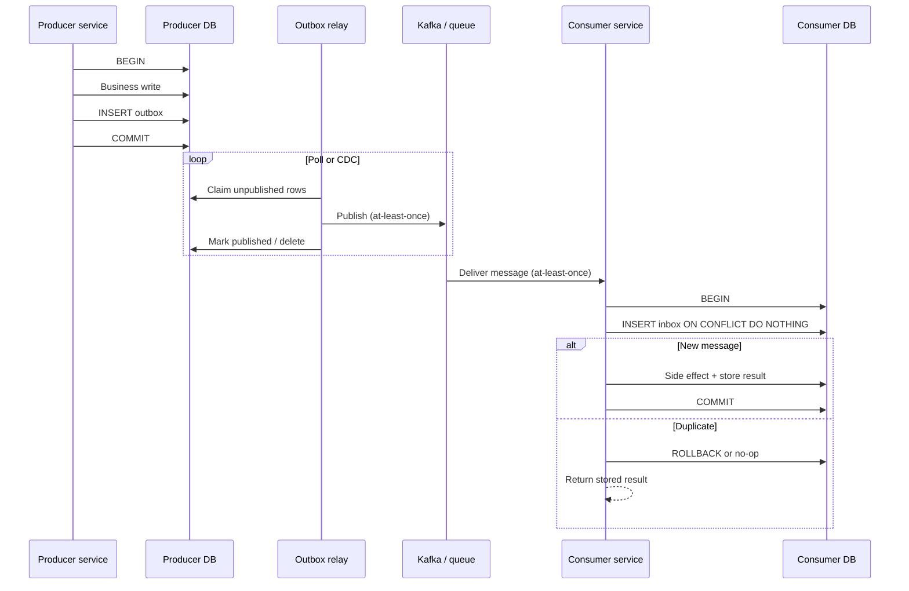
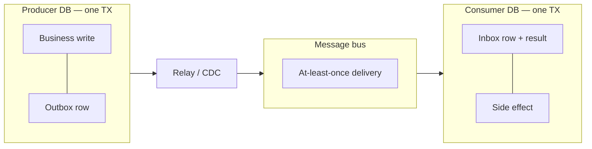

# Outbox and Inbox

Reliable **publish** (outbox) and reliable **consume** (inbox) as a pair — schemas, relay operations, CDC(Change Data Capture) alternatives, and how they relate to saga step idempotency.

> **Overview:** [Async integration](05-async-integration.md) · **Sagas:** [§7](07-sagas-and-distributed-workflows.md) · **Kafka:** [apache-kafka §8](../../apache-kafka/includes/08-integration-patterns.md) · **Idempotency:** [api-design §13](../../api-design-and-protection/includes/13-idempotency.md)

---

## At a glance

| Pattern | Role | Same DB transaction as… |
|---------|------|-------------------------|
| **Outbox** | Producer — durable intent to publish | Business write + outbox row |
| **Inbox** | Consumer — durable dedup before side effects | Inbox insert + side-effect write |
| **saga_step_log** | Saga participant — business-step idempotency | Step outcome + optional outbox |

**Rule of thumb:** Outbox stops lost publishes after commit. Inbox stops duplicate side effects under at-least-once delivery. Use both ends of every critical path.

---

## End-to-end: outbox ↔ bus ↔ inbox





Producer commit and consumer commit are **independent**. The bus guarantees neither exactly-once nor ordering unless you design for it (partition keys, idempotency).

---

## Transactional outbox (producer)

### Schema

```sql
CREATE TABLE outbox (
    id           BIGSERIAL PRIMARY KEY,
    event_id     UUID NOT NULL UNIQUE,
    aggregate_id UUID,
    topic        TEXT NOT NULL,
    payload      JSONB NOT NULL,
    headers      JSONB NOT NULL DEFAULT '{}',
    created_at   TIMESTAMPTZ NOT NULL DEFAULT now(),
    published_at TIMESTAMPTZ,
    attempts     INT NOT NULL DEFAULT 0,
    last_error   TEXT
);

CREATE INDEX outbox_unpublished_idx
    ON outbox (created_at)
    WHERE published_at IS NULL;
```

Write `event_id`, `topic`, `payload`, and correlation headers (`saga_id`, `correlation_id`) in the **same transaction** as the domain write — see [Transactional outbox](05-async-integration.md#transactional-outbox-pattern).

### Relay approaches

| Approach | Pros | Cons |
|----------|------|------|
| **Polling relay** | Simple; app-owned | Lag; DB load; need `FOR UPDATE SKIP LOCKED` |
| **CDC (Debezium) on outbox** | Near real-time; less app code | Extra infra; careful with deletes |
| **CDC on events table** | No separate outbox table | Couples bus shape to event store; harder to filter/transform |
| **In-process after commit** | Easy in dev | Crashes lose messages — not production-durable |

### Outbox table vs CDC on the events table

| Choice | Use when |
|--------|----------|
| **Dedicated outbox** | Integration events differ from stored domain events; need topic routing, headers, or redaction before publish |
| **CDC events table** | Bus payload **is** the event row; projectors and partners consume the same stream; team accepts store schema as the contract |

Prefer a **dedicated outbox** when public/integration contracts must stay stable while the internal event store evolves — [Event schema evolution](08-event-schema-evolution.md).

### Mark-published races (at-least-once from the relay)

The relay itself is at-least-once:

1. Publish to the bus succeeds.
2. Process crashes before `published_at` is set.
3. On restart the same row is published again.

**Implication:** Consumers must tolerate duplicates — inbox or equivalent. Do **not** aim for exactly-once by making the relay “careful”; make consumers idempotent.

Safe claim pattern for pollers:

```sql
BEGIN;
SELECT id, event_id, topic, payload, headers
FROM outbox
WHERE published_at IS NULL
  AND attempts < 20
ORDER BY created_at
FOR UPDATE SKIP LOCKED
LIMIT 100;
-- publish each row to the bus
UPDATE outbox
SET published_at = now(), attempts = attempts + 1
WHERE id = ANY(:ids);
COMMIT;
```

On publish failure: increment `attempts`, set `last_error`, leave `published_at` null. After max attempts → poison handling (below).

### Poison rows and relay DLQ

| Symptom | Action |
|---------|--------|
| Payload fails serialization / schema validation | Stop retrying blindly; quarantine |
| Broker rejects permanently (bad topic ACL) | Alert; fix config; replay |
| Transient broker errors | Backoff; keep `published_at` null |

Move exhausted rows to a **poison / DLQ table** (or mark `published_at` with a sentinel status column) so one bad row does not block the unpublished index forever. Align with [HTS DLQ](../../high-throughput-systems/includes/06-async-queues-workers.md#dead-letter-queue-dlq).

### Retention and cleanup

Published rows are not free:

| Strategy | Notes |
|----------|-------|
| **Delete after publish** | Smallest table; loses local audit of what was sent |
| **Soft-retain then purge** | Keep `published_at` for N days; scheduled `DELETE` / partition drop |
| **Archive** | Export to object storage before delete if compliance needs proof of publish |

Index only unpublished rows (`WHERE published_at IS NULL`) so cleanup does not hurt the hot path. Alert on **outbox lag** (unpublished count / age) — [Monitoring](05-async-integration.md#monitoring-async-integration).

---

## Inbox pattern (consumer)

### Schema (with stored outcome)

Align with saga step logs: store enough to **return the prior result** on duplicate delivery.

```sql
CREATE TABLE inbox (
    consumer_name TEXT NOT NULL,
    message_id    TEXT NOT NULL,
    result        JSONB,
    received_at   TIMESTAMPTZ NOT NULL DEFAULT now(),
    PRIMARY KEY (consumer_name, message_id)
);
```

| Column | Purpose |
|--------|---------|
| `consumer_name` | Isolate dedup per consumer / projector (same bus message, different handlers) |
| `message_id` | Stable id from producer — prefer `event_id` from the outbox |
| `result` | Outcome to return on retry (status, ids, error code) — omit only if side effect is pure upsert with no return value |

### Consumer transaction

```text
BEGIN;
  INSERT INTO inbox (consumer_name, message_id, result)
  VALUES (:name, :message_id, NULL)
  ON CONFLICT DO NOTHING
  RETURNING message_id;

  -- if no row returned: SELECT result … and exit (duplicate)

  -- apply side effect (update read model, call only if result stored after success)
  UPDATE …;
  UPDATE inbox SET result = :result::jsonb
  WHERE consumer_name = :name AND message_id = :message_id;
COMMIT;
-- then commit bus offset / ack
```

**Ordering:** Ack the bus **after** the inbox transaction commits. Ack-before-commit recreates lost-update bugs the outbox was meant to fix.

If the side effect is an external API(Application Programming Interface) that cannot join the DB transaction, use **inbox insert first** (reservation) + idempotency key on the external call + store `result` after success — same discipline as [saga step idempotency](07B-sagas-compensation-idempotency.md#idempotency-patterns-specific-to-sagas).

### Inbox vs saga_step_log

| Mechanism | Key | Typical owner |
|-----------|-----|---------------|
| **Inbox** | `(consumer_name, message_id)` — transport / event identity | Any consumer (projector, webhook worker, choreography listener) |
| **saga_step_log** | `(service_name, idempotency_key)` often `saga_id + step_name` — business step | Saga participant APIs |

A saga participant often uses **both**: inbox (or HTTP idempotency) against duplicate messages, and `saga_step_log` so `CapturePayment` for saga X never double-charges even if message ids differ. See [§7C](07C-sagas-operations.md) for ops around stuck sagas; schemas above are the source of truth for the pair.

---

## How the pair fits sagas

| Step | Pattern |
|------|---------|
| Orchestrator advances state and emits next command | Outbox in orchestrator DB |
| Participant handles command | Inbox or `saga_step_log` + local TX + outbox for reply/events |
| Compensation command | Same — compensation must be idempotent too |

Multi-step coordination → [Sagas and distributed workflows](07-sagas-and-distributed-workflows.md). Hand-rolled sagas vs workflow engines → [specialized-data-systems §4](../../specialized-data-systems/includes/04-workflow-engines.md).

---

## Common mistakes

| Mistake | Fix |
|---------|------|
| Publish outside the business transaction | Transactional outbox |
| Assume relay is exactly-once | Inbox / idempotent consumers |
| Inbox without storing `result` when callers need a response | Add `result` JSONB; return it on conflict |
| Ack bus before inbox commit | Commit DB first, then ack |
| CDC events table when integration contract must diverge | Dedicated outbox + stable public schema |
| Never purge published outbox rows | Retention job or delete-after-publish |
| One poison outbox row blocks the queue | Max attempts + quarantine / DLQ |
| Inbox keyed only globally (no `consumer_name`) | Collides when two handlers share a DB |