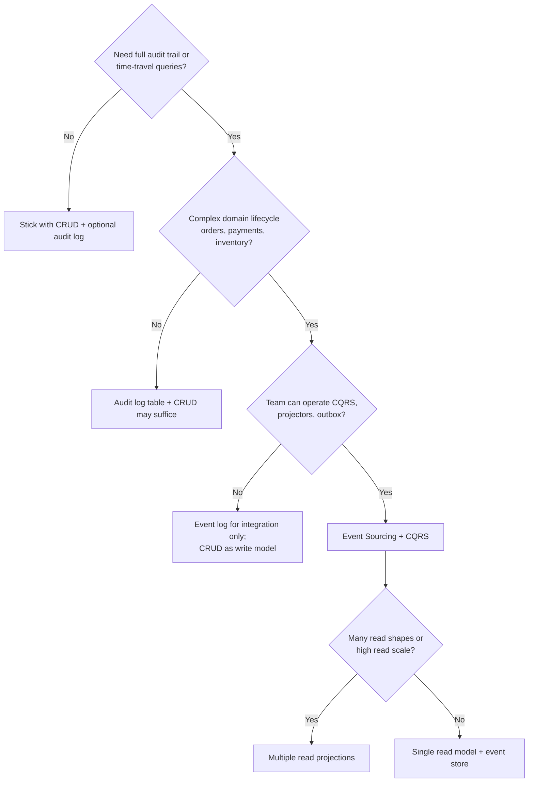
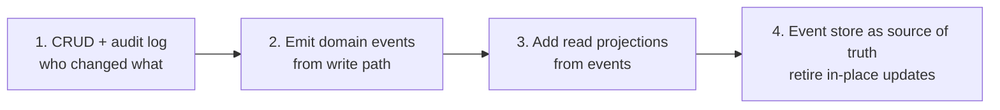

# Decision Guide

When to adopt Event Sourcing and CQRS(Command Query Responsibility Segregation), when to avoid them, and a concise pros/cons reference.

> **Related:** [Overview](00-overview.md) · [API design implications](04-api-design-implications.md) · [Async integration](05-async-integration.md) · [Outbox and Inbox](05A-outbox-and-inbox.md) · [Sagas and distributed workflows](07-sagas-and-distributed-workflows.md)

> **Read before deciding on multi-service platforms:** Cross-service workflows need [§5 async](05-async-integration.md) → [§5A outbox/inbox](05A-outbox-and-inbox.md) → [§7 sagas](07-sagas-and-distributed-workflows.md) (numbered after this guide for historical reasons; treat them as prerequisites for integration-heavy ES).

---

## Decision flow

---

## Use cases — strong fit

| Domain | Why |
|--------|-----|
| **Banking / payments** | Audit, reversals, regulatory history |
| **E-commerce orders** | Lifecycle, refunds, [fulfillment sagas](07-sagas-and-distributed-workflows.md) |
| **Inventory / warehouse** | Stock movements as facts |
| **Healthcare / legal** | Immutable action records |
| **Collaborative workflows** | Operation history, undo/redo |
| **IoT / telemetry** | Time-series facts at scale |
| **Multi-service platforms** | Event log as integration contract |

---

## When to avoid (or defer)

| Situation | Prefer |
|-----------|--------|
| Simple CRUD, few state transitions | PostgreSQL + normal tables |
| Single service, one database, no external APIs | Normal ACID(Atomicity, Consistency, Isolation, Durability) — no cross-service saga — see [When not to use a saga](07C-sagas-operations.md#when-not-to-use-a-saga) |
| Team new to distributed patterns | CRUD; add audit table first |
| Strong immediate read-after-write everywhere | CRUD or sync read model only |
| Tight deadline, small team | Defer ES until domain stabilizes |
| Heavy ad-hoc reporting on current state only | OLTP(Online Transaction Processing) + warehouse ETL(Extract, Transform, Load), not raw event replay |

---

## Pros and cons summary

### Event Sourcing

| Pros | Cons |
|------|------|
| Complete audit trail by design | Higher complexity than CRUD |
| Temporal queries ("state at time T") | [Event schema evolution (upcasting)](08-event-schema-evolution.md) |
| Debug by replaying exact sequence | Storage grows — snapshots + archival |
| Aligns with domain language | GDPR(General Data Protection Regulation)/PII(Personally Identifiable Information) erasure vs immutability |
| Flexible downstream consumers | Steeper learning curve |

### CQRS

| Pros | Cons |
|------|------|
| Optimized read and write paths | Eventual consistency on reads |
| Scale query tier independently | Duplicate data, sync logic |
| Add views without changing writes | More services to monitor |
| Clear caching boundary on GET | "Two truths" confusion if undocumented |

### Combined ES + CQRS

| Pros | Cons |
|------|------|
| Best audit + read performance | Highest operational surface |
| Rebuild read DB from events | Requires idempotent projectors |
| Natural microservice boundaries | Not worth it for simple domains |

---

## Comparison — ES vs audit log vs CRUD

| | CRUD | CRUD + audit table | Event Sourcing |
|--|------|-------------------|----------------|
| **Current state query** | Easy | Easy | Via projection |
| **Full history** | No | Yes (separate table) | Yes (primary) |
| **Rebuild state** | N/A | Hard | Replay events |
| **Complexity** | Low | Medium | High |
| **Compliance audit** | Bolt-on | Good | Excellent |

---

## Migration path (pragmatic)

Do not jump to step 4 without steps 1–3 unless greenfield and team is experienced.

---

## Storage quick pick

| Scenario | Store events in… |
|----------|------------------|
| Default / most teams | **PostgreSQL** event table |
| .NET DDD | **Marten** or **EventStoreDB** |
| AWS serverless | **DynamoDB** + S3 archive |
| Many subscribers | PostgreSQL + **outbox → Kafka** |
| 7+ year retention | PostgreSQL hot + **S3** cold |

Details → [Storage & projections](03-storage-and-projections.md).

---

## API quick pick

| Scenario | API shape |
|----------|-----------|
| Public REST(Representational State Transfer) SaaS(Software as a Service) | Resource POST commands + GET read models |
| High write conflict rate | `If-Match` + `409` + idempotency keys |
| Partners need push | Domain events → webhooks via outbox |
| Long exports / ML(Machine Learning) | Event triggers + [job resource](../../api-design-and-protection/includes/10-async-patterns.md) |

Details → [API design implications](04-api-design-implications.md).

## Common mistakes

| Mistake | Fix |
|---------|-----|
| Greenfield jump straight to event store as truth | CRUD → audit log → projections → ES |
| ES for simple admin CRUD | Normal tables + audit if needed |
| No projector rebuild runbook | Document full replay procedure |
| Multiple read models without ownership | Name owner per projection |
| Skip correlation IDs across store and bus | `correlation_id` in event metadata |
| Deploy breaking projector without version gate | Expand/contract projector schema |

## See also

| Guide | Topics |
|-------|--------|
| [api-design-and-protection](../../api-design-and-protection/README.md) | HTTP(Hypertext Transfer Protocol), gateway, async, threat model |
| [postgresql-performance](../../postgresql-performance/README.md) | Indexing, bulk ops for event tables |
| [api-rate-limiting](../../api-rate-limiting/README.md) | Separate limits on command vs query routes |
| [deployment-strategies](../../deployment-strategies/README.md) | Rolling deploys with projector compatibility |
| [high-throughput-systems](../../high-throughput-systems/README.md) | Streaming, outbox, read-model throughput |
| [database-connection-and-security](../../database-connection-and-security/README.md) | Event store credentials and cloud IAM(Identity and Access Management) |

---

## Reading paths

| If you are… | Read in order |
|-------------|---------------|
| **New to the pattern** | Overview → §1 Core concepts → §6 Decision guide |
| **Choosing storage** | §3 Storage → [postgresql-performance](../../postgresql-performance/README.md) |
| **Designing HTTP APIs** | §4 API design → [api-design-and-protection §1](../../api-design-and-protection/includes/01-api-design.md) |
| **Integrating microservices** | §5 Async integration → [async patterns §10](../../api-design-and-protection/includes/10-async-patterns.md) |
| **Security / compliance** | §4 Audit APIs → [threat model §6](../../api-design-and-protection/includes/06-threat-model.md) |
| **High-throughput read models** | §2 CQRS → [high-throughput-systems](../../high-throughput-systems/README.md) |