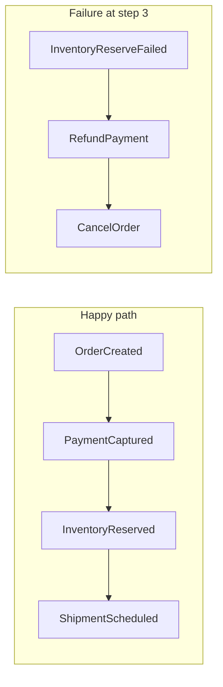
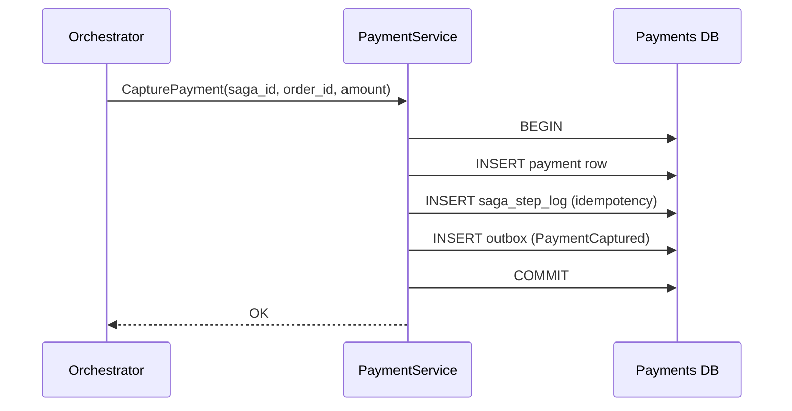
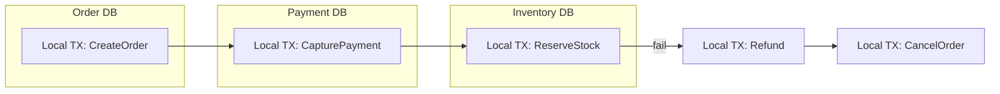

# Sagas and Distributed Workflows

Coordinate multi-service business processes with local transactions, compensating actions, and durable saga state — without distributed two-phase commit.

> **Related:** [Core concepts — aggregates](01-core-concepts.md#aggregates-and-streams) · [Async integration — outbox](05-async-integration.md) · [Strong consistency — promises and costs](../../postgresql-performance/includes/14-consistency-promises-and-costs.md) · [Idempotency](../../api-design-and-protection/includes/13-idempotency.md) · [Async patterns](../../api-design-and-protection/includes/10-async-patterns.md)

---

## At a glance

| Question | Answer |
|----------|--------|
| **What is it?** | A sequence of **local transactions** (one per service) coordinated so the process completes or is undone via **compensating actions** |
| **When to use?** | Cross-service workflows (order → payment → inventory → shipping) where one ACID(Atomicity, Consistency, Isolation, Durability) transaction across DBs is impossible |
| **How are transactions handled?** | **Local ACID** per service — no 2PC(Two-Phase Commit) across DBs; see [Transactions and distributed databases](#transactions-and-distributed-databases) |
| **When not to use?** | Single service + one DB → normal ACID; see [When not to use a saga](07C-sagas-operations.md#when-not-to-use-a-saga) |
| **Retry vs compensate?** | Transient → retry with cap; permanent → compensate; see [Retry vs compensate](07C-sagas-operations.md#retry-vs-compensate) |
| **How to operate?** | Stuck-saga metrics, DLQ(Dead Letter Queue), `saga_id` in traces — see [Observability and operations](07C-sagas-operations.md#observability-and-operations) |
| **Choreography vs orchestration?** | Events-only vs central **process manager** — see [Which one to choose?](07A-sagas-choreography-orchestration.md#which-one-to-choose) |
| **How to undo?** | Compensating transactions in **reverse order** (LIFO) — not a distributed `ROLLBACK` |
| **Critical requirement?** | **Idempotent** steps + persisted saga state + correlation IDs |

**Rule of thumb:** One local transaction per service; the saga coordinates. Never hold locks across service boundaries.

## Articles in this section

| Article | Topics |
|---------|--------|
| [Choreography vs orchestration](07A-sagas-choreography-orchestration.md) | Event-driven vs process manager, decision flow |
| [Compensation and idempotency](07B-sagas-compensation-idempotency.md) | LIFO compensation, saga state, step idempotency |
| [Operations and testing](07C-sagas-operations.md) | Observability, inbox, deploy versioning, test matrix |

## What a saga is

Each microservice owns its data. You cannot wrap `orders DB + payments DB + inventory DB` in one ACID transaction. A **saga** accepts **eventual consistency** across services and makes failure explicit.

**Saga vs compensating event (ES):** In event sourcing, a compensating **event** (`PaymentRefunded`) corrects history within one aggregate stream — see [Immutability and corrections](01-core-concepts.md#immutability-and-corrections). In a saga, a compensating **action** is a new local transaction in another service (call refund API(Application Programming Interface), publish `RefundPayment` command). They often combine: a saga orchestrator triggers compensating commands; each service appends domain events.

### Scope: one event store vs cross-service saga

| Situation | Pattern | This section |
|-----------|---------|--------------|
| **One ES system**, multiple aggregates in one event store | **Process manager** reacts to events and sends commands — still one DB, local ACID per aggregate | Cross-links [Core concepts](01-core-concepts.md#aggregates-and-streams); not a cross-DB problem |
| **Multiple services**, each with its own DB or external API | **Cross-service saga** — local TX per service, compensation across boundaries | **Main focus of §7** |

Do not introduce saga orchestration complexity when a single service and one database transaction suffices.

---

## Transactions and distributed databases

A saga **does not** use one ACID transaction across `orders DB`, `payments DB`, and `inventory DB`. That would require **two-phase commit (2PC)** — locks held across services, poor failure behavior, and poor fit for microservices. Instead:

| Level | Guarantee |
|-------|-----------|
| **Inside one service / one database** | Normal **ACID** local transaction |
| **Across services** | **Eventual consistency** — each step commits independently; failure handled by **compensation** |

### What one saga step commits

Each step is a **single local transaction** in **one** database:

Typical contents of that one `COMMIT`:

1. **Business write** — e.g. `INSERT INTO payments …`
2. **Idempotency record** — `saga_step_log` so retries do not double-charge — see [Idempotency patterns](07B-sagas-compensation-idempotency.md#idempotency-patterns-specific-to-sagas)
3. **Outbox row** (when publishing) — reliable event after commit — see [Transactional outbox](05-async-integration.md#transactional-outbox-pattern)

If anything fails → `ROLLBACK` **only within that service**. Other databases are unaffected until the saga drives the next step or compensation.

### Coordination is not a distributed transaction

The orchestrator (or event chain in choreography) persists **saga state** in its own DB, sends commands, and on failure runs **compensating local transactions** in reverse order. It is not a 2PC coordinator.

There is no moment where all three databases commit or roll back together.

### Failure: compensation, not rollback

If step 3 fails after steps 1–2 committed:

| Wrong mental model | Saga model |
|--------------------|------------|
| Roll back the whole saga like one DB transaction | Each completed step is a **fact** (payment was captured) |
| `ROLLBACK` across services | New local TXs: **RefundPayment**, **CancelOrder**, **ReleaseInventory** |

Each compensate call is again **one local ACID transaction** in that service's database. Details → [Compensation steps](07B-sagas-compensation-idempotency.md#compensation-steps-and-rollback-flows).

### Consistency you actually get

| Question | Answer |
|----------|--------|
| Are payment + inventory atomic together? | **No** — window where payment succeeded but inventory failed |
| Is each service's write atomic? | **Yes** — within that service's DB |
| What consistency across services? | **Eventual** — saga + compensation reach a valid business state |
| How do clients cope? | Status `PENDING`, `REFUNDING`, `CONFIRMED`; idempotent `POST /orders` |

Strong consistency applies **inside one primary database**. Microservices are a layer where consistency breaks unless you design for it — see [Where consistency breaks](../../postgresql-performance/includes/14-consistency-promises-and-costs.md#where-consistency-breaks).

### Microservices vs distributed SQL

| Setup | Saga role |
|-------|-----------|
| **Microservices, each with own DB** (PostgreSQL A, B, C) | Classic saga — separate transaction boundaries even if all are PostgreSQL |
| **One distributed SQL cluster** (CockroachDB, Spanner, Yugabyte) | Multi-row TX possible **inside one logical DB**; saga still needed when steps call **external APIs** (Stripe, warehouse) or cross **service boundaries** |

A global database does not remove sagas when the workflow crosses deployable services or non-database side effects.

### Practical rules

1. **One business step = one local transaction** in one service DB.
2. **Never** open a DB transaction, call another service synchronously, then commit — holds locks and breaks on timeouts.
3. **Persist saga state + outbox in the same TX** as the orchestrator's step-advance write when possible.
4. **Idempotency on every step** — `(saga_id, step_name)` or message ID; at-least-once delivery is normal.
5. **Design for in-between states** — `PENDING`, `PAYMENT_CAPTURED`, `COMPENSATING`; UX and support must tolerate them.
6. **Reconcile late replies** — payment may succeed after timeout; use saga `version` + idempotent handlers.

### Per-step transaction map (orchestrated example)

| Step | Service | Local transaction |
|------|---------|-------------------|
| 1 | Order | `BEGIN` → insert order `PENDING` → step log → `COMMIT` |
| 2 | Payment | `BEGIN` → capture payment → step log → outbox → `COMMIT` |
| 3 | Inventory | `BEGIN` → reserve stock → step log → `COMMIT` or fail |
| 3b (fail) | Payment | `BEGIN` → refund → step log → `COMMIT` |
| 3c (fail) | Order | `BEGIN` → cancel order → `COMMIT` |

Each row is an independent ACID commit. Saga "atomicity" is **logical** (business invariants over time), not **physical** (single 2PC).

### Saga vs other distributed transaction patterns

| Approach | Use when |
|----------|----------|
| **Saga** (local TX + compensation) | Microservices, external APIs, long workflows — **default in this guide** |
| **2PC / XA** | Rare; tight coupling, short transactions — usually avoided |
| **TCC (Try-Confirm-Cancel)** | Need reserved resources before commit; more complex than classic saga |

Prefer **saga + outbox + idempotency** over 2PC for service-oriented systems.

---

