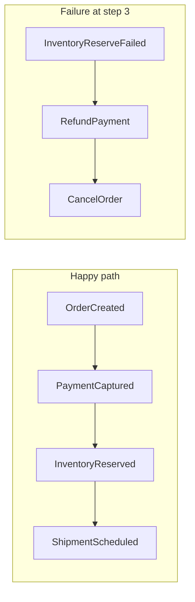
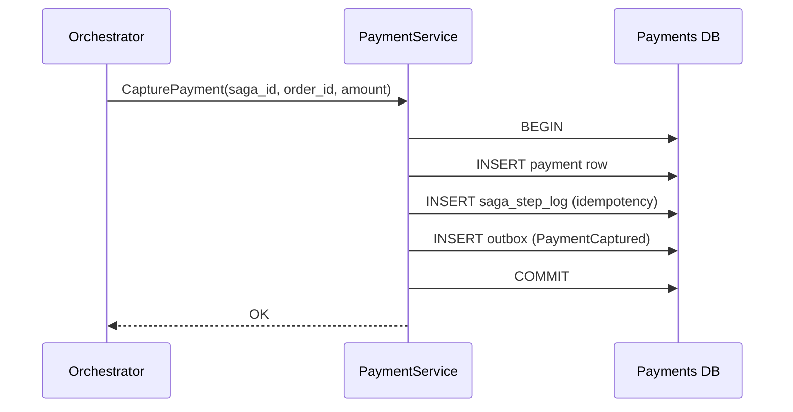
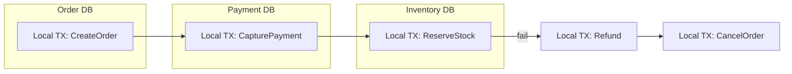
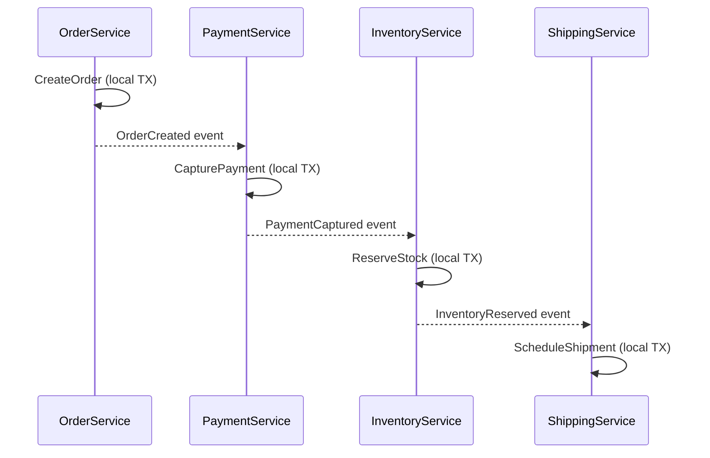
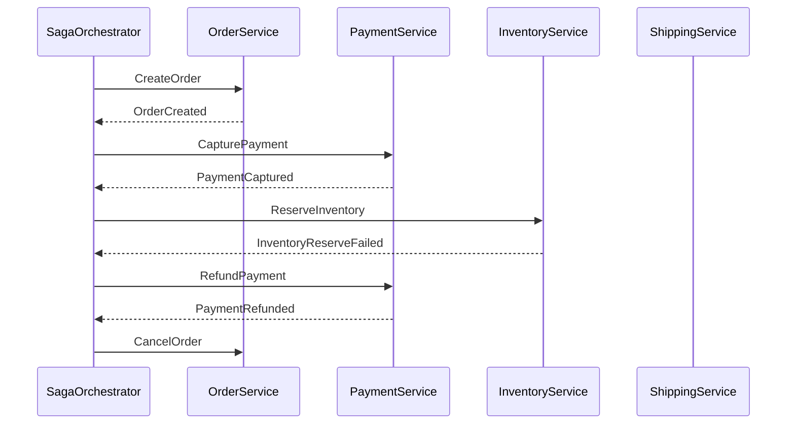
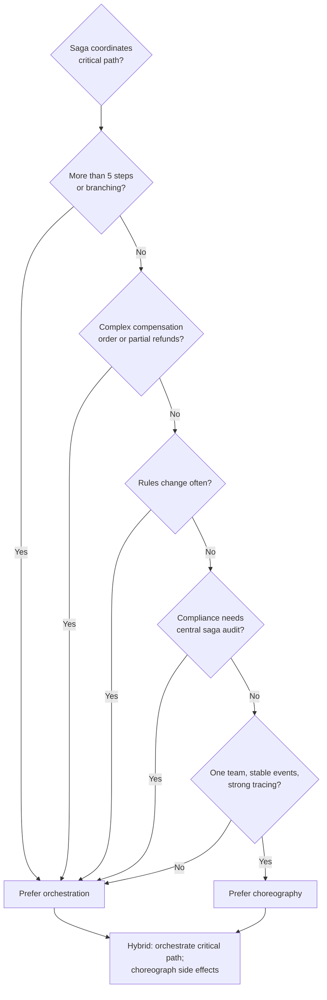
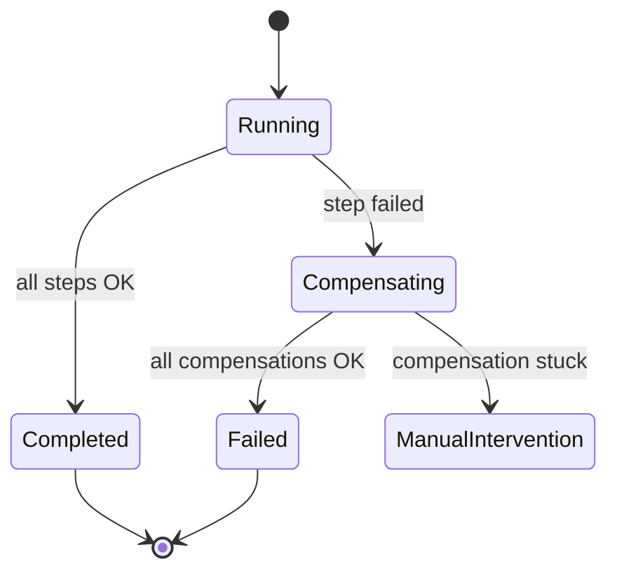
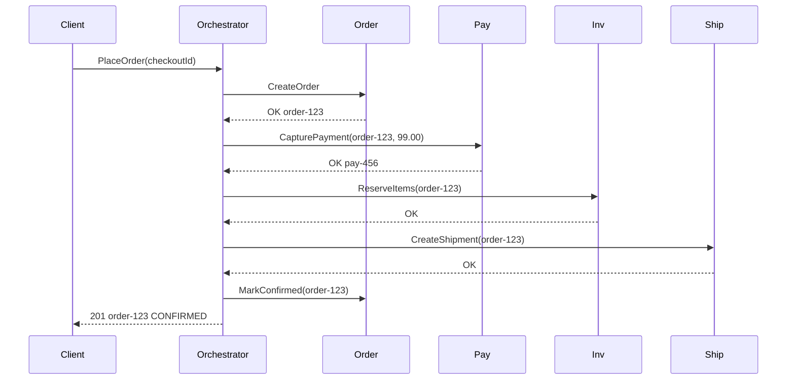
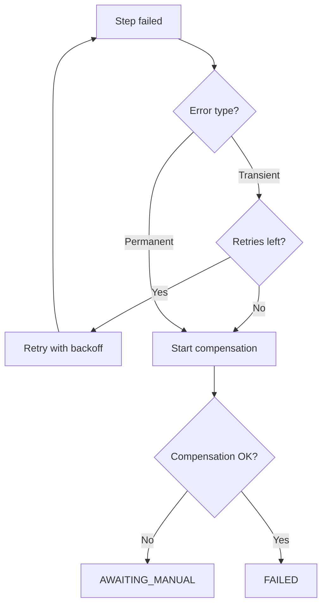

# Sagas and Distributed Workflows

Coordinate multi-service business processes with local transactions, compensating actions, and durable saga state — without distributed two-phase commit.

> **Related:** [Core concepts — aggregates](01-core-concepts.md#aggregates-and-streams) · [Async integration — outbox](05-async-integration.md) · [Strong consistency — promises and costs](../../postgresql-performance/includes/14-consistency-promises-and-costs.md) · [Idempotency](../../api-design-and-protection/includes/13-idempotency.md) · [Async patterns](../../api-design-and-protection/includes/10-async-patterns.md)

---

## At a glance

| Question | Answer |
|----------|--------|
| **What is it?** | A sequence of **local transactions** (one per service) coordinated so the process completes or is undone via **compensating actions** |
| **When to use?** | Cross-service workflows (order → payment → inventory → shipping) where one ACID(Atomicity, Consistency, Isolation, Durability) transaction across DBs is impossible |
| **How are transactions handled?** | **Local ACID** per service — no 2PC(Two-Phase Commit) across DBs; see [Transactions and distributed databases](#transactions-and-distributed-databases) |
| **When not to use?** | Single service + one DB → normal ACID; see [When not to use a saga](#when-not-to-use-a-saga) |
| **Retry vs compensate?** | Transient → retry with cap; permanent → compensate; see [Retry vs compensate](#retry-vs-compensate) |
| **How to operate?** | Stuck-saga metrics, DLQ(Dead Letter Queue), `saga_id` in traces — see [Observability and operations](#observability-and-operations) |
| **Choreography vs orchestration?** | Events-only vs central **process manager** — see [Which one to choose?](#which-one-to-choose) |
| **How to undo?** | Compensating transactions in **reverse order** (LIFO) — not a distributed `ROLLBACK` |
| **Critical requirement?** | **Idempotent** steps + persisted saga state + correlation IDs |

**Rule of thumb:** One local transaction per service; the saga coordinates. Never hold locks across service boundaries.

---

## What a saga is

Each microservice owns its data. You cannot wrap `orders DB + payments DB + inventory DB` in one ACID transaction. A **saga** accepts **eventual consistency** across services and makes failure explicit.



**Saga vs compensating event (ES):** In event sourcing, a compensating **event** (`PaymentRefunded`) corrects history within one aggregate stream — see [Immutability and corrections](01-core-concepts.md#immutability-and-corrections). In a saga, a compensating **action** is a new local transaction in another service (call refund API(Application Programming Interface), publish `RefundPayment` command). They often combine: a saga orchestrator triggers compensating commands; each service appends domain events.

### Scope: one event store vs cross-service saga

| Situation | Pattern | This section |
|-----------|---------|--------------|
| **One ES system**, multiple aggregates in one event store | **Process manager** reacts to events and sends commands — still one DB, local ACID per aggregate | Cross-links [Core concepts](01-core-concepts.md#aggregates-and-streams); not a cross-DB problem |
| **Multiple services**, each with its own DB or external API | **Cross-service saga** — local TX per service, compensation across boundaries | **Main focus of §7** |

Do not introduce saga orchestration complexity when a single service and one database transaction suffices.

---

## Transactions and distributed databases

A saga **does not** use one ACID transaction across `orders DB`, `payments DB`, and `inventory DB`. That would require **two-phase commit (2PC)** — locks held across services, poor failure behavior, and poor fit for microservices. Instead:

| Level | Guarantee |
|-------|-----------|
| **Inside one service / one database** | Normal **ACID** local transaction |
| **Across services** | **Eventual consistency** — each step commits independently; failure handled by **compensation** |

### What one saga step commits

Each step is a **single local transaction** in **one** database:



Typical contents of that one `COMMIT`:

1. **Business write** — e.g. `INSERT INTO payments …`
2. **Idempotency record** — `saga_step_log` so retries do not double-charge — see [Idempotency patterns](#idempotency-patterns-specific-to-sagas)
3. **Outbox row** (when publishing) — reliable event after commit — see [Transactional outbox](05-async-integration.md#transactional-outbox-pattern)

If anything fails → `ROLLBACK` **only within that service**. Other databases are unaffected until the saga drives the next step or compensation.

### Coordination is not a distributed transaction

The orchestrator (or event chain in choreography) persists **saga state** in its own DB, sends commands, and on failure runs **compensating local transactions** in reverse order. It is not a 2PC coordinator.



There is no moment where all three databases commit or roll back together.

### Failure: compensation, not rollback

If step 3 fails after steps 1–2 committed:

| Wrong mental model | Saga model |
|--------------------|------------|
| Roll back the whole saga like one DB transaction | Each completed step is a **fact** (payment was captured) |
| `ROLLBACK` across services | New local TXs: **RefundPayment**, **CancelOrder**, **ReleaseInventory** |

Each compensate call is again **one local ACID transaction** in that service's database. Details → [Compensation steps](#compensation-steps-and-rollback-flows).

### Consistency you actually get

| Question | Answer |
|----------|--------|
| Are payment + inventory atomic together? | **No** — window where payment succeeded but inventory failed |
| Is each service's write atomic? | **Yes** — within that service's DB |
| What consistency across services? | **Eventual** — saga + compensation reach a valid business state |
| How do clients cope? | Status `PENDING`, `REFUNDING`, `CONFIRMED`; idempotent `POST /orders` |

Strong consistency applies **inside one primary database**. Microservices are a layer where consistency breaks unless you design for it — see [Where consistency breaks](../../postgresql-performance/includes/14-consistency-promises-and-costs.md#where-consistency-breaks).

### Microservices vs distributed SQL(Structured Query Language)

| Setup | Saga role |
|-------|-----------|
| **Microservices, each with own DB** (PostgreSQL A, B, C) | Classic saga — separate transaction boundaries even if all are PostgreSQL |
| **One distributed SQL cluster** (CockroachDB, Spanner, Yugabyte) | Multi-row TX possible **inside one logical DB**; saga still needed when steps call **external APIs** (Stripe, warehouse) or cross **service boundaries** |

A global database does not remove sagas when the workflow crosses deployable services or non-database side effects.

### Practical rules

1. **One business step = one local transaction** in one service DB.
2. **Never** open a DB transaction, call another service synchronously, then commit — holds locks and breaks on timeouts.
3. **Persist saga state + outbox in the same TX** as the orchestrator's step-advance write when possible.
4. **Idempotency on every step** — `(saga_id, step_name)` or message ID; at-least-once delivery is normal.
5. **Design for in-between states** — `PENDING`, `PAYMENT_CAPTURED`, `COMPENSATING`; UX and support must tolerate them.
6. **Reconcile late replies** — payment may succeed after timeout; use saga `version` + idempotent handlers.

### Per-step transaction map (orchestrated example)

| Step | Service | Local transaction |
|------|---------|-------------------|
| 1 | Order | `BEGIN` → insert order `PENDING` → step log → `COMMIT` |
| 2 | Payment | `BEGIN` → capture payment → step log → outbox → `COMMIT` |
| 3 | Inventory | `BEGIN` → reserve stock → step log → `COMMIT` or fail |
| 3b (fail) | Payment | `BEGIN` → refund → step log → `COMMIT` |
| 3c (fail) | Order | `BEGIN` → cancel order → `COMMIT` |

Each row is an independent ACID commit. Saga "atomicity" is **logical** (business invariants over time), not **physical** (single 2PC).

### Saga vs other distributed transaction patterns

| Approach | Use when |
|----------|----------|
| **Saga** (local TX + compensation) | Microservices, external APIs, long workflows — **default in this guide** |
| **2PC / XA** | Rare; tight coupling, short transactions — usually avoided |
| **TCC (Try-Confirm-Cancel)** | Need reserved resources before commit; more complex than classic saga |

Prefer **saga + outbox + idempotency** over 2PC for service-oriented systems.

---

## Choreography vs orchestration

### Choreography (event-driven, no central coordinator)

Each service publishes **domain events**; downstream services **react** without a coordinator.



| Pros | Cons |
|------|------|
| Loose coupling; easy to add a new listener | Hard to see full flow; implicit protocol |
| No single point of failure for coordination | Debugging "where is my order?" is harder |
| Scales with event bus | Cyclic dependencies and ordering bugs |
| Fits pure event-driven teams | Compensation logic scattered across services |

**When to use:** Few services (3–5), stable event contract, team owns end-to-end domain, flow rarely changes.

### Orchestration (central process manager)

A **saga orchestrator** (or **process manager**) owns the script: it sends **commands** to each participant and tracks state.



| Pros | Cons |
|------|------|
| Explicit state machine; one place for timeouts/retries | Orchestrator is a critical component |
| Easier to test and reason about long flows | Can become a "god service" if not bounded |
| Clear compensation order | Must version saga definitions carefully |
| Good for 5+ steps or frequent rule changes | Extra persistence and ops for orchestrator |

**When to use:** Complex workflows, strict ordering, compliance/audit needs, many failure branches.

### Hybrid (common in production)

- **Orchestrator** for the business saga (order fulfillment).
- **Choreography** inside each service (payment service emits `PaymentCaptured` for analytics, fraud, receipts).

| Criterion | Prefer choreography | Prefer orchestration |
|-----------|--------------------|-----------------------|
| Steps | Linear, few | Branching, many |
| Visibility | Team OK with distributed tracing | Need explicit saga dashboard |
| Change frequency | Stable | Rules change often |
| Compensation | Simple, symmetric | Ordered, partial refunds, etc. |

### Which one to choose?

**Default for money + inventory critical paths:** **orchestration** — compensation, timeouts, and support visibility are easier when one process manager owns the script.

**Default for small, stable, event-native teams:** **choreography** — when the flow is linear, rarely changes, and one squad owns the whole protocol.

| Choose **choreography** when… | Choose **orchestration** when… |
|------------------------------|--------------------------------|
| 3–5 services, linear flow | 5+ steps or branching paths |
| Event contract is stable | Business rules change often |
| One team owns the whole flow | Multiple teams; need a workflow owner |
| Compensation is simple and symmetric | Compensation order matters (partial refunds, release-before-refund) |
| Strong tracing + event schema discipline | Saga dashboard, timeouts, audit in one place |

#### Decision flow



#### Decision checklist

Ask in order:

1. **How many steps and branches?** Linear 3-step checkout → choreography can work. Refunds, alternate warehouses, manual review → orchestration.
2. **Who needs visibility?** Support asking "stuck at step 3?" → orchestration with persisted saga state. Tracing-only engineering culture → choreography is viable.
3. **How hard is compensation?** Simple cancel + refund → either works. Domain-specific order (release stock before refund) → orchestration.
4. **How often does the flow change?** Stable for years → choreography. Product changes steps monthly → orchestration (version the saga definition).
5. **Team topology** — one squad owns order → payment → inventory: either works. Separate teams per service → orchestration, or very strict event contracts for choreography.
6. **Compliance / audit** — need "who decided to refund and when?" → orchestration (central saga log).

#### Signals (rule of thumb)

| Signal | Lean toward |
|--------|-------------|
| "We might double-charge or refund twice on retry" | Orchestration + step idempotency |
| "We can't draw the flow on one whiteboard" | Orchestration |
| "Adding a listener shouldn't break checkout" | Choreography for **non-critical** listeners only |
| "Compensation is scattered; nobody knows the order" | Orchestration |

If unsure, start with **orchestration for the critical path** (money + inventory). Each step can still publish domain events so analytics, fraud, and email stay decoupled — see [Hybrid](#hybrid-common-in-production) above.

---

## Compensation steps and rollback flows

Sagas do **not** roll back like a database `ROLLBACK`. Completed steps leave **facts** (payment was captured). You run **compensating transactions** — new local operations that **semantically undo** the business effect.

### Rules

1. **Every forward step needs a compensating action** (or be marked non-compensatable — e.g. email already sent).
2. **Compensate in reverse order** (LIFO): if payment then inventory failed, refund payment before canceling order-side effects that depend on payment.
3. **Compensation can fail too** — retry, alert, manual intervention queue.
4. **Not all steps are reversible** — design for **pivot** (accept partial success + human task) instead of infinite compensate loops.

### Example compensation map

| Forward step | Compensating action | Notes |
|--------------|---------------------|-------|
| Create order (`PENDING`) | Cancel order (`CANCELLED`) | Idempotent cancel |
| Capture payment | Refund payment | Refund idempotency key = `sagaId + step` |
| Reserve inventory | Release reservation | Safe if reserve never committed |
| Schedule shipment | Cancel shipment | May fail if already picked — escalate |

### Forward recovery vs backward recovery

- **Backward recovery:** Failure → run compensations (most common).
- **Forward recovery:** Failure → retry or alternate path (e.g. try warehouse B if A has no stock) without undoing prior steps.



---

## Saga state machines and timeouts

The orchestrator (or choreographed service pair) should persist **saga instance state** — not only in memory.

### Typical states

| State | Meaning |
|-------|---------|
| `STARTED` | Saga instance created |
| `STEP_N_IN_PROGRESS` | Command sent; awaiting reply |
| `STEP_N_COMPLETED` | Step acknowledged |
| `COMPENSATING` | Running undo steps |
| `COMPLETED` | All forward steps done |
| `FAILED` | Compensated or abandoned safely |
| `AWAITING_MANUAL` | Auto recovery exhausted |

### Timeouts

| Timeout type | Purpose |
|--------------|---------|
| **Step timeout** | Payment service didn't respond in 30s → retry or compensate |
| **Saga timeout** | Entire fulfillment must finish in 24h or cancel |
| **Compensation timeout** | Refund stuck → page on-call, freeze order |

**Implementation sketch:**

```sql
CREATE TABLE saga_instances (
    saga_id        UUID PRIMARY KEY,
    saga_type      TEXT NOT NULL,
    current_step   TEXT NOT NULL,
    status         TEXT NOT NULL,
    correlation_id UUID NOT NULL,
    payload        JSONB NOT NULL,
    step_deadline  TIMESTAMPTZ,
    version        INT NOT NULL DEFAULT 1,
    created_at     TIMESTAMPTZ NOT NULL DEFAULT now(),
    updated_at     TIMESTAMPTZ NOT NULL DEFAULT now()
);
```

A **timeout worker** polls `step_deadline < now() AND status LIKE 'STEP_%_IN_PROGRESS'` and drives compensate or retry policy.

**Important:** Timeouts are not free — a slow payment may still succeed after your timeout. Handlers must be **idempotent** and treat late success as no-op or reconcile (see below).

---

## Idempotency patterns specific to sagas

At-least-once messaging + client retries mean **every saga step runs at least once in effect, at most once in outcome**.

### Correlation and saga IDs

- **`saga_id`** — one UUID per business process instance (e.g. one checkout).
- **`correlation_id`** — ties all messages/logs for tracing (often same as `saga_id`).
- **`causation_id`** — parent message/event that caused this step.

Propagate on every command and event header. Aligns with event metadata in [Aggregates and streams](01-core-concepts.md#aggregates-and-streams).

### Per-step idempotency

Each participant stores **processed commands**:

```sql
CREATE TABLE saga_step_log (
    service_name    TEXT NOT NULL,
    saga_id         UUID NOT NULL,
    step_name       TEXT NOT NULL,
    idempotency_key TEXT NOT NULL,
    result          JSONB,
    processed_at    TIMESTAMPTZ NOT NULL DEFAULT now(),
    PRIMARY KEY (service_name, idempotency_key)
);
```

On duplicate delivery: return stored `result` without re-executing side effects.

### Patterns by role

| Role | Pattern |
|------|---------|
| **Orchestrator** | Persist before send: outbox + saga state in same TX — see [Transactional outbox](05-async-integration.md#transactional-outbox-pattern); dedupe replies by `(saga_id, step, message_id)` |
| **Participant** | `INSERT ... ON CONFLICT DO NOTHING` on step log; then execute or skip |
| **Compensation** | Same idempotency key namespace — `RefundPayment` for saga X must not double-refund |
| **Choreography** | Consumer dedupes on `event_id` — see [Projectors vs integration consumers](05-async-integration.md#projectors-vs-integration-consumers) |

### Late or duplicate replies

After timeout compensation started, the original step may still complete:

- **Reconcile:** Payment captured after refund initiated → alert + manual or auto second refund check.
- **Version field:** Saga instance `version` incremented on each transition; stale replies ignored.

General HTTP(Hypertext Transfer Protocol) idempotency (`Idempotency-Key`, storage patterns) → [Idempotency](../../api-design-and-protection/includes/13-idempotency.md). Saga idempotency extends that to **async multi-step** flows.

---

## Example: order → payment → inventory → shipping

### Services and local transactions

1. **OrderService** — `CreateOrder` → status `PENDING`
2. **PaymentService** — `CapturePayment(orderId, amount)`
3. **InventoryService** — `ReserveItems(orderId, lines)`
4. **ShippingService** — `CreateShipment(orderId, address)`

### Happy path (orchestrated)



### Failure: inventory out of stock (after payment)

1. `ReserveItems` returns `INSUFFICIENT_STOCK`
2. Orchestrator → `RefundPayment(pay-456)` (compensate step 2)
3. Orchestrator → `CancelOrder(order-123)` (compensate step 1)
4. Client notified: order failed, refund in progress

### Failure: shipping unavailable (after inventory reserved)

1. Compensate: `ReleaseInventory` → `RefundPayment` → `CancelOrder`
2. Release inventory **before** refund if business rule requires stock back before refund (ordering is domain-specific)

### Choreographed version (same flow)

- OrderService publishes `OrderCreated`
- PaymentService consumes → captures → publishes `PaymentCaptured`
- InventoryService consumes → on failure publishes `OrderFulfillmentFailed` with reason
- PaymentService listens for `OrderFulfillmentFailed` → refunds
- OrderService listens → cancels

The **protocol** (who listens to what) is the implicit saga definition — document it like an API contract.

### API surface (client view)

- `POST /orders` with `Idempotency-Key` → returns `201` or `202` if async saga
- `GET /orders/{id}` shows saga-derived status: `PENDING`, `CONFIRMED`, `CANCELLED`, `REFUNDING`
- Do not expose internal saga steps unless B2B/debug — see [API design implications](04-api-design-implications.md)

---

## When not to use a saga

A saga adds operational cost (state DB, compensation, idempotency). Prefer simpler patterns when:

| Situation | Prefer |
|-----------|--------|
| **Single service**, one database | Normal **ACID** transaction — `BEGIN` … all writes … `COMMIT` |
| **Short sync workflow**, no external side effects | One local TX or one aggregate command |
| **Strong immediate consistency** everywhere | Single DB or sync API chain without cross-service commit |
| **Cross-service boundaries**, external APIs, or **long async** flows | **Saga** — see [Decision guide](06-decision-guide.md) |

**Rule of thumb:** If you can draw the workflow inside one deployable service and one database, you probably do not need a saga.

---

## Retry vs compensate

When a step fails, classify the error before acting:

| Failure type | Examples | Action |
|--------------|----------|--------|
| **Transient** | 503, timeout, broker blip, deadlock | **Retry** the same step with exponential backoff (cap at N attempts) |
| **Permanent** | 400, insufficient stock, invalid state, business rule violation | **Compensate** immediately — retries will not help |
| **Exhausted retries** | Still failing after N attempts | **Compensate** or move to `AWAITING_MANUAL` |



Do **not** compensate on the first transient blip — you will undo work that would have succeeded on retry. Do **not** retry forever on permanent errors — you delay refunds and tie up inventory.

---

## Observability and operations

> **Scope:** Saga-specific metrics and alerts below. General observability → [HTS §11 Observability](../../high-throughput-systems/includes/11-observability.md). DLQ mechanics and retry policies → [HTS §6 Dead letter queue](../../high-throughput-systems/includes/06-async-queues-workers.md#dead-letter-queue-dlq).

### Metrics to track

| Metric | Alert when |
|--------|------------|
| **Stuck sagas** | Count where `step_deadline < now()` and status is `STEP_*_IN_PROGRESS` — growing |
| **In-flight by type** | Sudden spike or plateau near capacity |
| **Step latency p95** | Per `saga_type` / step — SLO(Service Level Objective) breach |
| **Compensation rate** | Failures vs successes — compensation errors trending up |
| **DLQ depth** | Non-zero for saga-related consumers |

Propagate **`saga_id`** (and `correlation_id`) in structured logs and distributed traces — same IDs as [Idempotency patterns](#idempotency-patterns-specific-to-sagas). Support queries like “show me everything for checkout `saga-abc`”.

### DLQ and manual intervention

Side-effect steps (payment, refund) that fail after max retries must land in a **DLQ** — not block the queue forever. Route to on-call or a reconciliation tool; replay after fix with idempotency keys intact.

### Security (orchestrator → participants)

The saga orchestrator calls participant APIs with **service identity** — mTLS(Mutual Transport Layer Security), service JWT(JSON Web Token), or workload IAM(Identity and Access Management) — not end-user tokens alone. See [Identity, RBAC, IAM](../../api-design-and-protection/includes/12-identity-rbac-iam-ad.md).

---

## Message ordering

At-least-once delivery can reorder messages unless you design for it:

| Transport | Pattern |
|-----------|---------|
| **Kafka / Kinesis** | **Partition key = `saga_id`** (or `correlation_id`) so all commands and events for one saga instance stay ordered within a partition |
| **Choreography** | Especially sensitive — `PaymentCaptured` must not be processed before `OrderCreated` is visible; enforce via partition key or idempotent state checks |
| **Queue without ordering** (SQS default) | **Orchestration** serializes via persisted state machine; participant idempotency handles duplicates |

---

## Inbox pattern (consumer dedup)

The **outbox** ([§5 Async integration](05-async-integration.md#transactional-outbox-pattern)) ensures reliable **publish** after a local write. The **inbox** ensures reliable **consume** — dedup before side effects:

```sql
CREATE TABLE inbox (
    consumer_name TEXT NOT NULL,
    message_id    TEXT NOT NULL,
    received_at   TIMESTAMPTZ NOT NULL DEFAULT now(),
    PRIMARY KEY (consumer_name, message_id)
);
```

In the consumer: `BEGIN` → `INSERT INTO inbox … ON CONFLICT DO NOTHING` → if inserted, apply side effect → `COMMIT`. If conflict, return stored outcome.

| Pattern | Role |
|---------|------|
| **Outbox** | Producer — same TX as business write + event row |
| **Inbox** | Consumer — same TX as dedup + side effect |
| **saga_step_log** | Saga participant — idempotency keyed by `(saga_id, step)` |

All three prevent duplicate side effects under at-least-once delivery.

---

## Deploying saga definition changes

In-flight saga instances must finish on the **definition version** they started with:

1. Add a **`saga_definition_version`** (or `saga_type` suffix) on `saga_instances`.
2. **Never change compensation order** for running instances — only for new sagas.
3. **Add steps at the end** of the forward path when possible; avoid inserting steps mid-flight.
4. Deploy orchestrator **backward compatible** — old workers drain v1; new instances use v2.

Same expand/contract mindset as schema migrations — see [deployment §12 Schema migrations and deploy](../../deployment-strategies/includes/12-schema-migrations-and-deploy.md).

---

## Testing sagas

| Test | What to verify |
|------|----------------|
| **State machine unit tests** | Happy path, fail-at-step-N, full compensation, late reply after timeout |
| **Failure injection** | Integration test with in-memory bus or testcontainers — force 503, timeout, duplicate delivery |
| **Idempotency** | Same `(saga_id, step)` twice → one side effect, identical response |
| **Compensation order** | Assert LIFO matches forward step map |
| **Workflow engines** | Optional: Temporal, Step Functions, Camunda — same saga rules; engine owns persistence and timers |

Full ES test pyramid (aggregates, projectors, outbox) → [§9 Testing and verification](09-testing-and-verification.md).

---

## Pros

- Multi-service workflows without distributed 2PC
- Explicit failure and compensation paths
- Combines cleanly with event sourcing, outbox, and idempotent APIs

## Cons

- Eventual consistency across services; complex client UX
- Orchestrator ops (state DB, timeouts, versioning)
- Choreography hard to debug without strong tracing and contracts

See [Decision guide](06-decision-guide.md).

## Common mistakes

| Mistake | Fix |
|---------|-----|
| No saga state persistence | DB table + outbox; survive restarts |
| Missing compensation for a step | Map forward/compensate pairs upfront |
| Double charge on retry | Step-level idempotency keys |
| Timeout without late-reply handling | Reconciliation job + saga version |
| One giant distributed transaction | One local TX per service; saga coordinates |
| Choreography without documented event contract | Versioned schema registry / async API spec |
| Retry forever on permanent errors | Classify transient vs permanent; cap retries |
| Compensate on first transient blip | Backoff retry before compensation |
| No partition key for ordered choreography | `saga_id` as Kafka partition key |
| Deploy changes compensation order mid-flight | Version saga definition; drain in-flight instances |
