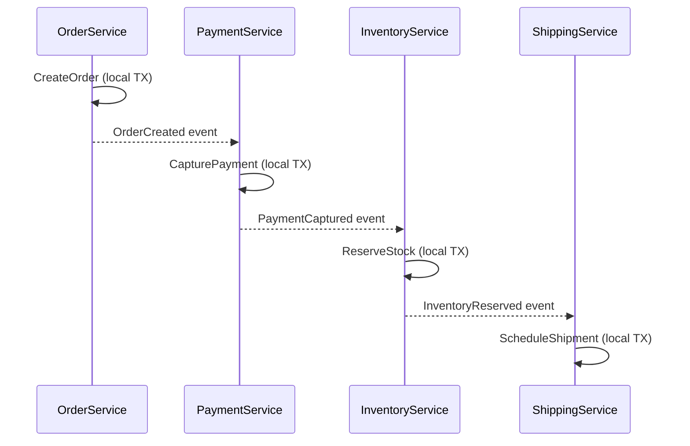
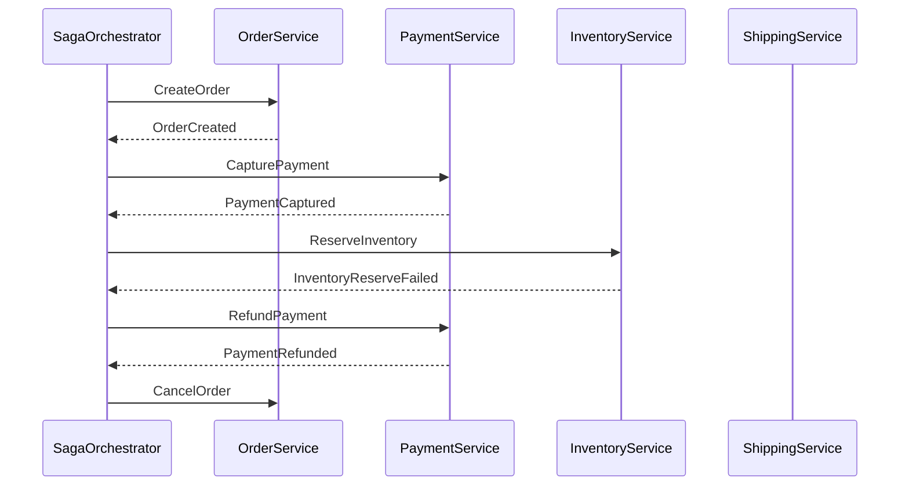
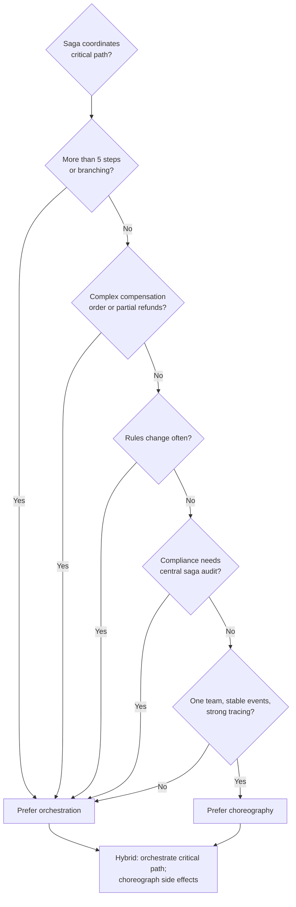

# Sagas — choreography vs orchestration

> **Related:** Overview → [Sagas and distributed workflows](07-sagas-and-distributed-workflows.md) · Compensation → [07-sagas-compensation-idempotency.md](07-sagas-compensation-idempotency.md) · Operations → [07-sagas-operations.md](07-sagas-operations.md)

## Choreography vs orchestration

### Choreography (event-driven, no central coordinator)

Each service publishes **domain events**; downstream services **react** without a coordinator.

| Pros | Cons |
|------|------|
| Loose coupling; easy to add a new listener | Hard to see full flow; implicit protocol |
| No single point of failure for coordination | Debugging "where is my order?" is harder |
| Scales with event bus | Cyclic dependencies and ordering bugs |
| Fits pure event-driven teams | Compensation logic scattered across services |

**When to use:** Few services (3–5), stable event contract, team owns end-to-end domain, flow rarely changes.

### Orchestration (central process manager)

A **saga orchestrator** (or **process manager**) owns the script: it sends **commands** to each participant and tracks state.

| Pros | Cons |
|------|------|
| Explicit state machine; one place for timeouts/retries | Orchestrator is a critical component |
| Easier to test and reason about long flows | Can become a "god service" if not bounded |
| Clear compensation order | Must version saga definitions carefully |
| Good for 5+ steps or frequent rule changes | Extra persistence and ops for orchestrator |

**When to use:** Complex workflows, strict ordering, compliance/audit needs, many failure branches.

### Hybrid (common in production)

- **Orchestrator** for the business saga (order fulfillment).
- **Choreography** inside each service (payment service emits `PaymentCaptured` for analytics, fraud, receipts).

| Criterion | Prefer choreography | Prefer orchestration |
|-----------|--------------------|-----------------------|
| Steps | Linear, few | Branching, many |
| Visibility | Team OK with distributed tracing | Need explicit saga dashboard |
| Change frequency | Stable | Rules change often |
| Compensation | Simple, symmetric | Ordered, partial refunds, etc. |

### Which one to choose?

**Default for money + inventory critical paths:** **orchestration** — compensation, timeouts, and support visibility are easier when one process manager owns the script.

**Default for small, stable, event-native teams:** **choreography** — when the flow is linear, rarely changes, and one squad owns the whole protocol.

| Choose **choreography** when… | Choose **orchestration** when… |
|------------------------------|--------------------------------|
| 3–5 services, linear flow | 5+ steps or branching paths |
| Event contract is stable | Business rules change often |
| One team owns the whole flow | Multiple teams; need a workflow owner |
| Compensation is simple and symmetric | Compensation order matters (partial refunds, release-before-refund) |
| Strong tracing + event schema discipline | Saga dashboard, timeouts, audit in one place |

#### Decision flow

#### Decision checklist

Ask in order:

1. **How many steps and branches?** Linear 3-step checkout → choreography can work. Refunds, alternate warehouses, manual review → orchestration.
2. **Who needs visibility?** Support asking "stuck at step 3?" → orchestration with persisted saga state. Tracing-only engineering culture → choreography is viable.
3. **How hard is compensation?** Simple cancel + refund → either works. Domain-specific order (release stock before refund) → orchestration.
4. **How often does the flow change?** Stable for years → choreography. Product changes steps monthly → orchestration (version the saga definition).
5. **Team topology** — one squad owns order → payment → inventory: either works. Separate teams per service → orchestration, or very strict event contracts for choreography.
6. **Compliance / audit** — need "who decided to refund and when?" → orchestration (central saga log).

#### Signals (rule of thumb)

| Signal | Lean toward |
|--------|-------------|
| "We might double-charge or refund twice on retry" | Orchestration + step idempotency |
| "We can't draw the flow on one whiteboard" | Orchestration |
| "Adding a listener shouldn't break checkout" | Choreography for **non-critical** listeners only |
| "Compensation is scattered; nobody knows the order" | Orchestration |

If unsure, start with **orchestration for the critical path** (money + inventory). Each step can still publish domain events so analytics, fraud, and email stay decoupled — see [Hybrid](#hybrid-common-in-production) above.

---
