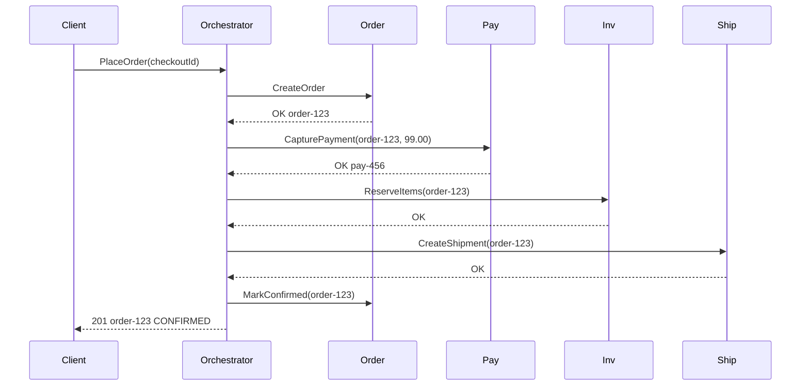
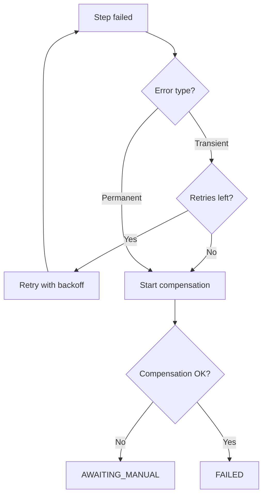

# Sagas — operations, inbox, and testing

> **Related:** Overview → [Sagas and distributed workflows](07-sagas-and-distributed-workflows.md) · Compensation → [07-sagas-compensation-idempotency.md](07-sagas-compensation-idempotency.md) · Testing → [09-testing-and-verification.md](09-testing-and-verification.md)

## Example: order → payment → inventory → shipping

### Services and local transactions

1. **OrderService** — `CreateOrder` → status `PENDING`
2. **PaymentService** — `CapturePayment(orderId, amount)`
3. **InventoryService** — `ReserveItems(orderId, lines)`
4. **ShippingService** — `CreateShipment(orderId, address)`

### Happy path (orchestrated)



### Failure: inventory out of stock (after payment)

1. `ReserveItems` returns `INSUFFICIENT_STOCK`
2. Orchestrator → `RefundPayment(pay-456)` (compensate step 2)
3. Orchestrator → `CancelOrder(order-123)` (compensate step 1)
4. Client notified: order failed, refund in progress

### Failure: shipping unavailable (after inventory reserved)

1. Compensate: `ReleaseInventory` → `RefundPayment` → `CancelOrder`
2. Release inventory **before** refund if business rule requires stock back before refund (ordering is domain-specific)

### Choreographed version (same flow)

- OrderService publishes `OrderCreated`
- PaymentService consumes → captures → publishes `PaymentCaptured`
- InventoryService consumes → on failure publishes `OrderFulfillmentFailed` with reason
- PaymentService listens for `OrderFulfillmentFailed` → refunds
- OrderService listens → cancels

The **protocol** (who listens to what) is the implicit saga definition — document it like an API(Application Programming Interface) contract.

### API surface (client view)

- `POST /orders` with `Idempotency-Key` → returns `201` or `202` if async saga
- `GET /orders/{id}` shows saga-derived status: `PENDING`, `CONFIRMED`, `CANCELLED`, `REFUNDING`
- Do not expose internal saga steps unless B2B/debug — see [API design implications](04-api-design-implications.md)

---

## When not to use a saga

A saga adds operational cost (state DB, compensation, idempotency). Prefer simpler patterns when:

| Situation | Prefer |
|-----------|--------|
| **Single service**, one database | Normal **ACID(Atomicity, Consistency, Isolation, Durability)** transaction — `BEGIN` … all writes … `COMMIT` |
| **Short sync workflow**, no external side effects | One local TX or one aggregate command |
| **Strong immediate consistency** everywhere | Single DB or sync API chain without cross-service commit |
| **Cross-service boundaries**, external APIs, or **long async** flows | **Saga** — see [Decision guide](06-decision-guide.md) |

**Rule of thumb:** If you can draw the workflow inside one deployable service and one database, you probably do not need a saga.

---

## Retry vs compensate

When a step fails, classify the error before acting:

| Failure type | Examples | Action |
|--------------|----------|--------|
| **Transient** | 503, timeout, broker blip, deadlock | **Retry** the same step with exponential backoff (cap at N attempts) |
| **Permanent** | 400, insufficient stock, invalid state, business rule violation | **Compensate** immediately — retries will not help |
| **Exhausted retries** | Still failing after N attempts | **Compensate** or move to `AWAITING_MANUAL` |



Do **not** compensate on the first transient blip — you will undo work that would have succeeded on retry. Do **not** retry forever on permanent errors — you delay refunds and tie up inventory.

---

## Observability and operations

> **Scope:** Saga-specific metrics and alerts below. General observability → [HTS §11 Observability](../../high-throughput-systems/includes/11-observability.md). DLQ(Dead Letter Queue) mechanics and retry policies → [HTS §6 Dead letter queue](../../high-throughput-systems/includes/06-async-queues-workers.md#dead-letter-queue-dlq).

### Metrics to track

| Metric | Alert when |
|--------|------------|
| **Stuck sagas** | Count where `step_deadline < now()` and status is `STEP_*_IN_PROGRESS` — growing |
| **In-flight by type** | Sudden spike or plateau near capacity |
| **Step latency p95** | Per `saga_type` / step — SLO(Service Level Objective) breach |
| **Compensation rate** | Failures vs successes — compensation errors trending up |
| **DLQ depth** | Non-zero for saga-related consumers |

Propagate **`saga_id`** (and `correlation_id`) in structured logs and distributed traces — same IDs as [Idempotency patterns](07-sagas-compensation-idempotency.md#idempotency-patterns-specific-to-sagas). Support queries like “show me everything for checkout `saga-abc`”.

### DLQ and manual intervention

Side-effect steps (payment, refund) that fail after max retries must land in a **DLQ** — not block the queue forever. Route to on-call or a reconciliation tool; replay after fix with idempotency keys intact.

### Security (orchestrator → participants)

The saga orchestrator calls participant APIs with **service identity** — mTLS(Mutual Transport Layer Security), service JWT(JSON Web Token), or workload IAM(Identity and Access Management) — not end-user tokens alone. See [Identity, RBAC, IAM](../../api-design-and-protection/includes/12-identity-rbac-iam-ad.md).

---

## Message ordering

At-least-once delivery can reorder messages unless you design for it:

| Transport | Pattern |
|-----------|---------|
| **Kafka / Kinesis** | **Partition key = `saga_id`** (or `correlation_id`) so all commands and events for one saga instance stay ordered within a partition |
| **Choreography** | Especially sensitive — `PaymentCaptured` must not be processed before `OrderCreated` is visible; enforce via partition key or idempotent state checks |
| **Queue without ordering** (SQS default) | **Orchestration** serializes via persisted state machine; participant idempotency handles duplicates |

---

## Inbox pattern (consumer dedup)

The **outbox** ([§5 Async integration](05-async-integration.md#transactional-outbox-pattern)) ensures reliable **publish** after a local write. The **inbox** ensures reliable **consume** — dedup before side effects:

```sql
CREATE TABLE inbox (
    consumer_name TEXT NOT NULL,
    message_id    TEXT NOT NULL,
    received_at   TIMESTAMPTZ NOT NULL DEFAULT now(),
    PRIMARY KEY (consumer_name, message_id)
);
```

In the consumer: `BEGIN` → `INSERT INTO inbox … ON CONFLICT DO NOTHING` → if inserted, apply side effect → `COMMIT`. If conflict, return stored outcome.

| Pattern | Role |
|---------|------|
| **Outbox** | Producer — same TX as business write + event row |
| **Inbox** | Consumer — same TX as dedup + side effect |
| **saga_step_log** | Saga participant — idempotency keyed by `(saga_id, step)` |

All three prevent duplicate side effects under at-least-once delivery.

---

## Deploying saga definition changes

In-flight saga instances must finish on the **definition version** they started with:

1. Add a **`saga_definition_version`** (or `saga_type` suffix) on `saga_instances`.
2. **Never change compensation order** for running instances — only for new sagas.
3. **Add steps at the end** of the forward path when possible; avoid inserting steps mid-flight.
4. Deploy orchestrator **backward compatible** — old workers drain v1; new instances use v2.

Same expand/contract mindset as schema migrations — see [deployment §12 Schema migrations and deploy](../../deployment-strategies/includes/12-schema-migrations-and-deploy.md).

---

## Testing sagas

| Test | What to verify |
|------|----------------|
| **State machine unit tests** | Happy path, fail-at-step-N, full compensation, late reply after timeout |
| **Failure injection** | Integration test with in-memory bus or testcontainers — force 503, timeout, duplicate delivery |
| **Idempotency** | Same `(saga_id, step)` twice → one side effect, identical response |
| **Compensation order** | Assert LIFO matches forward step map |
| **Workflow engines** | Optional: Temporal, Step Functions, Camunda — same saga rules; engine owns persistence and timers |

Full ES test pyramid (aggregates, projectors, outbox) → [§9 Testing and verification](09-testing-and-verification.md).

---

## Pros

- Multi-service workflows without distributed 2PC(Two-Phase Commit)
- Explicit failure and compensation paths
- Combines cleanly with event sourcing, outbox, and idempotent APIs

## Cons

- Eventual consistency across services; complex client UX
- Orchestrator ops (state DB, timeouts, versioning)
- Choreography hard to debug without strong tracing and contracts

See [Decision guide](06-decision-guide.md).

## Common mistakes

| Mistake | Fix |
|---------|-----|
| No saga state persistence | DB table + outbox; survive restarts |
| Missing compensation for a step | Map forward/compensate pairs upfront |
| Double charge on retry | Step-level idempotency keys |
| Timeout without late-reply handling | Reconciliation job + saga version |
| One giant distributed transaction | One local TX per service; saga coordinates |
| Choreography without documented event contract | Versioned schema registry / async API spec |
| Retry forever on permanent errors | Classify transient vs permanent; cap retries |
| Compensate on first transient blip | Backoff retry before compensation |
| No partition key for ordered choreography | `saga_id` as Kafka partition key |
| Deploy changes compensation order mid-flight | Version saga definition; drain in-flight instances |
