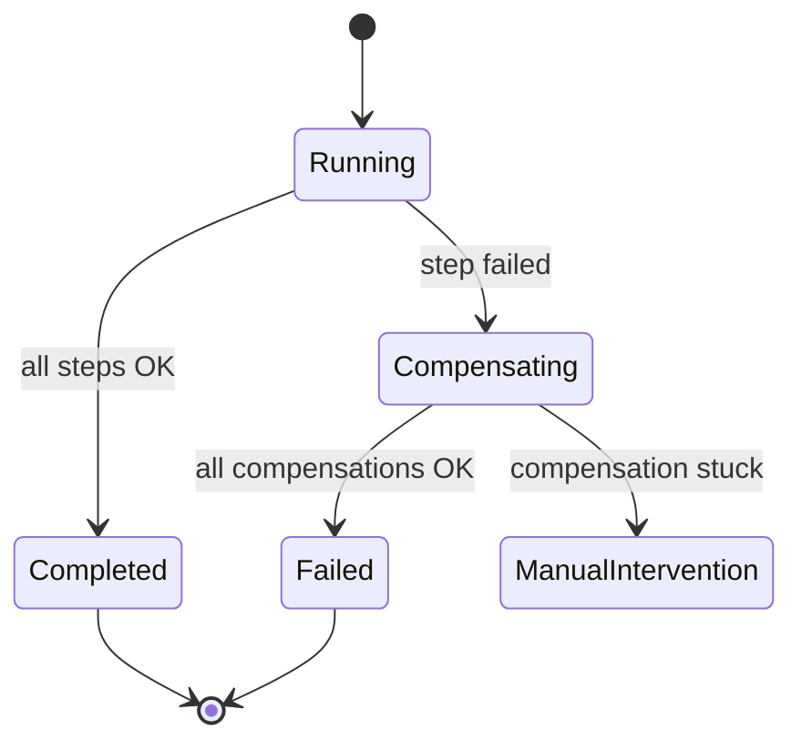

# Sagas — compensation and idempotency

> **Related:** Overview → [Sagas and distributed workflows](07-sagas-and-distributed-workflows.md) · Choreography → [07A-sagas-choreography-orchestration.md](07A-sagas-choreography-orchestration.md) · Idempotency → [api-design §13](../../api-design-and-protection/includes/13-idempotency.md)

## Compensation steps and rollback flows

Sagas do **not** roll back like a database `ROLLBACK`. Completed steps leave **facts** (payment was captured). You run **compensating transactions** — new local operations that **semantically undo** the business effect.

### Rules

1. **Every forward step needs a compensating action** (or be marked non-compensatable — e.g. email already sent).
2. **Compensate in reverse order** (LIFO): if payment then inventory failed, refund payment before canceling order-side effects that depend on payment.
3. **Compensation can fail too** — retry, alert, manual intervention queue.
4. **Not all steps are reversible** — design for **pivot** (accept partial success + human task) instead of infinite compensate loops.

### Example compensation map

| Forward step | Compensating action | Notes |
|--------------|---------------------|-------|
| Create order (`PENDING`) | Cancel order (`CANCELLED`) | Idempotent cancel |
| Capture payment | Refund payment | Refund idempotency key = `sagaId + step` |
| Reserve inventory | Release reservation | Safe if reserve never committed |
| Schedule shipment | Cancel shipment | May fail if already picked — escalate |

### Forward recovery vs backward recovery

- **Backward recovery:** Failure → run compensations (most common).
- **Forward recovery:** Failure → retry or alternate path (e.g. try warehouse B if A has no stock) without undoing prior steps.



---

## Saga state machines and timeouts

The orchestrator (or choreographed service pair) should persist **saga instance state** — not only in memory.

### Typical states

| State | Meaning |
|-------|---------|
| `STARTED` | Saga instance created |
| `STEP_N_IN_PROGRESS` | Command sent; awaiting reply |
| `STEP_N_COMPLETED` | Step acknowledged |
| `COMPENSATING` | Running undo steps |
| `COMPLETED` | All forward steps done |
| `FAILED` | Compensated or abandoned safely |
| `AWAITING_MANUAL` | Auto recovery exhausted |

### Timeouts

| Timeout type | Purpose |
|--------------|---------|
| **Step timeout** | Payment service didn't respond in 30s → retry or compensate |
| **Saga timeout** | Entire fulfillment must finish in 24h or cancel |
| **Compensation timeout** | Refund stuck → page on-call, freeze order |

**Implementation sketch:**

```sql
CREATE TABLE saga_instances (
    saga_id        UUID PRIMARY KEY,
    saga_type      TEXT NOT NULL,
    current_step   TEXT NOT NULL,
    status         TEXT NOT NULL,
    correlation_id UUID NOT NULL,
    payload        JSONB NOT NULL,
    step_deadline  TIMESTAMPTZ,
    version        INT NOT NULL DEFAULT 1,
    created_at     TIMESTAMPTZ NOT NULL DEFAULT now(),
    updated_at     TIMESTAMPTZ NOT NULL DEFAULT now()
);
```

A **timeout worker** polls `step_deadline < now() AND status LIKE 'STEP_%_IN_PROGRESS'` and drives compensate or retry policy.

**Important:** Timeouts are not free — a slow payment may still succeed after your timeout. Handlers must be **idempotent** and treat late success as no-op or reconcile (see below).

---

## Idempotency patterns specific to sagas

At-least-once messaging + client retries mean **every saga step runs at least once in effect, at most once in outcome**.

### Correlation and saga IDs

- **`saga_id`** — one UUID(Universally Unique Identifier) per business process instance (e.g. one checkout).
- **`correlation_id`** — ties all messages/logs for tracing (often same as `saga_id`).
- **`causation_id`** — parent message/event that caused this step.

Propagate on every command and event header. Aligns with event metadata in [Aggregates and streams](01-core-concepts.md#aggregates-and-streams).

### Per-step idempotency

Each participant stores **processed commands**:

```sql
CREATE TABLE saga_step_log (
    service_name    TEXT NOT NULL,
    saga_id         UUID NOT NULL,
    step_name       TEXT NOT NULL,
    idempotency_key TEXT NOT NULL,
    result          JSONB,
    processed_at    TIMESTAMPTZ NOT NULL DEFAULT now(),
    PRIMARY KEY (service_name, idempotency_key)
);
```

On duplicate delivery: return stored `result` without re-executing side effects.

### Patterns by role

| Role | Pattern |
|------|---------|
| **Orchestrator** | Persist before send: outbox + saga state in same TX — see [Transactional outbox](05-async-integration.md#transactional-outbox-pattern); dedupe replies by `(saga_id, step, message_id)` |
| **Participant** | `INSERT ... ON CONFLICT DO NOTHING` on step log; then execute or skip |
| **Compensation** | Same idempotency key namespace — `RefundPayment` for saga X must not double-refund |
| **Choreography** | Consumer dedupes on `event_id` — see [Projectors vs integration consumers](05-async-integration.md#projectors-vs-integration-consumers) |

### Late or duplicate replies

After timeout compensation started, the original step may still complete:

- **Reconcile:** Payment captured after refund initiated → alert + manual or auto second refund check.
- **Version field:** Saga instance `version` incremented on each transition; stale replies ignored.

General HTTP(Hypertext Transfer Protocol) idempotency (`Idempotency-Key`, storage patterns) → [Idempotency](../../api-design-and-protection/includes/13-idempotency.md). Saga idempotency extends that to **async multi-step** flows.

---