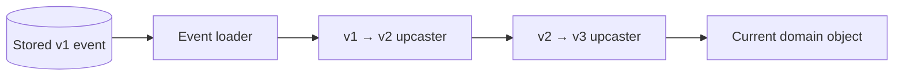

# Event Schema Evolution

Event logs are forever — schema changes are **read-path** transformations (upcasting), not `UPDATE` on historical rows.

> **Related:** Immutability → [01-core-concepts.md#immutability-and-corrections](01-core-concepts.md#immutability-and-corrections) · Projector rebuild → [03-storage-and-projections.md](03-storage-and-projections.md) · API(Application Programming Interface) versioning → [api-design §14](../../api-design-and-protection/includes/14-api-versioning-and-deprecation.md) · Deploy coupling → [deployment §12](../../deployment-strategies/includes/12-schema-migrations-and-deploy.md)

---

## At a glance

| Strategy | What changes | Replay impact |
|----------|--------------|---------------|
| **Additive fields** | New optional JSON fields | Old events still valid |
| **Upcasting** | Transform v1 → v2 on read | Loader applies per event |
| **New event type** | v2 alongside v1 | Both types in stream |
| **Projector version** | New read model shape | Rebuild projection from scratch |

**Rule of thumb:** Never mutate stored events. Add version metadata; upcast at load time; rebuild projections when read models change structurally.

---

## Version metadata

Store on every event:

```json
{
  "event_type": "OrderCreated",
  "schema_version": 2,
  "aggregate_id": "ord-123",
  "payload": { ... }
}
```

| Field | Purpose |
|-------|---------|
|  | Routing to handler / projector |
|  | Select upcaster chain |
|  | Stream partition key |

---

## Upcasting



| Rule | Detail |
|------|--------|
| **Chain upcasters** | v1→v2, v2→v3 — not v1→v3 skip unless documented |
| **Test fixtures** | Golden files for each historical version |
| **Deploy order** | Deploy readers that understand new version **before** writers emit it |
| **Snapshots** | Re-snapshot after major schema jumps to cut replay cost |

Example: v1  int → v2  object .

---

## Projector compatibility

| Change | Safe during rolling deploy? |
|--------|----------------------------|
| Add optional column to read model | ✅ Expand |
| New projector for new view | ✅ Side-by-side |
| Rename column consumed by API | ❌ Expand/contract —  |
| Change projection logic only | Rebuild from events; may lag during deploy |

Runbook: stop projector → deploy new code → rebuild or catch-up → resume. See  and snapshots in .

---

## Contract with consumers

| Consumer type | Evolution rule |
|---------------|----------------|
| **Internal projector** | Upcast + rebuild |
| **External Kafka subscriber** | Additive fields only; new topic for breaking |
| **Public event API** | Versioned envelope; deprecation window |

Pair with  for published schemas.

---

## Common mistakes

| Mistake | Fix |
|---------|-----|
|  | Upcast on read |
| Deploy writer before reader | Two-phase deploy: readers first |
| No version field | Add  early |
| Skip upcaster tests | Fixture per version in CI |

---

## Pros and cons

### Upcasting on read

**Pros:** Full history preserved; gradual migration.

**Cons:** Loader complexity grows; replay slows without snapshots.
