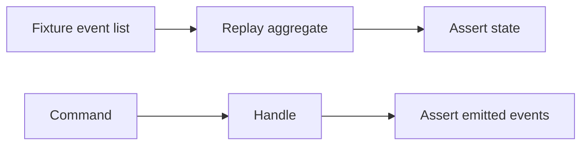

# Testing and Verification

Event-sourced systems need tests at three layers: command handling, projection correctness, and integration paths (outbox, sagas).

> **Related:** Sagas → [07-sagas-and-distributed-workflows.md](07-sagas-and-distributed-workflows.md) · Schema evolution → [08-event-schema-evolution.md](08-event-schema-evolution.md) · Contract CI → [api-design §15](../../api-design-and-protection/includes/15-contract-and-schema-testing.md)

---

## At a glance

| Layer | What to prove | Technique |
|-------|---------------|-----------|
| **Aggregate** | Given events → state; command → events | In-memory event store |
| **Projector** | Event sequence → read model rows | Table-driven fixtures |
| **Outbox relay** | Row published after commit | Integration test + test broker |
| **Saga** | Happy path + compensation order | Orchestrator test harness |
| **Replay** | Upcasters + rebuild = expected state | Golden event files |

**Rule of thumb:** Test **behavior from events**, not hidden mutable fields. Use the same upcasters in tests and production loaders.

---

## Aggregate tests



| Check | Example |
|-------|---------|
| Replay from empty | `OrderCreated` → status `open` |
| Optimistic concurrency | Stale version → conflict |
| Invalid command | No events appended |

---

## Golden event fixtures

Store versioned JSON fixtures per aggregate — replay in tests without a database.

**File:** `fixtures/orders/order-happy-path.v1.json`

```json
{
  "aggregate_type": "Order",
  "aggregate_id": "order_fixture_001",
  "schema_version": 1,
  "events": [
    {
      "event_type": "OrderCreated",
      "schema_version": 1,
      "occurred_at": "2026-06-01T10:00:00Z",
      "payload": {
        "order_id": "order_fixture_001",
        "customer_id": "cust_42",
        "status": "open",
        "total_cents": 9900
      }
    },
    {
      "event_type": "OrderLineAdded",
      "schema_version": 1,
      "occurred_at": "2026-06-01T10:00:01Z",
      "payload": {
        "line_id": "line_1",
        "sku": "SKU-ABC",
        "quantity": 2,
        "price_cents": 4950
      }
    }
  ],
  "expected_state": {
    "status": "open",
    "line_count": 1,
    "total_cents": 9900
  },
  "command_tests": [
    {
      "command": "ConfirmOrder",
      "given_version": 2,
      "expect_events": ["OrderConfirmed"],
      "expect_state": { "status": "confirmed" }
    }
  ]
}
```

**Test sketch (pseudocode):**

```text
events = load_fixture("order-happy-path.v1.json")
agg = OrderAggregate.replay(events.events)
assert agg.state == events.expected_state

for cmd_test in events.command_tests:
    result = agg.handle(cmd_test.command, version=cmd_test.given_version)
    assert result.new_events.map(type) == cmd_test.expect_events
```

| Fixture rule | Why |
|--------------|-----|
| One file per scenario (happy, fail, compensate) | Clear regression signal |
| Include `schema_version` on every event | Upcaster tests in same file |
| `expected_state` after replay | Catches projector/aggregate drift |
| Commit fixtures next to domain code | PRs that change rules update fixtures |

Pair with schema evolution → [§8 Event schema evolution](08-event-schema-evolution.md) when bumping `schema_version`.

---

## Projector tests

| Pattern | Detail |
|---------|--------|
| **Given / when / then** | Given events in file → run projector → assert DB rows |
| **Idempotent replay** | Run projector twice → same rows |
| **Version jump** | Include v1 and v2 events after upcast |

Rebuild test: wipe read table → replay full stream → compare to snapshot CSV.

---

## Saga and integration tests

| Test type | Setup |
|-----------|--------|
| **Orchestrator unit** | Mock participant APIs; assert command order and compensation LIFO |
| **In-memory bus** | Choreography with synchronous handlers |
| **Outbox integration** | Real PG + test Kafka/SQS; assert message after TX commit |
| **Failure injection** | Fail step 3 → assert compensate 2, 1 |

Propagate `saga_id` in test traces — same as production — [§7 Observability](07C-sagas-operations.md#observability-and-operations).

---

## CI checklist

- [ ] Golden event fixtures per `schema_version`
- [ ] Projector tests on every PR touching projection logic
- [ ] Contract test for published integration events (JSON Schema / Avro)
- [ ] Saga compensation order test for each new workflow
- [ ] Load test projector catch-up after deploy (optional nightly)

---

## Common mistakes

| Mistake | Fix |
|---------|-----|
| Test only happy path | Compensation + duplicate delivery |
| Mock event store that differs from prod | Same loader/upcaster code path |
| Skip rebuild test after schema change | Automated rebuild in CI |
| Saga tests without idempotency | Replay same command twice |

---

## Pros and cons

### Fixture-driven event tests

**Pros:** Deterministic; catches regression in rules and projections.

**Cons:** Fixture maintenance as schemas evolve — pair with [§8](08-event-schema-evolution.md).