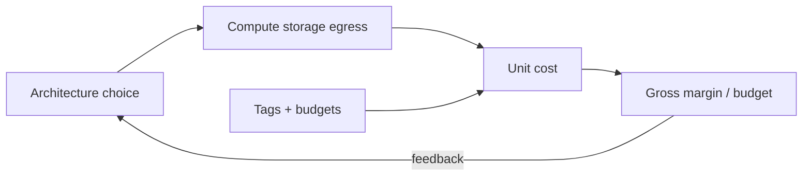

# Overview — FinOps & Cost

FinOps(Cloud Financial Operations) for engineering leaders: **cost is a product and architecture input**, not only a monthly invoice surprise.

> **Related:** Throughput waste → [HTS overview](../../high-throughput-systems/includes/00-overview.md) · Store sprawl → [data-platforms](../../data-platforms/README.md) · Architecture forks → [architecture-decisions](../../architecture-decisions/README.md) · [§7](07-architecture-cost-tradeoffs.md)

---

## At a glance

| Role | Cost responsibility |
|------|---------------------|
| **Tech Lead** | Design choices that set unit cost; tag ownership |
| **Platform / FinOps** | Visibility, budgets, commitment discounts |
| **Product** | Margin vs feature; accept or reject expensive paths |
| **On-call** | Kill runaway queries/jobs that burn cash |

**Rule of thumb:** If you cannot state **cost per request**, **per tenant**, or **per feature** within an order of magnitude, you are optimizing blindly — start with [§1](01-unit-economics.md).

---

## Cost as design constraint

| Design choice | Cost lever |
|---------------|------------|
| Sync vs async | Holding connections vs queue storage |
| Cache vs always-origin | Redis/CDN(Content Delivery Network) vs DB CPU |
| Multi-region active-active | ~2× compute + egress |
| Infinite retention | Storage + scan cost |
| Managed Kafka vs SQS(Simple Queue Service) | Ops time vs $ / message |

---

## Document map

| # | Topic | File |
|---|-------|------|
| 1 | Unit economics | [01-unit-economics.md](01-unit-economics.md) |
| 2 | Cloud cost drivers | [02-cloud-cost-drivers.md](02-cloud-cost-drivers.md) |
| 3 | Right-sizing and autoscaling | [03-right-sizing-and-autoscaling.md](03-right-sizing-and-autoscaling.md) |
| 4 | Storage and retention | [04-storage-and-retention-cost.md](04-storage-and-retention-cost.md) |
| 5 | Build vs managed | [05-build-vs-managed-cost.md](05-build-vs-managed-cost.md) |
| 6 | Visibility and budgets | [06-cost-visibility-and-budgets.md](06-cost-visibility-and-budgets.md) |
| 7 | Architecture tradeoffs | [07-architecture-cost-tradeoffs.md](07-architecture-cost-tradeoffs.md) |
| 8 | Decision guide | [08-decision-guide.md](08-decision-guide.md) |

---

## When to read other guides instead

| Question | Read |
|----------|------|
| How do we scale throughput correctly? | [high-throughput-systems](../../high-throughput-systems/README.md) |
| Which data store should we add? | [data-platforms §8](../../data-platforms/includes/08-decision-guide.md) |
| Kafka retention mechanics? | [apache-kafka §5](../../apache-kafka/includes/05-retention-compaction-and-storage.md) |
| DB inefficient queries? | [postgresql-performance](../../postgresql-performance/README.md) — fix waste before buying larger instances |

---

## Operating cadence

| Cadence | Activity |
|---------|----------|
| **Weekly** | Top services by $ delta; anomaly review |
| **Per design review** | Unit-cost estimate for new path |
| **Monthly** | Budget vs actual; commitment coverage |
| **Quarterly** | Architecture cost tradeoffs — [§7](07-architecture-cost-tradeoffs.md) |

---

## Common mistakes

| Mistake | Fix |
|---------|-----|
| Cost only reviewed by finance | Engineering owns unit metrics — [§1](01-unit-economics.md) |
| Scale out before right-size | [§3](03-right-sizing-and-autoscaling.md) |
| Keep all data forever | [§4](04-storage-and-retention-cost.md) + [data-platforms §5](../../data-platforms/includes/05-data-ownership-lineage-retention.md) |
| No tags → no owners | [§6](06-cost-visibility-and-budgets.md) |