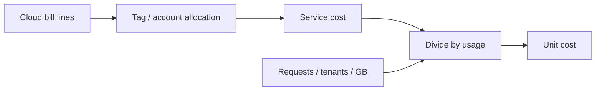

# Unit Economics

Express infrastructure spend as **cost per request**, **per tenant**, and **per feature** so design reviews can reject paths that destroy margin.

> **Related:** Overview → [§0](00-overview.md) · Drivers → [§2](02-cloud-cost-drivers.md) · Multi-tenant APIs → [api-design §16](../../api-design-and-protection/includes/16-multi-tenant-apis.md) · SLO(Service Level Objective) vs cost → [HTS §1](../../high-throughput-systems/includes/01-measurement-and-slo.md)

---

## At a glance

| Metric | Formula sketch | Use |
|--------|----------------|-----|
| **Cost / request** | Service $ / successful requests | API(Application Programming Interface) pricing, cache ROI |
| **Cost / tenant** | Attributed $ / active tenants | SaaS packaging, noisy neighbors |
| **Cost / feature** | Tagged resources for a capability | Kill or redesign expensive features |
| **Cost / GB processed** | Pipeline $ / data volume | ETL(Extract, Transform, Load) and streaming design |

**Rule of thumb:** Track **one primary unit** per service (usually request or tenant). Add feature splits only when a capability has dedicated resources.

---

## Building the metric

| Step | Practice |
|------|----------|
| 1 | Tag compute, DB, queue, storage by `service` + `env` |
| 2 | Allocate shared costs (cluster, NAT, observability) with a published key |
| 3 | Pull usage from metrics (RPS, active tenants, bytes) |
| 4 | Compute weekly unit cost; alert on +20% week-over-week |

Shared allocation will be imperfect — **consistency beats precision** early.

---

## Per-request lens

| Lever | Effect on cost/request |
|-------|------------------------|
| Cache hit ratio up | Amortizes origin |
| p99 work down | Fewer retries / timeouts |
| Payload size down | Less egress / serialize CPU |
| Sync fan-out to N services | Multiplies dependency cost |

Pair with rate limits for abuse — [api-rate-limiting](../../api-rate-limiting/README.md) protects both SLO and wallet.

---

## Per-tenant lens

| Pattern | Cost risk |
|---------|-----------|
| Noisy neighbor (one tenant 80% load) | Fairness + tiered pricing |
| Heavy export / analytics API | Separate SKU or async job fees |
| Per-tenant isolation (dedicated DB) | Higher floor cost; clearer attribution |
| Shared pool | Cheaper; need quotas |

Document **included units** in the product tier — [api-design §5](../../api-design-and-protection/includes/05-rate-limit-tiers.md).

---

## Per-feature lens

| Feature shape | Attribution |
|---------------|-------------|
| Dedicated workers / topics | Direct tag |
| Shared monolith code path | Approximate via span/sampled cost or % traffic |
| Optional AI / search | Separate budget; kill switch |

If a feature cannot carry its unit cost at expected volume, redesign before launch — [§7](07-architecture-cost-tradeoffs.md).

---

## Worked sketch

| Input | Value |
|-------|-------|
| Orders API monthly infra | $12,000 |
| Successful requests | 40M |
| **Cost / 1k requests** | $0.30 |
| Top tenant share | 15% of traffic → ~$1,800 |

Use sketches in design review; refine with tags over time — [§6](06-cost-visibility-and-budgets.md).

---

## Common mistakes

| Mistake | Fix |
|---------|-----|
| Only absolute $ dashboards | Add unit denominators |
| Attribute 100% of shared cluster to one team | Published allocation key |
| Ignore data transfer | Include egress in unit — [§2](02-cloud-cost-drivers.md) |
| Optimize cost against unmet SLOs | Meet SLO first; then reduce waste |

---

## Pros and cons

### Unit-cost driven design

**Pros:** Aligns eng and product; catches expensive designs early; enables pricing.

**Cons:** Attribution politics; noisy early metrics; temptation to under-provision.