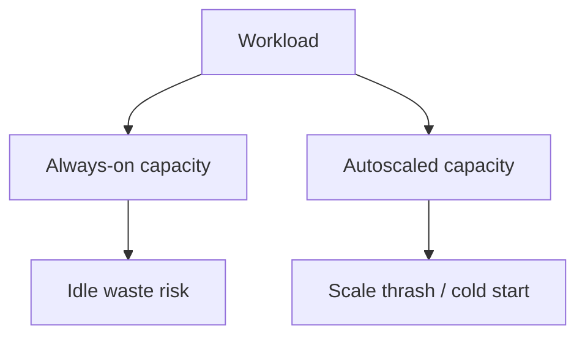

# Cloud Cost Drivers

Most bills concentrate in a few categories: **compute**, **storage**, **egress**, and **managed services**. Know which driver you are moving before you "optimize."

> **Related:** Unit economics → [§1](01-unit-economics.md) · Retention → [§4](04-storage-and-retention-cost.md) · Managed premiums → [§5](05-build-vs-managed-cost.md) · Kafka storage → [apache-kafka §5](../../apache-kafka/includes/05-retention-compaction-and-storage.md)

---

## At a glance

| Driver | Typical surprises | First levers |
|--------|-------------------|--------------|
| **Compute** | Idle always-on; over-CPU | Right-size, scale-to-zero, commitments |
| **Storage** | Snapshots, indexes, versions | Lifecycle, retention, compression |
| **Egress / data transfer** | Cross-AZ, cross-region, internet | Locality, private links, fewer hops |
| **Managed services** | RU/CU, provisioned throughput | Match capacity mode; avoid idle provisioned |
| **Observability** | High-cardinality metrics/logs | Sample, drop, retain tiers |

**Rule of thumb:** Sort last month's bill by service — optimize the **top three lines** before micro-tuning the long tail.

---

## Compute

| Pattern | Cost note |
|---------|-----------|
| Stateless app pods | Scale with RPS; avoid huge min replicas without traffic |
| Workers | Scale on queue depth — [HTS §6](../../high-throughput-systems/includes/06-async-queues-workers.md) |
| Databases | Instance class + IOPS + storage; replicas multiply |
| Batch | Spot/preemptible where safe; don't use on-demand for nightly ETL(Extract, Transform, Load) |

Right-sizing depth: [§3](03-right-sizing-and-autoscaling.md).

---

## Storage

| Store | Cost shape |
|-------|------------|
| Block (EBS etc.) | Provisioned GB + IOPS |
| Object (S3/GCS) | GB stored + requests + retrieval |
| DB | Primary + replicas + WAL(Write-Ahead Log)/backup |
| Kafka | Retention × replication × growth |
| Search | Primary shards + replicas + segments |

Retention policy is a **cost control** — [§4](04-storage-and-retention-cost.md), [data-platforms §5](../../data-platforms/includes/05-data-ownership-lineage-retention.md).

---

## Egress and networking

| Path | Often expensive? |
|------|------------------|
| Same AZ private | Low |
| Cross-AZ | Medium — replicas and chats add up |
| Cross-region | High |
| Internet egress | High — APIs, CDN(Content Delivery Network) origin miss |
| NAT gateway data | High at scale |

Design for **data locality**: process near the data; cache at edge; avoid chatty cross-region sync — [HTS §13](../../high-throughput-systems/includes/13-multi-region-read-routing.md).

---

## Managed services

| Example | Meter |
|---------|-------|
| Serverless DB / API(Application Programming Interface) GW | Per request / RU |
| Managed Kafka / MQ | Hours + storage + throughput |
| Warehouse | Compute slots / scanned bytes |
| CDN | Requests + egress |

Idle **provisioned** capacity is a common leak; serverless can be cheaper at low volume and expensive at high — model both — [§5](05-build-vs-managed-cost.md).

---

## Observability and security add-ons

| Line item | Control |
|-----------|---------|
| Log GB ingested | Sample debug; structured drop |
| Custom metrics cardinality | Bound labels |
| WAF(Web Application Firewall) / scanner | Scope to edge needs |
| Backup copies | Retention tiers |

---

## Common mistakes

| Mistake | Fix |
|---------|-----|
| Optimize CPU while egress dominates | Sort bill first |
| Cross-region "for DR(Disaster Recovery)" without RTO(Recovery Time Objective) need | Match [RPO/RTO](../../database-connection-and-security/includes/12-credential-rotation-and-dr.md) |
| Unlimited log retention | Tier and drop |
| One giant shared account | Tagging / accounts — [§6](06-cost-visibility-and-budgets.md) |

---

## Pros and cons

### Driver-first optimization

**Pros:** Biggest $ wins; clearer design reviews; less bike-shedding.

**Cons:** Requires clean billing data; some drivers need architecture change, not a toggle.