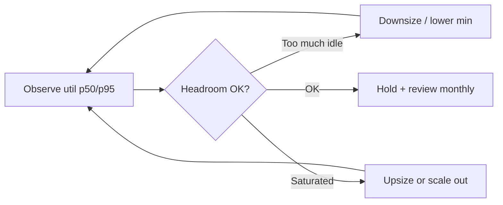

# Right-Sizing and Autoscaling

Pay for **needed capacity**, not peak folklore. Right-size continuously; autoscale on **signal**, not CPU alone.

> **Related:** Drivers → [§2](02-cloud-cost-drivers.md) · HTS scale/deploy → [HTS §10](../../high-throughput-systems/includes/10-scale-and-deploy.md) · Backpressure → [HTS §9](../../high-throughput-systems/includes/09-backpressure-and-limits.md) · PG memory → [PG §8](../../postgresql-performance/includes/08-memory-and-config.md)

---

## At a glance

| Workload | Scale signal | Floor |
|----------|--------------|-------|
| **HTTP(Hypertext Transfer Protocol) API(Application Programming Interface)** | RPS, concurrency, p99 latency | Min replicas for deploy + spike |
| **Queue workers** | Lag / depth | 0–1 if delay OK |
| **Stateful DB** | Connections, CPU, IOPS, bloat | Vertical first; plan replicas |
| **Cron / batch** | Schedule | Scale to zero between runs |
| **Kafka consumers** | Consumer lag | Partitions limit parallelism |

**Rule of thumb:** Fix **wasteful work** (queries, N+1, huge payloads) before buying bigger boxes — [HTS overview](../../high-throughput-systems/includes/00-overview.md).

---

## Right-size loop

| Check | Action |
|-------|--------|
| CPU p95 < 30% for weeks | Smaller instance / fewer replicas |
| Memory OOM with low CPU | Memory-optimized shape or leak fix |
| Disk IOPS throttled | Storage class / index / query fix |
| Connection storms | Pool sizing — [PG §7](../../postgresql-performance/includes/07-connection-management.md) |

---

## Autoscaling pitfalls

| Pitfall | Symptom | Fix |
|---------|---------|-----|
| Scale on CPU only | Latency bad while CPU low | Use RPS / concurrency / lag |
| Min = max | Always pay peak | Separate min (HA) from max (budget) |
| Flapping | Scale thrash costs + instability | Longer windows; stabilization |
| Cold starts | Spiky latency | Warm pool for critical paths |
| No max | Runaway $ on attack | Cap + rate limit |

Couple scale-out with **load shedding** — [HTS §9](../../high-throughput-systems/includes/09-backpressure-and-limits.md).

---

## Commitments and discounting

| Tool | When |
|------|------|
| Savings Plans / Reserved | Steady baseline after right-size |
| Spot / preemptible | Stateless batch, tolerant workers |
| Sustained-use | Vendor automatic — still right-size |

**Never** buy 3-year commits on oversized instances — right-size for 2–4 weeks first.

---

## Databases and stateful systems

| Lever | Note |
|-------|------|
| Vertical resize | Plan maintenance window / failover |
| Read replicas | Cost × N; only if read-heavy — [PG §11](../../postgresql-performance/includes/11-read-scaling-and-caching.md) |
| Storage autoscaling | Enable with alerts; don't ignore growth |
| Connection poolers | Fewer backend processes = smaller DB |

---

## Environments

| Env | Policy |
|-----|--------|
| **Prod** | HA floor; budget max |
| **Staging** | Smaller; schedule off-hours shutdown |
| **Dev** | Scale to zero; shared where safe |
| **Ephemeral PR** | TTL(Time To Live) destroy |

Dual environments for blue/green are a **deploy cost** — use when risk warrants — [deployment §3](../../deployment-strategies/includes/03-blue-green.md).

---

## Common mistakes

| Mistake | Fix |
|---------|-----|
| "Prod-sized" staging 24/7 | Schedule / shrink |
| Autoscale without max | Hard cap + alerts |
| Commit then discover 4× oversize | Right-size first |
| Scale out chatty monolith | Profile; cache; fix queries |
| Ignore partition limits on consumers | Kafka partitions — [kafka §4](../../apache-kafka/includes/04-consumers-and-consumer-groups.md) |

---

## Pros and cons

### Aggressive right-sizing + signal-based scale

**Pros:** Large recurring savings; forces performance hygiene.

**Cons:** Risk of under-provision; needs good metrics and on-call discipline.