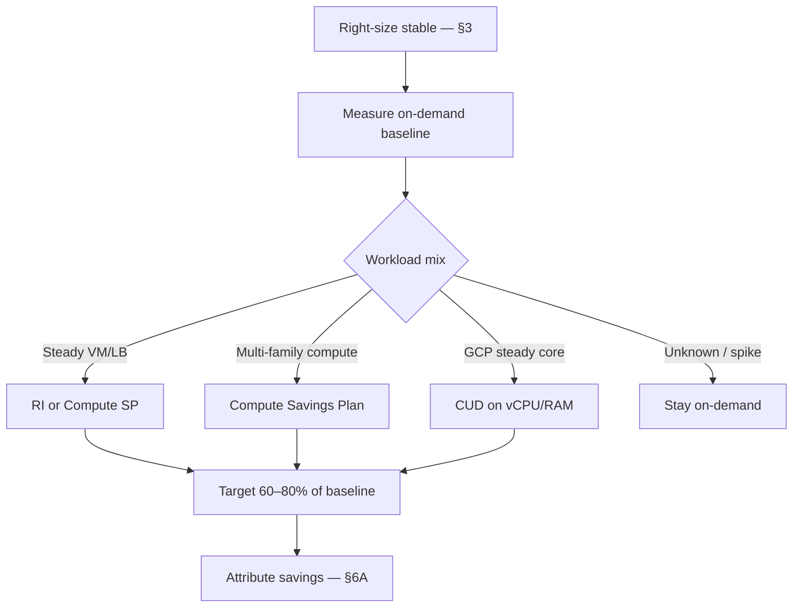

# Commitments and Discount Strategy

Right-sizing — [§3](03-right-sizing-and-autoscaling.md) — removes waste on **current** shape. Commitments (RI(Reserved Instance), SP(Savings Plan), CUD(Committed Use Discount)) lock in discount on **predictable baseline** spend after shape is sane. Buy coverage for steady floor, not peak folklore or pre-optimization inventory.

> **Scope:** Cloud commitment purchasing, coverage targets, exchange/renewal, and FinOps(Cloud Financial Operations) governance beyond instance sizing. Right-size loop and autoscale signals → [§3](03-right-sizing-and-autoscaling.md). Allocating commitment savings to teams → [§6A](06A-platform-showback-and-unit-cost.md). Cost drivers and billing dimensions → [§2](02-cloud-cost-drivers.md).
>
> **Related:** Visibility and budgets → [§6](06-cost-visibility-and-budgets.md) · Unit economics → [§1](01-unit-economics.md) · Storage retention trade-offs → [§4](04-storage-and-retention-cost.md) · HTS scale/deploy → [HTS §10](../../high-throughput-systems/includes/10-scale-and-deploy.md)

---

## At a glance

| Instrument | Typical use | Flexibility |
|------------|-------------|-------------|
| **RI(Reserved Instance)** | Stable instance family/region | Low — match shape carefully |
| **SP(Savings Plan)** | Compute $/hr commitment across families | Medium — watch OS/tenant |
| **CUD(Committed Use Discount)** | GCP-style vCPU/RAM/memory commit | Medium — region + resource type |
| **Savings Plans (DB)** | RDS/Aurora baseline | Low — engine lock-in |
| **No commitment** | Spiky / experimental workloads | Full on-demand price |

**Rule of thumb:** Commit **after** four to eight weeks of stable utilization post-right-size — not before the first production launch.

---

## Decision flow

| Input | Source |
|-------|--------|
| Baseline hours | Cost explorer / billing export — [§6](06-cost-visibility-and-budgets.md) |
| Growth forecast | Product roadmap + capacity plan |
| Shape changes | [§3](03-right-sizing-and-autoscaling.md) review cadence |

---

## Coverage targets

| Tier | Coverage | Rationale |
|------|----------|-----------|
| **Core platform** | 70–85% of 24×7 baseline | DB primaries, ingress, shared services |
| **Product steady state** | 60–75% | Min replicas after autoscale tuning |
| **Batch / CI(Continuous Integration)** | 0–40% | Schedule-driven; scale-to-zero |
| **New services (< 90 days)** | 0% until baseline proven | Avoid wrong-family lock-in |

Over-committing turns savings into **stranded capacity** when architecture shifts (ARM migration, serverless move, region change).

---

## RI vs SP vs CUD

| Question | Prefer |
|----------|--------|
| Single instance type for years | RI |
| Mixed families, same cloud | Compute SP |
| Frequent instance generation changes | SP over RI |
| GCP core fleet | CUD + sustained use where applicable |
| Multi-cloud portability | Minimal commitments; optimize shape first |

Review **effective savings rate** monthly, not invoice day alone. Exchanges and marketplace RIs exist — use them instead of letting bad commits age out silently.

---

## Governance and showback

| Practice | Why |
|----------|-----|
| Central purchase, distributed accountability | Platform buys; teams own utilization |
| Attribute gross vs net in showback | Teams see behavior, not just discounts — [§6A](06A-platform-showback-and-unit-cost.md) |
| Tag commitments in reports | Avoid "mystery credit" arguments |
| Renewal calendar 90 days ahead | Exchanges need lead time |
| Document exception policy | On-demand allowed for experiments |

Pair commitment decisions with **unit cost** — [§1](01-unit-economics.md) — so savings fund throughput, not hidden over-provisioning.

---

## Operational checklist

- [ ] Baseline measured post-right-size — [§3](03-right-sizing-and-autoscaling.md)
- [ ] Coverage targets by workload tier documented
- [ ] Renewal / exchange calendar owned
- [ ] Showback splits on-demand vs committed — [§6A](06A-platform-showback-and-unit-cost.md)
- [ ] Quarterly review after architecture changes

---

## Common mistakes

| Mistake | Fix |
|---------|-----|
| Buy 3-year RI before right-sizing | Right-size first — [§3](03-right-sizing-and-autoscaling.md) |
| Commit to peak from load test | Commit to observed min/baseline |
| Ignore instance family drift | SP or exchange |
| Hide savings in one platform line item | Showback with net attribution — [§6A](06A-platform-showback-and-unit-cost.md) |
| Same coverage for batch and API(Application Programming Interface) | Tiered targets |
| No owner for renewals | FinOps + platform RACI(Responsible, Accountable, Consulted, Informed) |
