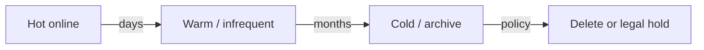

# Storage and Retention Cost

Storage grows silently. **Retention policies** and **tiering** are the primary controls — not buying bigger disks after the pager fires.

> **Related:** Data ownership → [data-platforms §5](../../data-platforms/includes/05-data-ownership-lineage-retention.md) · Kafka retention → [apache-kafka §5](../../apache-kafka/includes/05-retention-compaction-and-storage.md) · Drivers → [§2](02-cloud-cost-drivers.md) · Analytics isolation → [data-platforms §7](../../data-platforms/includes/07-analytics-without-harming-oltp.md)

---

## At a glance

| Store | Cost grows with | Control |
|-------|-----------------|---------|
| **Object / lake** | GB × time × copies | Lifecycle to cold/archive; delete |
| **Warehouse** | Stored tables + scanned bytes | Drop unused marts; partition prune |
| **Kafka** | Retention × RF × produce rate | Time/size retention; compact |
| **DB** | Live data + indexes + bloat + backups | Archive; vacuum; backup retention |
| **Search** | Docs × replicas × segments | TTL(Time To Live) indexes; shrink replicas |
| **Logs / traces** | Ingest rate × retain days | Sample; short hot retain |

**Rule of thumb:** Default is **delete or tier** — infinite retention requires an explicit legal/product owner.

---

## Tiering model

| Tier | Access | Typical use |
|------|--------|-------------|
| **Hot** | ms–s | OLTP(Online Transaction Processing), active search, recent Kafka |
| **Warm** | seconds–minutes | Last quarter analytics |
| **Cold** | minutes–hours | Compliance archive |
| **Delete** | — | Past policy; no hold |

Match tiers to [data-platforms retention](../../data-platforms/includes/05-data-ownership-lineage-retention.md).

---

## Backups and replicas multiply

| Copy | Often forgotten? |
|------|------------------|
| Streaming replica | Yes — full storage × N |
| Automated snapshots | Yes — retention × frequency |
| Cross-region backup | Yes — storage + transfer |
| PITR(Point-in-Time Recovery) WAL(Write-Ahead Log) window | Medium — tune window to RPO(Recovery Point Objective) |

DR(Disaster Recovery) copies must match [RPO/RTO](../../database-connection-and-security/includes/12-credential-rotation-and-dr.md) — not "keep everything everywhere."

---

## Kafka and streaming

| Lever | Effect |
|-------|--------|
| Shorter retention | Less disk; ensure sinks landed |
| Compaction | Keep latest key; shrink changelog |
| Tiered storage | Hot local + cold object |
| RF=3 | 3× storage — required for prod durability |

Do not set infinite retention to "be safe" — land to warehouse/lake first ([kafka §5](../../apache-kafka/includes/05-retention-compaction-and-storage.md)).

---

## Warehouse and lake hygiene

| Practice | Why |
|----------|-----|
| Drop unused tables/schemas | Scans and storage |
| Partition by time | Prune old partitions cheaply |
| Compact small files | Lower request + planning cost |
| Separate raw vs curated retention | Raw shorter or colder |

Scanned-byte pricing means **bad SQL(Structured Query Language) is a bill** — teach partition filters; set user quotas.

---

## Application data lifecycle

| Data class | Policy example |
|------------|----------------|
| Sessions | Hours–days in Redis |
| Operational events | 7–30d in Kafka → warehouse |
| Orders | Years online per finance; archive lines |
| PII(Personally Identifiable Information) | Minimum necessary; erasure path |
| Debug logs | 3–14d hot |

---

## Common mistakes

| Mistake | Fix |
|---------|-----|
| Backup retention = forever | Align to legal + restore drills |
| Kafka retain 90d + unused sink | Shorten or prove consumer |
| Search index full history | Hot window + rebuild from source |
| Snapshot every hour × 365d | Frequency × retention math |
| No owner for lake bucket | Assign — [data-platforms §5](../../data-platforms/includes/05-data-ownership-lineage-retention.md) |

---

## Pros and cons

### Aggressive retention and tiering

**Pros:** Predictable storage bill; smaller blast radius; faster restores of hot sets.

**Cons:** Needs product/legal sign-off; risk of deleting needed history; engineering for rehydrate.