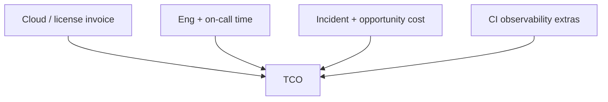

# Build vs Managed Cost

Compare **cloud invoice** plus **engineering time** (TCO(Total Cost of Ownership)) — managed is not always more expensive, and self-host is not always cheaper.

> **Related:** Kafka managed vs self → [apache-kafka §11](../../apache-kafka/includes/11-decision-guide-and-common-mistakes.md) · Drivers → [§2](02-cloud-cost-drivers.md) · Architecture tradeoffs → [§7](07-architecture-cost-tradeoffs.md) · Data platform sprawl → [data-platforms §8](../../data-platforms/includes/08-decision-guide.md)

---

## At a glance

| Signal | Lean managed | Lean self-host / build |
|--------|--------------|------------------------|
| Small platform team | ✅ | ❌ |
| Steady huge volume | Model both | Often wins on $ |
| Strict custom kernel/network | Maybe not | ✅ |
| Need day-1 HA + patches | ✅ | Costly ops |
| Compliance needs dedicated gear | Check offering | ✅ |

**Rule of thumb:** Price **people + pages + risk**, not only the SKU. A "cheap" Kafka cluster that consumes two FTEs is expensive.

---

## TCO components

| Component | Managed | Self-host |
|-----------|---------|-----------|
| **Invoice** | Higher unit $ often | Lower unit $ at scale |
| **Patching / upgrades** | Vendor | You |
| **Paging** | Shared responsibility | You own brokers/nodes |
| **Features lag** | Vendor roadmap | Upstream speed |
| **Exit cost** | Lock-in risk | Ops knowledge locked in |

---

## Worked comparison dimensions

| Dimension | Questions |
|-----------|-----------|
| **Volume curve** | Year-1 vs year-3 traffic — crossover point? |
| **Staffing** | Who patches at 2am? Opportunity cost of roadmap? |
| **SLA(Service Level Agreement)** | Does vendor SLA meet your SLO(Service Level Objective)? Credits ≠ uptime |
| **Skills** | Do you already run this well? |
| **Portability** | Multi-cloud / exit plan? |

Example: **Amazon SQS(Simple Queue Service)** vs **self-managed Kafka** for simple jobs — SQS usually wins until fan-out/replay dominate ([HTS §14](../../high-throughput-systems/includes/14-message-brokers-and-queues.md)).

---

## Common managed categories

| Service | Managed trap | Build trap |
|---------|--------------|------------|
| **DB** | Oversized instances idle | Understaffed failover drills |
| **Kafka / MQ** | Paying for unused partitions/hours | Under-replicated "savings" |
| **Warehouse** | Unbounded scan spend | Half-built lake swamp |
| **Search** | Replica overkill | Untested restore |
| **K8s** | Control plane + idle nodes | DIY etcd heroes |

---

## Decision checklist

| # | Check |
|---|-------|
| 1 | 12-month volume + growth sketch |
| 2 | Invoice estimate both options |
| 3 | FTE-hours for ops (honest) |
| 4 | Incident history / risk tolerance |
| 5 | Lock-in / exit plan |
| 6 | Security/compliance constraints |
| 7 | Revisit at 2× volume |

Revisit when unit economics shift — [§1](01-unit-economics.md).

---

## Hybrid patterns

| Pattern | When |
|---------|------|
| Managed control plane, self data plane | Rare; complexity high |
| Managed prod, self-host non-prod | Training vs cost |
| Start managed, migrate at scale | Explicit crossover metric |
| Buy commodity (Postgres), build domain | Default for most product logic |

---

## Common mistakes

| Mistake | Fix |
|---------|-----|
| Invoice-only comparison | Add people + risk |
| Self-host to "save money" with no Kafka experts | Managed or simpler queue |
| Managed forever without re-bid | Annual TCO review |
| Build unique DB | Use boring managed PG |
| Ignore data egress from managed | Model transfer — [§2](02-cloud-cost-drivers.md) |

---

## Pros and cons

### Defaulting to managed for undifferentiated infra

**Pros:** Faster delivery; fewer heroics; clearer vendor SLA.

**Cons:** Premium at scale; less control; surprise meters (scans, RUs).