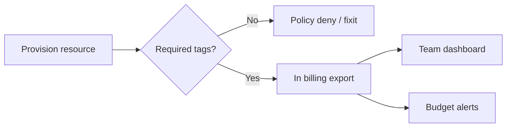

# Cost Visibility and Budgets

You cannot improve what you cannot attribute. **Tags, accounts, budgets, and anomaly alerts** make FinOps(Cloud Financial Operations) actionable for engineering teams.

> **Related:** Unit economics → [§1](01-unit-economics.md) · Overview cadence → [§0](00-overview.md) · Ownership of datasets → [data-platforms §5](../../data-platforms/includes/05-data-ownership-lineage-retention.md)

---

## At a glance

| Capability | Purpose |
|------------|---------|
| **Consistent tags** | Map $ → service / team / env |
| **Account or folder strategy** | Hard isolation for prod vs sandbox |
| **Budgets + alerts** | Catch runaway before month-end |
| **Anomaly detection** | Day-over-day spikes |
| **Showback / chargeback** | Behavior change |

**Rule of thumb:** Enforce `service`, `env`, `owner` tags at provision time — untagged resources are **orphans** and get cleaned or charged to platform.

---

## Tagging minimum

| Tag | Example |
|-----|---------|
| `service` | `orders-api` |
| `env` | `prod` / `staging` |
| `owner` | team email or Slack id |
| `cost-center` | finance code |
| `feature` (optional) | `search-v2` |

Automate via IaC(Infrastructure as Code) policy — manual tagging drifts.

---

## Budgets

| Budget type | Use |
|-------------|-----|
| **Monthly service** | Primary eng signal |
| **Project / feature** | Temporary spikes (migration, ML(Machine Learning)) |
| **Sandbox** | Hard cap; auto-shutdown |
| **Shared platform** | Platform team owns; showback to consumers |

Alert at **50% / 80% / 100%** with different actions (inform → ticket → page).

---

## Showback vs chargeback

| Mode | Effect |
|------|--------|
| **Showback** | Visibility without billing — start here |
| **Chargeback** | Real budget transfer — after tag quality is high |

Chargeback without accurate tags creates politics, not savings.

---

## Anomalies and runaway controls

| Signal | Response |
|--------|----------|
| +30% day-over-day service $ | Check deploys, traffic, warehouse scans |
| NAT / egress spike | Trace new cross-AZ or internet path |
| Idle but expensive | Right-size — [§3](03-right-sizing-and-autoscaling.md) |
| Orphan untagged | Quarantine list weekly |

Warehouse scan spikes often track bad BI queries — [data-platforms §7](../../data-platforms/includes/07-analytics-without-harming-oltp.md).

---

## Engineering rituals

| Ritual | Output |
|--------|--------|
| Weekly cost review (15 min) | Top deltas + owners |
| Design review cost note | Unit estimate — [§1](01-unit-economics.md) |
| Post-incident | Include $ impact if material |
| Quarterly | Commitment coverage + architecture review — [§7](07-architecture-cost-tradeoffs.md) |

---

## Tooling notes

| Layer | Examples |
|-------|----------|
| Native | AWS Cost Explorer, GCP Billing, Azure Cost Management |
| Open | OpenCost, CloudQuery exports |
| Vendor FinOps | Various — still need tag discipline |

Tools do not replace **owners**.

---

## Common mistakes

| Mistake | Fix |
|---------|-----|
| Tags optional | Policy enforce |
| One budget for whole org | Per-service budgets |
| Alert only at 100% | Earlier thresholds |
| Finance-only dashboards | Eng-facing unit views |
| Ignore sandbox sprawl | Caps + TTL(Time To Live) |

---

## Pros and cons

### Strong visibility and budgets

**Pros:** Fast anomaly catch; accountable teams; better forecasts.

**Cons:** Tagging overhead; false alarms; chargeback conflict if premature.