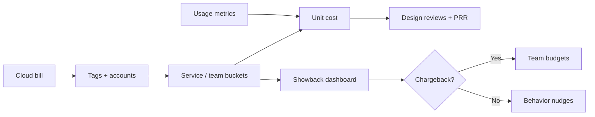

# Platform Showback and Unit Cost

FinOps(Cloud Financial Operations) visibility — [§6](06-cost-visibility-and-budgets.md) — becomes actionable when platform teams publish **showback** (informative allocation) and selective **chargeback** (budget impact). Pair allocated dollars with **unit cost** from [§1](01-unit-economics.md) so teams see price per request, tenant, or feature — not just a monthly invoice.

> **Scope:** Team/service showback dashboards, chargeback policy, and unit-cost attribution for engineering decisions. Tagging and budgets → [§6](06-cost-visibility-and-budgets.md). Unit math → [§1](01-unit-economics.md).
>
> **Related:** [§6 Cost visibility and budgets](06-cost-visibility-and-budgets.md) · [§1 Unit economics](01-unit-economics.md) · Architecture cost trade-offs → [§7](07-architecture-cost-tradeoffs.md) · Multi-tenant attribution → [api-design §16](../../api-design-and-protection/includes/16-multi-tenant-apis.md)

---

## At a glance

| Mode | Purpose |
|------|---------|
| **Showback** | Educate; no budget transfer |
| **Chargeback** | Assign $ to cost centers; changes behavior |
| **Unit cost** | $ / request, tenant, GB — [§1](01-unit-economics.md) |
| **Shared platform** | Split by usage proxy (CPU-hours, egress, seats) |
| **Cadence** | Monthly close + weekly anomaly review |
| **Governance** | Finance + platform own methodology |

**Rule of thumb:** Showback without **unit denominators** becomes arguments about tags; unit cost without **showback** never reaches team standups.

---

## Allocation flow

| Input | Source |
|-------|--------|
| `$` by service | Required tags — [§6](06-cost-visibility-and-budgets.md) |
| Requests / tenants | Metrics backend, API(Application Programming Interface) gateway |
| Shared Kafka/DB | Allocated by % of consumer lag, queries, or negotiated split |

---

## Showback dashboard minimum

| Panel | Audience |
|-------|----------|
| **MTD spend vs budget** | Team lead |
| **Top drivers** | Engineers (SKU breakdown) |
| **Unit cost trend** | PM(Product Manager) + TL(Tech Lead) |
| **Anomalies** | Platform FinOps |
| **Untagged orphan $** | Platform cleanup queue |

Publish **methodology notes** ( amortized RIs(Reserved Instances), shared load balancers) so debates target assumptions, not motives.

---

## Chargeback policy

| Guideline | Detail |
|-----------|--------|
| Start with showback 2–3 quarters | Build trust in allocation |
| Chargeback prod only | Sandboxes still showback — [§6](06-cost-visibility-and-budgets.md) |
| Cap surprises | Budget alerts before hard charge |
| Escalation | Architecture review for >X% MoM(Month over Month) without usage growth |
| Unit economics gate | New features estimate $/request before launch — [§1](01-unit-economics.md) |

---

## Platform team responsibilities

| Duty | Output |
|------|--------|
| Enforce tags at provision | Policy-as-code deny |
| Maintain allocation rules | Versioned spreadsheet or code |
| Run monthly close | PDF/Slack summary per team |
| Partner with SRE(Site Reliability Engineering) | Tie cost spikes to deploys/incidents |
| Feed design reviews | Unit cost cards for major changes |

---

## Common mistakes

| Mistake | Fix |
|---------|-----|
| Raw bill CSV to teams | Curated dashboard + unit denominators |
| Chargeback without warning | Showback first; alerts |
| Shared services untagged | Default platform bucket + escalation |
| Unit cost using revenue requests only | Define successful vs total consistently — [§1](01-unit-economics.md) |
| One-time RI(Reserved Instance) benefit hidden | Document amortization in methodology |
| FinOps only at month-end | Weekly anomaly + deploy correlation |
