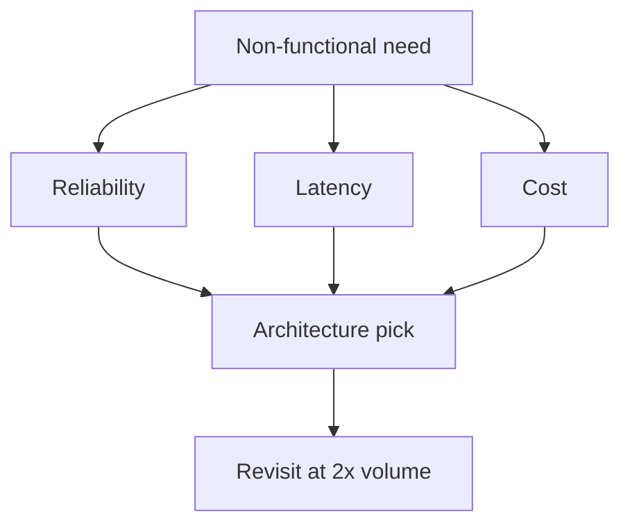

# Architecture Cost Tradeoffs

Architecture choices set the **cost curve**. Use this section in design reviews alongside reliability and delivery — not after the invoice lands.

> **Related:** Decision guide → [§8](08-decision-guide.md) · Org/stage/pricing fit → [architecture §14](../../architecture-decisions/includes/14-org-stage-and-pricing-fit.md) · ADRs and tradeoffs → [architecture-decisions](../../architecture-decisions/README.md) · HTS decisions → [HTS §12](../../high-throughput-systems/includes/12-decision-guide-and-common-mistakes.md) · Data store choice → [data-platforms §8](../../data-platforms/includes/08-decision-guide.md) · Build vs managed → [§5](05-build-vs-managed-cost.md)

---

## At a glance

| Choice | Cheaper when | More expensive when |
|--------|--------------|---------------------|
| **Monolith + one DB** | Small team, one domain | Noisy analytics on primary |
| **Cache + CDN(Content Delivery Network)** | Read-heavy, cacheable | Low hit ratio / huge keys |
| **Async + queue** | Spiky write fan-out | Always-on huge broker idle |
| **Multi-region active-active** | Need local write/latency | Traffic does not justify 2× |
| **Microservices** | Clear boundaries + scale | Chatty mesh + duplicate stacks |
| **Warehouse for BI** | Protects OLTP | Unbounded scans / unused marts |

**Rule of thumb:** Pick the **simplest architecture that meets SLO(Service Level Objective)** at target volume; revisit cost at each 2× growth.

---

## Tradeoff map

| Need | Cost-aware approach |
|------|---------------------|
| Higher availability | Measure downtime $ vs replica $ |
| Lower latency | Cache/edge before multi-region |
| Higher throughput | Fix queries → cache → scale — [HTS](../../high-throughput-systems/README.md) |
| Compliance retention | Tier cold storage — [§4](04-storage-and-retention-cost.md) |

---

## Expensive-by-default patterns

| Pattern | Why costly | Alternative |
|---------|------------|-------------|
| Dual-write many stores | Ops + incidents | CDC(Change Data Capture)/outbox — [data-platforms §2](../../data-platforms/includes/02-search-systems.md) |
| Always-on blue/green both full size | 2× compute | Canary / rolling — [deployment](../../deployment-strategies/README.md) |
| Per-tenant dedicated everything early | High floor | Shared + strong isolation until enterprise tier |
| Sync cross-region every write | Egress + latency | Async replicate; accept lag |
| Infinite observability cardinality | Ingest $ | Bound labels; sample |

---

## Cheap-but-fragile patterns

| Pattern | Hidden cost |
|---------|-------------|
| Single AZ "savings" | Outage blast radius |
| RF=1 Kafka | Data loss |
| No backups | Unrecoverable $ + trust |
| BI on primary | Sev1 + overtime |
| Under-sized connection pools | Cascading failures |

Cost wins that increase **expected incident cost** are not wins — include risk in TCO ([§5](05-build-vs-managed-cost.md)).

---

## Design review cost questions

| # | Ask |
|---|-----|
| 1 | What is unit cost at 1× and 10× traffic? |
| 2 | Which bill drivers move? ([§2](02-cloud-cost-drivers.md)) |
| 3 | What is the idle / floor cost? |
| 4 | What retention did we just imply? |
| 5 | Managed vs build crossover? |
| 6 | How do we kill or shrink this feature? |
| 7 | Who owns the budget tag? |

---

## Growth revisits

| Trigger | Re-evaluate |
|---------|-------------|
| 2× traffic | Right-size, cache, commitments |
| New region | Egress model |
| New heavy feature (search, ML) | Dedicated unit economics |
| Margins compress | Architecture simplification |

---

## Common mistakes

| Mistake | Fix |
|---------|-----|
| Optimize $ ignoring SLO | Meet SLO; then reduce waste |
| Copy FAANG multi-region early | Prove latency/DR need |
| Microservice split without cost model | Count duplicate platforms |
| Skip cost in ADR / design doc | Add unit estimate section |

---

## Pros and cons

### Explicit architecture–cost reviews

**Pros:** Fewer surprise bills; better product pricing; intentional complexity.

**Cons:** Slower approvals; estimates wrong early — refine with visibility ([§6](06-cost-visibility-and-budgets.md)).