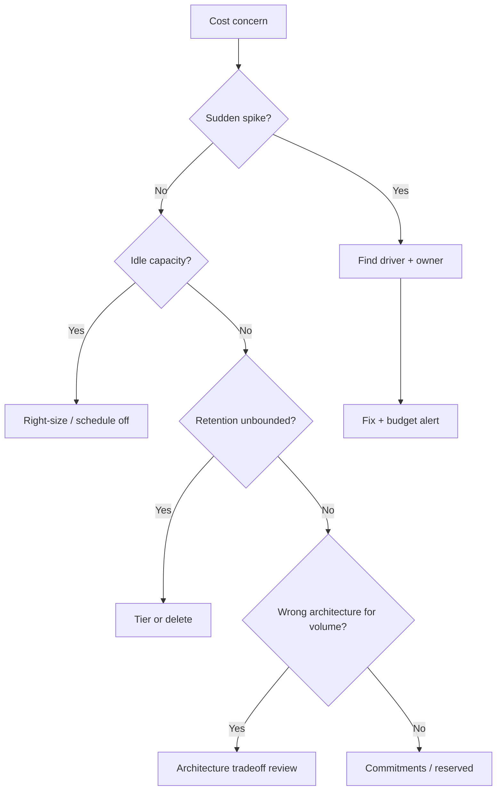

# Decision Guide

When to spend, when to cut, and which FinOps(Cloud Financial Operations) moves belong in the next sprint versus the next architecture review.

> **Related:** Overview → [§0](00-overview.md) · Architecture tradeoffs → [§7](07-architecture-cost-tradeoffs.md) · [architecture-decisions](../../architecture-decisions/README.md) · HTS decisions → [HTS §12](../../high-throughput-systems/includes/12-decision-guide-and-common-mistakes.md) · Data platform decisions → [data-platforms §8](../../data-platforms/includes/08-decision-guide.md)

---

## At a glance

| Situation | Do this first |
|-----------|---------------|
| Bill spiked this week | Anomaly + top drivers — [§2](02-cloud-cost-drivers.md), [§6](06-cost-visibility-and-budgets.md) |
| Designing a new feature | Unit-cost sketch — [§1](01-unit-economics.md) |
| Steady high invoice | Right-size + commitments — [§3](03-right-sizing-and-autoscaling.md) |
| Storage climbing | Retention/tiering — [§4](04-storage-and-retention-cost.md) |
| Choosing Kafka vs SQS etc. | TCO(Total Cost of Ownership) — [§5](05-build-vs-managed-cost.md) |
| Multi-region / many stores | Architecture cost — [§7](07-architecture-cost-tradeoffs.md) |

**Rule of thumb:** **Stop hemorrhage** (anomaly) → **remove waste** (right-size, retention) → **change shape** (architecture) → **commit discounts**.

---

## Decision flow

---

## Spend vs save matrix

| Move | Effort | Typical $ impact | Risk |
|------|--------|------------------|------|
| Kill orphan resources | Low | Medium | Low |
| Right-size / scale-to-zero non-prod | Low | Medium–high | Low |
| Retention policies | Medium | High over time | Medium (delete) |
| Cache / query fix | Medium | High | Low if measured |
| Managed → self-host | High | Variable | High |
| Remove a region | High | High | High (product) |

---

## When not to optimize cost

| Signal | Prefer |
|--------|--------|
| Error budget burning | Reliability first — [HTS §1](../../high-throughput-systems/includes/01-measurement-and-slo.md) |
| Incident in progress | Stabilize; cost blameless later |
| Estimate < eng-hour cost of project | Skip |
| Savings require violating compliance | Keep spend |

---

## Anti-patterns catalog

| Anti-pattern | Fix |
|--------------|-----|
| Finance-only FinOps | Eng unit metrics + tags |
| Discount before right-size | [§3](03-right-sizing-and-autoscaling.md) |
| Delete backups to save $ | Align retention to RPO(Recovery Point Objective) |
| "Premature multi-region" | [§7](07-architecture-cost-tradeoffs.md) |
| Untagged shared cluster forever | [§6](06-cost-visibility-and-budgets.md) |
| BI on primary to "save warehouse $" | False economy — [data-platforms §7](../../data-platforms/includes/07-analytics-without-harming-oltp.md) |

---

## Rollout checklist for a FinOps practice

| # | Check |
|---|-------|
| 1 | Required tags enforced |
| 2 | Per-service dashboards with unit cost |
| 3 | Budgets at 50/80/100% |
| 4 | Weekly 15-min review with owners |
| 5 | Design-review cost questions ([§7](07-architecture-cost-tradeoffs.md)) |
| 6 | Retention owners named ([data-platforms §5](../../data-platforms/includes/05-data-ownership-lineage-retention.md)) |
| 7 | Quarterly architecture–cost revisit |

---

## Common mistakes (summary)

| Mistake | Section |
|---------|---------|
| No denominators | [§1](01-unit-economics.md) |
| Optimize wrong driver | [§2](02-cloud-cost-drivers.md) |
| Ignore TCO people cost | [§5](05-build-vs-managed-cost.md) |
| Architecture without $ | [§7](07-architecture-cost-tradeoffs.md) |

---

## Pros and cons

### Embedding FinOps in engineering decisions

**Pros:** Sustainable margins; fewer surprises; aligned product packaging.

**Cons:** Process overhead; imperfect attribution; tension with speed — keep rituals short.