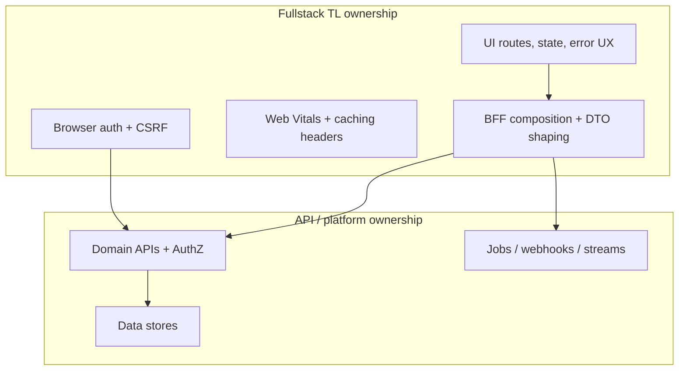

# Overview — Fullstack BFF & Clients

This guide is for **fullstack Tech Leads** who own the seam between UI and APIs: what the client renders, what the BFF(Backend for Frontend) aggregates, how auth feels in the browser, and how performance/accessibility stay non-negotiable.

> **Related:** API(Application Programming Interface) contracts & auth → [api-design-and-protection](../../api-design-and-protection/README.md) · Architecture BFF placement → [architecture-decisions §9](../../architecture-decisions/includes/09-bff-and-api-composition.md) · Async/realtime protocols → [api-design §10](../../api-design-and-protection/includes/10-async-patterns.md) · Decision flow → [§10 Decision guide](10-decision-guide.md)

## At a glance

| Need | Start here | Pair with |
|------|------------|-----------|
| Who owns UI↔API | This overview + [§3 BFF](03-bff-ownership.md) | api-design versioning |
| App structure | [§1 Frontend architecture](01-frontend-architecture.md) | Design system §9 |
| SSR(Server-Side Rendering) vs SPA | [§2 Rendering](02-rendering-tradeoffs.md) | Performance §4 |
| Core Web Vitals | [§4 Web performance](04-web-performance.md) | CDN(Content Delivery Network) / HTS edge |
| Live updates | [§5 Realtime UX](05-realtime-ux.md) | api-design async |
| a11y bar | [§6 Accessibility](06-accessibility-bar.md) | Design system |
| Login / session | [§7 Auth UX](07-auth-ux.md) | api-design §4 |
| Flaky mobile nets | [§8 Offline](08-offline-and-flaky-network.md) | Idempotency |

**Rule of thumb:** The TL owns **the contract the UI can rely on** — not every microservice interior.

## Ownership model

| Concern | Fullstack TL | API / domain team |
|---------|--------------|-------------------|
| Screen-ready DTO shape | Yes (BFF) | Provide stable resources |
| Object-level AuthZ(Authorization) | Enforce via API; never “UI-only” | Own enforcement |
| OpenAPI for public/partner | Coordinate | Own |
| Pixel / interaction design | With design system | N/A |
| DB schema | Consult | Own |

## Default recommendation

For a typical **SaaS(Software as a Service) web app**:

1. **BFF per experience** (web) that aggregates domain APIs — no browser talking to 12 internal services
2. **Server-rendered shell** for marketing + authenticated app entry when SEO/LCP(Largest Contentful Paint) matter; client interactivity where needed → [§2](02-rendering-tradeoffs.md)
3. **Cookie session or BFF-held refresh** for first-party web; never long-lived secrets in JS → [§7](07-auth-ux.md)
4. **Design-system primitives** for a11y; product features compose, don’t fork → [§9](09-design-system-boundaries.md)
5. **Contract tests** between UI/BFF and domain APIs → [api-design §15](../../api-design-and-protection/includes/15-contract-and-schema-testing.md)

## Pros of explicit BFF ownership

- UI stays stable when domain services split
- Secrets and CSRF(Cross-Site Request Forgery) stay off the browser
- Aggregation cuts chatty fan-out from mobile/web

## Cons

- Extra hop and ownership boundary to staff
- Risk of BFF becoming a new monolith god-service
- Duplicated validation if BFF and API drift

## Common mistakes

| Mistake | Fix |
|---------|-----|
| Browser calls internal microservices directly | BFF or public API gateway only |
| “Frontend owns AuthZ” | API denies; UI only reflects |
| One mega-BFF for all products | Bounded context per app/experience |
| Ignoring Web Vitals until launch week | Budgets in CI(Continuous Integration) → [§4](04-web-performance.md) |
| No TL for the seam | Name an owner; use this guide’s §10 |