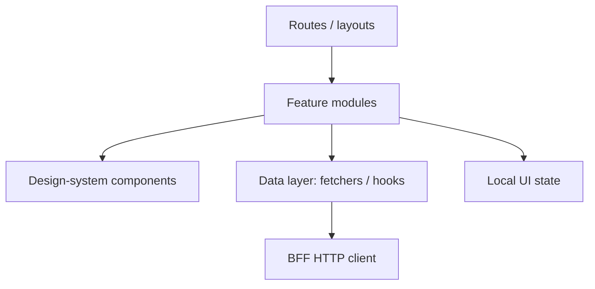

# Frontend Architecture

> **Related:** Rendering modes → [§2](02-rendering-tradeoffs.md) · BFF(Backend for Frontend) contracts → [§3](03-bff-ownership.md) · Error/offline UX → [§8](08-offline-and-flaky-network.md) · Design system → [§9](09-design-system-boundaries.md)

## At a glance

| Concern | Prefer | Avoid |
|---------|--------|-------|
| Routing | File/app router with clear layouts | Ad-hoc hash routing in large apps |
| Server vs client state | Server/cache for remote data; local UI state in components | Duplicating server entities in global stores “just in case” |
| Data fetching | Colocate with route; typed client to BFF | N+1 waterfalls without suspense/streaming plan |
| Errors | Error boundaries + route-level fallbacks | Silent empty screens |
| Feature code | Vertical slices by route/domain | Layer folders that hide feature coupling |

**Rule of thumb:** Structure the repo the way users navigate — **routes first**, shared kit second.

## Layer sketch

| Layer | Owns | Does not own |
|-------|------|--------------|
| **Routes** | URL map, layouts, auth gates | Business rules of domain APIs |
| **Features** | Page composition, forms, feature flags | Raw CSS primitives (use DS) |
| **Data** | Query keys, mutations, cache invalidation | Direct DB access |
| **Design system** | Accessible primitives | Product business copy |

## Routing

| Pattern | Use when |
|---------|----------|
| Nested layouts | Shared chrome (nav, shell) |
| Parallel / intercepted routes | Drawers/modals that need URLs |
| Route guards | Auth and entitlement redirects |
| Shallow query params | Filters/shareable views |

Keep **authorization truth** on the server; client guards are UX only.

## State and data fetching

| Kind | Examples | Tooling posture |
|------|----------|-----------------|
| **Remote/server** | Orders list, profile | Cache library or SSR(Server-Side Rendering) loader; keyed by route params |
| **Client ephemeral** | Modal open, wizard step | Component/local store |
| **Cross-cutting client** | Theme, locale | Small context; not a dumping ground |
| **Optimistic** | Toggle, rename | Only with rollback + idempotent API(Application Programming Interface) |

Waterfalls: prefer parallel fetch at layout boundaries; stream HTML when the framework supports it → [§2](02-rendering-tradeoffs.md).

## Error UX

| Level | Behavior |
|-------|----------|
| Field validation | Inline, immediate |
| Mutation failure | Toast/banner + retain form draft |
| Route load failure | Retry + support code / correlation id |
| Auth expiry | Re-auth without losing return URL → [§7](07-auth-ux.md) |
| Partial outage | Degrade section, not whole app shell |

Surface `correlation_id` from BFF when support needs it — never raw stack traces.

## Testing pyramid (frontend)

| Layer | Focus |
|-------|-------|
| Unit | Pure view logic, formatters |
| Component | a11y roles, critical interactions |
| Contract | BFF DTO fixtures / OpenAPI consumer |
| E2E | Few happy paths + auth |

## Common mistakes

| Mistake | Fix |
|---------|-----|
| Global Redux for every server field | Remote cache + local UI state |
| Fetch in deep leaves without coordination | Route-level loaders |
| Error boundary only at root | Nested boundaries per major panel |
| Coupling features to CSS framework internals | Wrap via design system |
| Entitlements checked only in UI | Mirror checks on BFF/API |