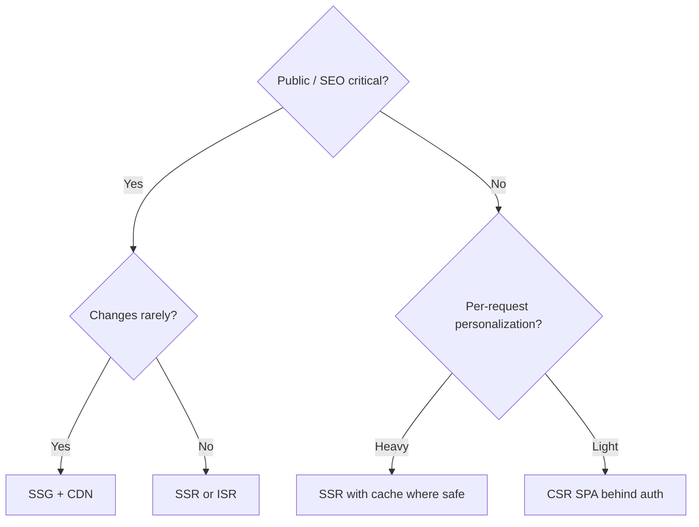

# Rendering Trade-offs

> **Related:** Performance budgets → [§4](04-web-performance.md) · Architecture → [§1](01-frontend-architecture.md) · Auth cookies vs SPA tokens → [§7](07-auth-ux.md)

## At a glance

| Mode | First paint | SEO | Interactivity cost | Best for |
|------|-------------|-----|--------------------|----------|
| **CSR(Client-Side Rendering)** | Slower TTFB→content | Weak without extras | Ship large JS | Authenticated dashboards, internal tools |
| **SSR(Server-Side Rendering)** | HTML on first response | Strong | Hydration cost | Marketing + content + personalized shell |
| **SSG(Static Site Generation)** | Fast via CDN(Content Delivery Network) | Strong | Low if little JS | Docs, marketing, rarely changing pages |
| **ISR(In-Sync Replicas) / incremental** | Static + revalidate | Strong | Medium | Catalogs with periodic updates |
| **Streaming SSR** | Progressive HTML | Strong | Careful boundaries | Large pages with slow fragments |

**Rule of thumb:** Default **SSG/SSR for public**; **SSR or CSR for app** based on personalization and SEO need — measure LCP(Largest Contentful Paint), don’t guess.

## Decision flow

## Hydration realities

| Issue | Mitigation |
|-------|------------|
| Hydration mismatch | Same data on server and client; avoid `Date.now()` in render |
| Heavy hydration blocks input | Split islands / selective hydration; defer non-critical widgets |
| Double data fetch | Pass server-loaded state into client cache |
| Auth-personal HTML at CDN | Cache private responses correctly — or don’t CDN-cache them |

## Mixing modes in one product

| Surface | Typical choice |
|---------|----------------|
| Marketing site | SSG |
| Blog / docs | SSG + ISR |
| Login / app shell | SSR |
| Dense interactive grids | Client islands after shell |
| Admin internal | CSR acceptable |

## Pros and cons

### SSR

| Pros | Cons |
|------|------|
| Fast meaningful HTML | Server cost and caching complexity |
| Better LCP for content | Hydration bugs |
| Cookie auth fits naturally | TTFB depends on origin |

### CSR

| Pros | Cons |
|------|------|
| Simple hosting of static assets | Worse LCP/SEO without work |
| Clear SPA navigation | Large JS budgets |
| Easy optimistic UI | Token storage pitfalls → [§7](07-auth-ux.md) |

### SSG

| Pros | Cons |
|------|------|
| Cheapest edge performance | Stale until rebuild/revalidate |
| Very cacheable | Not for per-user HTML |

## Common mistakes

| Mistake | Fix |
|---------|-----|
| CSR everything “because React” | Pick per route |
| SSR personalized pages with shared CDN cache | `Cache-Control: private` or uncache |
| Shipping megabyte hydration for a blog | Islands or less JS |
| Ignoring hydration errors in CI(Continuous Integration) | Fail builds on mismatch in strict mode |
| Forcing SSG for per-user dashboards | SSR/CSR instead |