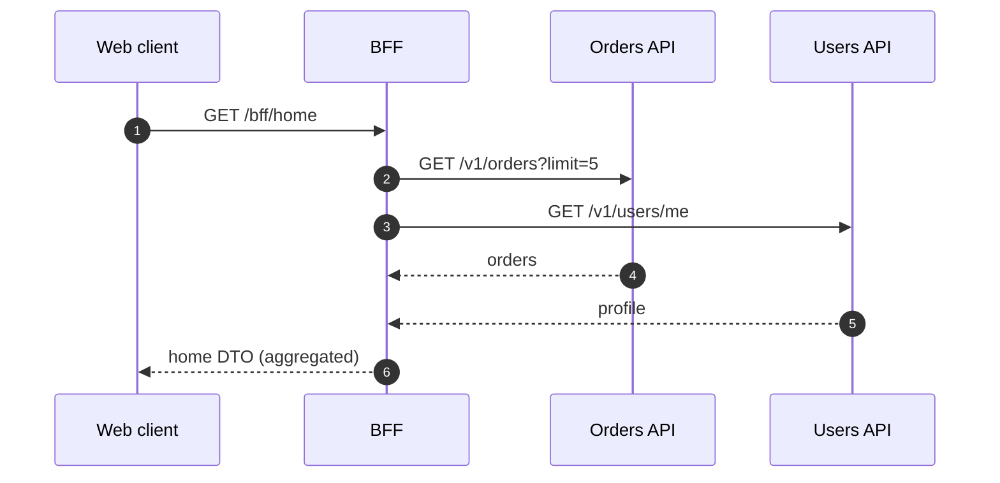

# BFF Ownership

> **Scope:** **Experience-level BFF contracts and ownership** — screen DTOs, cookie bridge, fan-out UX. System-shape “do we have a BFF at all?” → [architecture-decisions §9](../../architecture-decisions/includes/09-bff-and-api-composition.md).
>
> **Related:** Overview ownership → [§0](00-overview.md) · Architecture BFF placement → [architecture-decisions §9](../../architecture-decisions/includes/09-bff-and-api-composition.md) · API(Application Programming Interface) design & versioning → [api-design §1](../../api-design-and-protection/includes/01-api-design.md) / [§14](../../api-design-and-protection/includes/14-api-versioning-and-deprecation.md) · Auth at API → [api-design §4](../../api-design-and-protection/includes/04-auth-model.md) · Contract tests → [api-design §15](../../api-design-and-protection/includes/15-contract-and-schema-testing.md)

## At a glance

| BFF(Backend for Frontend) owns | Domain API owns |
|--------------------------------|-----------------|
| Screen-shaped DTOs / Graph aggregation | Canonical resources and AuthZ |
| Cookie session bridge for browsers | Token issuance / IdP integration |
| Fan-out + timeout/fallback per widget | Source-of-truth latency SLOs |
| CSRF(Cross-Site Request Forgery) for cookie mutates | Idempotency keys on writes |
| Client-facing error mapping | Stable error codes |

**Rule of thumb:** If the browser needs it shaped for **one UI**, it belongs in the BFF; if **many clients** need the same resource, it belongs in the domain API.

## Request path

## Contract rules

| Rule | Practice |
|------|----------|
| **Version the BFF** | `/bff/v1/...` separate from domain `/v1` |
| **Don’t leak domain internals** | No raw internal error payloads |
| **Explicit aggregation SLAs** | Partial success: return available sections + errors[] |
| **Auth propagation** | Forward identity; BFF is not a privilege escalator |
| **Schema** | OpenAPI or typed RPC for BFF; consumer tests in UI CI(Continuous Integration) |

## When you need a BFF

| Signal | Prefer BFF |
|--------|------------|
| Mobile/web would call many services | Yes |
| Need to hide internal topology | Yes |
| Cookie session for first-party web | Yes |
| Single public API already screen-shaped | Maybe thin gateway only |
| Partner integrations | Public API, not web BFF |

## Anti-patterns

| Anti-pattern | Why |
|--------------|-----|
| BFF embeds business AuthZ only | Domain must still deny |
| BFF as shared kitchen sink for all apps | Split by experience |
| Translating every field 1:1 forever | Revisit domain API design |
| Long timeouts fan-out without budget | Cap parallel calls; degrade |
| Storing domain DB credentials in BFF “for speed” | Call APIs; keep boundaries |

## Ownership RACI (lightweight)

| Decision | TL (fullstack) | Domain TL | Platform |
|----------|----------------|-----------|----------|
| Home DTO fields | A | C | I |
| Orders AuthZ rule | C | A | I |
| Edge caching for BFF GET | C | I | A |
| Session cookie flags | A | C | C |

A=accountable, C=consulted, I=informed.

## Common mistakes

| Mistake | Fix |
|---------|-----|
| Browser → mesh of microservices | Single BFF entry |
| BFF bypasses rate limits | Still protect → [api-rate-limiting](../../api-rate-limiting/README.md) |
| Silent omission when one dependency fails | Partial response contract |
| No consumer contract tests | Pact/OpenAPI tests in CI |
| Copying mobile BFF into web 1:1 | Separate shapes if UX differs |