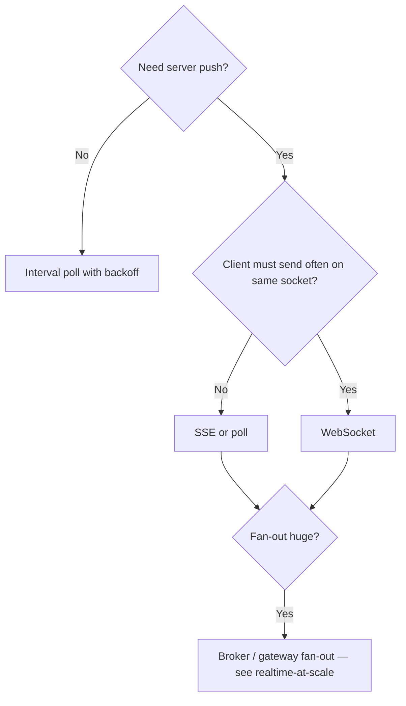

# Realtime UX

> **Scope:** **Client UX and transport choice** for live updates — WebSockets, SSE(Server-Sent Events), and polling. Protocol design, jobs, webhooks, and server async patterns → [api-design §10 Async patterns](../../api-design-and-protection/includes/10-async-patterns.md) (hub), [10A jobs/polling](../../api-design-and-protection/includes/10A-async-jobs-polling.md), [10C streaming](../../api-design-and-protection/includes/10C-async-streaming.md). **Connection fan-out, pub/sub backplanes, presence, and CRDT(Conflict-free Replicated Data Type)/OT(Operational Transformation) at scale** → [realtime-at-scale](../../realtime-at-scale/README.md).
>
> **Related:** API(Application Programming Interface) async hub → [api-design §10](../../api-design-and-protection/includes/10-async-patterns.md) · Fan-out architecture → [realtime-at-scale](../../realtime-at-scale/README.md) · Offline reconciliation → [§8](08-offline-and-flaky-network.md) · Rate limits / 429 UX → [api-rate-limiting](../../api-rate-limiting/README.md)

## At a glance

| Transport | Strengths | Watch-outs |
|-----------|-----------|------------|
| **Short polling** | Simple; HTTP(Hypertext Transfer Protocol) cache/auth familiar | Load; backoff required |
| **Long poll** | Fewer empty responses | Timeout handling; server ties |
| **SSE** | One-way server push over HTTP | Proxy buffering; auto-reconnect |
| **WebSocket** | Bidirectional; low latency | Ops complexity; sticky/LB; auth refresh |

**Rule of thumb:** Prefer **SSE or polling** until you need client→server streaming of many events; don’t open a WebSocket for a badge count.

## Choose transport

## UX requirements (any transport)

| Requirement | Practice |
|-------------|----------|
| Connection state | Show “live / reconnecting / offline” without scary modals |
| Reconnect | Exponential backoff + jitter; resume cursor/offset |
| Auth expiry | Refresh then resume; don’t infinite 401 loop |
| Event order | Version/timestamp; ignore stale |
| Idempotency | Apply event ids once |
| Tab fan-out | Shared worker or leader tab to avoid N sockets |

## Mapping to API async

| UI need | Prefer (see api-design) |
|---------|-------------------------|
| “Is my export done?” | Job + poll → [10A](../../api-design-and-protection/includes/10A-async-jobs-polling.md) |
| Activity feed | SSE/stream → [10C](../../api-design-and-protection/includes/10C-async-streaming.md) |
| Collaborative editing | WebSocket + OT(Operational Transformation)/CRDT (product-specific) |
| Partner notifies us | Webhook inbound — not a browser socket → [10B](../../api-design-and-protection/includes/10B-async-webhooks.md) |

## BFF role

- Terminate browser SSE/WebSocket at BFF; subscribe internally to domain events or poll domain APIs.
- Don’t expose internal broker credentials to the browser.
- Enforce per-user channel AuthZ on subscribe.

## Common mistakes

| Mistake | Fix |
|---------|-----|
| WebSocket for rare status checks | Poll/SSE |
| No backoff → reconnect storms | Jittered exponential backoff |
| Ignoring proxy buffering on SSE | `X-Accel-Buffering: no` / disable buffer |
| Auth only at socket open | Revalidate on resume; short-lived tickets |
| One socket per React component | Shared connection layer |