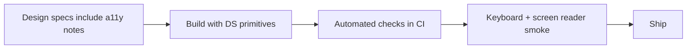

# Accessibility Bar

> **Related:** Design-system primitives → [§9](09-design-system-boundaries.md) · Frontend structure → [§1](01-frontend-architecture.md) · Auth flows (focus, errors) → [§7](07-auth-ux.md)

## At a glance

| Bar | Meaning |
|-----|---------|
| **Legal/product baseline** | Target WCAG(Web Content Accessibility Guidelines) 2.2 AA unless legal says otherwise |
| **Design system** | Primitives ship accessible behavior; products don’t reimplement dialogs |
| **CI(Continuous Integration)** | Automated axe/lighthouse a11y on critical routes; human keyboard pass |
| **Definition of done** | Keyboard + name/role/value + contrast for every interactive feature |

**Rule of thumb:** If it needs a custom `div` with `onClick`, you probably need a **design-system component** with roles and keyboard support.

## Non-negotiables

| Area | Requirement |
|------|-------------|
| Keyboard | All actions reachable; visible focus; no keyboard traps |
| Semantics | Correct headings, landmarks, lists, buttons vs links |
| Name / role / value | Accessible names for controls; live regions for async status |
| Contrast | Text and UI components meet AA |
| Forms | Labels tied to inputs; errors announced and linked |
| Motion | Respect `prefers-reduced-motion` |
| Auth / modals | Focus move + restore; Escape closes |

## Workflow

| Stage | Activity |
|-------|----------|
| Design | Contrast, focus order, error text |
| Build | Prefer DS `Dialog`, `Menu`, `Tabs` |
| PR | axe on changed routes; screenshots optional |
| QA | VoiceOver/NVDA smoke on login, checkout, primary task |
| Prod | Collect a11y issues like any bug; severity by blocker |

## Testing matrix

| Method | Catches | Misses |
|--------|---------|--------|
| axe / eslint-plugin-jsx-a11y | Many static issues | Poor UX wording, complex widgets |
| Keyboard-only pass | Traps, focus loss | Screen reader verbosity |
| Screen reader smoke | Naming, live regions | Visual-only contrast sometimes |
| Visual contrast tools | Color failures | Cognitive load |

## Component ownership

| Component type | Owner |
|----------------|-------|
| Button, input, dialog, menu, toast | Design system |
| Product page layout using DS | Feature team |
| One-off canvas / map widget | Feature team + a11y review |

## Common mistakes

| Mistake | Fix |
|---------|-----|
| `div` + click as button | Real `<button>` or DS Button |
| Color-only error state | Text + icon + `aria-invalid` |
| Auto-playing motion | Reduced-motion path |
| Modals without focus trap | DS Dialog only |
| “We’ll fix a11y after GA” | Bar in DoD; CI gate on critical flows |
| Icon buttons without names | `aria-label` / visible text |